# <<一個64位操作系統的設計與實現>> 第十一章 設備驅動程式 學習筆記
這一章中將實現鍵盤、滑鼠、IDE硬碟設備驅動程式。  
## 鍵盤與滑鼠的驅動程式
### 鍵盤控制器命令
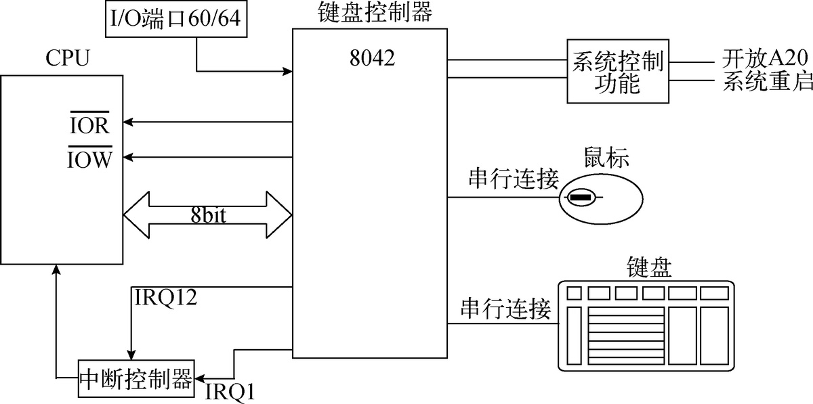

<p class="text-center">
8042鍵盤控制器結構
</p>

I/O端口0x60與0x64都是鍵盤控制器雙向讀寫的I/O端口地址，他暪可以向8042晶片發送數據也可以向鍵盤發送數據。但是受限於I/O端口的傳輸數據位寬，因此控制8042晶片或是控制鍵盤滑鼠都須仰賴命令加參數的通信方式。  

| 端口 | 讀/寫 | 名稱       | 功能                                   |
| ---- | ----- | -------- | -------------------------------------- |
| 0x60 | 讀    | 輸出緩衝區 | 返回鍵盤掃描碼或8042發送的數據         |
| 0x60 | 寫    | 輸入緩衝區 | 向鍵盤發送命令或向8042晶片發送命令參數 |
| 0x64 | 讀    | 控制器狀態 | 返回8042晶片的狀態，其功能描述如下。<br>bit7=1:鍵盤通信時發生奇偶校驗錯誤。<br>bit6=1:鍵盤接收數據超時<br>bit5=1:滑鼠輸出緩衝區已滿<br>bit4=0:禁止鍵盤<br>bit3:紀錄上次操作的端口號(1=0x64，0=0x60)<br>bit2=1:控制器完成自檢<br>bit1=1:鍵盤輸入緩衝區已滿<br>bit0=1:鍵盤輸出緩衝區已滿  |
| 0x64 | 寫    | 控制器命令 | 向8042晶片發送控制命令                                   |

**8042晶片的控制命令表**  


| 命令 | 參數 | 返回值 | 功能                                |
| ---- | ---- | ------ | ----------------------------------- |
| 20h  | 有   | 有     | 讀取鍵盤配置<br>bit7=0:0<br>bit6=1:掃描碼輸入緩衝區前轉換成第一套掃描碼<br>bit5=0:啟用滑鼠<br>bit4=0:啟用鍵盤<br>bit3=0:0<br>bit2=1:通知系統已完成熱啟動測試與初始化<br>bit1=1:啟用滑鼠中斷IRQ12(MIBF)<br>bot0=1:啟用鍵盤中斷IRQ1(IBF)                        |
| 60h  | 無   | 無     | 向鍵盤發配置命令。                  |
| A7h  | 無   | 無     | 禁止滑鼠端口                        |
| A8h  | 無   | 無     | 開啟滑鼠端口                        |
| A9h  | 無   | 有     | 滑鼠端口自檢，返回00h表示正常       |
| AAh  | 無   | 有     | 控制器自檢，返回55h表示正常         |
| ABh  | 無   | 有     | 鍵盤端口自檢，返回00h表示正常       |
| ADh  | 無   | 無     | 禁止鍵盤通信，復位控制器狀態的第4位 |
| AEh  | 無   | 無     | 開啟鍵盤通信，置位控制器狀態的第4位 |
| C0h  | 無   | 有     | 讀輸入端口P1                        |
| D0h  | 無   | 有     | 讀輸出端口P2                        |
| D1h  | 有   | 無     | 寫輸出端口P2                        |
| D2h  | 有   | 無     | 寫入參數到鍵盤緩衝區                |
| D3h  | 有   | 無     | 寫入參數到滑鼠緩衝區                |
| D4h  | 有   | 無     | 發送數據到滑鼠                      |
| E0h  | 無   | 無     | 讀測試端口P3                        |
| FEh  | 無   | 無     | 系統重啟                            |

8048鍵盤編碼器晶片定義了3套掃描碼，線待鍵盤默認第2套但為了兼容以前的XT鍵盤，8042晶片接收到掃描碼後會默認轉換為第1套掃描碼。  
以下為鍵盤命令，這些命令須透過I/O端口0x60發送到鍵盤控制器，如果命令需要參數，請在傳輸命令後再傳輸參數到I/O端口0x60。  

| 命令 | 參數 | 返回值 | 功能 |
| ---- | ---- | ------ | ---- |
| FFh  | 無   | 有     | 重啟鍵盤     |
| FEh  | 無   | 無     | 重新發送上一位元組     |
| F6h  | 無   | 無     | 使用默認按鍵速率(10.9cps/500ms)     |
| F5h  | 無   | 無     | 停止鍵盤掃描     |
| F4h  | 無   | 無     | 開啟鍵盤掃描     |
| F3h  | 有   | 無     | 設置按鍵速率     |
| F2h  | 無   | 有     | 獲取鍵盤的設備ID號(2byte)     |
| F0h  | 有   | 無     |  設置鍵盤使用的掃描碼。<br>0x0:取得當前掃描碼(有返回值)<br>0x1:第一套掃描碼<br>0x2:第二套掃描碼<br>0x3:第三套掃描碼|
| EEh  | 無   | 有     | 鍵盤返回EEh     |
| EDh  | 有   | 無     | 控制LED燈，1:亮，0:滅<br>bit2:Caps Lock<br>bit1:Num Lock <br>bit0:Scroll Lock    |

**滑鼠控制命令**  
需要參數，請在傳輸命令後再傳輸參數到I/O端口0x60。  

| 命令 | 功能                            |
| ---- | ------------------------------- |
| FFh  | 重啟滑鼠                        |
| FEh  | 重新發送上調數據包              |
| F6h  | 默認取樣率100Hz，分辨率4pixel/mm |
| F5h  | 禁止滑鼠發送數據                    |
| F4h  | 允許滑鼠發送數據                    |
| F3h  | 設置滑鼠取樣率                    |
| F2h  | 獲取滑鼠的設備ID號      |

**滑鼠數據包格式**  
印象中以前讀取滑鼠數據時都是接收到3byte，但書上說會根據滑鼠的設備ID號區分為3byte與4byte，只有ID=3、4時才是4byte，但多數的滑鼠設備ID值為0。  


<p class="text-center">
滑鼠數據包格式
</p>

### 完善鍵盤驅動

```
kernel/keyboard.h

#define KB_BUF_SIZE     100
#define PORT_KB_DATA    0x60
#define PORT_KB_STATUS  0x64

#define KBCMD_WRITE_CMD 0x60
#define KBCMD_READ_CMD  0x20

#define KB_INIT_MODE    0x47

struct keyboard_inputbuffer {
    unsigned char *p_head;
    unsigned char *p_tail;
    int count;
    unsigned char buf[KB_BUF_SIZE];
};
```

頭文件中定義了鍵盤控制器的I/O端口、命令與初始化常量，並建立一個循環佇列用以輸出鍵盤數據。  


| 巨集            | 值   | 功能                               |
| --------------- | ---- | ---------------------------------- |
| KB_BUF_SIZE     | 100  | 鍵盤緩衝區大小                     |
| PORT_KB_DATA    | 0x60 | 鍵盤控制器數據I/O端口              |
| PORT_KB_STATUS  | 0x64 | 鍵盤控制器狀態I/O端口              |
| KBCMD_WRITE_CMD | 0x60 | 鍵盤控制器控制命令用於發送配置參數 |
| KBCMD_READ_CMD  | 0x20 | 讀取鍵盤配置值                     |
| KB_INIT_MODE    | 0x47 | 鍵盤配置值，配置如下:<br>bit7:0<br>bit6=1:轉換為第一套掃描碼<br>bit5=0:啟用滑鼠<br>bit4=0:啟用鍵盤<br>bit3=0:0<br>bit2=1:通知系統完成熱測試與初始化<br>bit1=1:啟用滑鼠中斷IRQ12<br>bit0=1:啟用鍵盤中斷IRQ1|


```
kernel/leyboard.c

struct keyboard_inputbuffer *p_kb = NULL;
static int shift_l, shift_r, ctrl_l, ctrl_r,alt_l, alt_r;

void keyboard_init()
{
    struct IO_APIC_RET_entry entry;
    unsigned long i, j;

    p_kb = (struct keyboard_inputbuffer *) kmalloc(sizeof(struct keyboard_inputbuffer), 0);

    p_kb->p_head = p_kb->buf;
    p_kb->p_tail = p_kb->buf;
    p_kb->count = 0;

    memset(p_kb->buf, 0, KB_BUF_SIZE);

    // 設定RTE暫存器
    entry.vector = 0x21; // 鍵盤中斷向量號
    entry.deliver_mode = APIC_ICR_IOAPIC_Fixed; // 標準模式
    entry.dest_mode = ICR_IOAPIC_DELV_PHYSICAL;
    entry.deliver_status = APIC_ICR_IOAPIC_Idle;
    entry.polarity = APIC_IOAPIC_POLARITY_HIGH;
    entry.irr = APIC_IOAPIC_IRR_RESET;
    entry.trigger = APIC_ICR_IOAPIC_Edge;
    entry.mask = APIC_ICR_IOAPIC_Masked;
    entry.reserved = 0;

    entry.destination.physical.reserved1 = 0;
    entry.destination.physical.phy_dest = 0;
    entry.destination.physical.reserved2 = 0;


    wait_KB_write();
    io_out8(PORT_KB_CMD, KBCMD_WRITE_CMD);
    wait_KB_write();
    io_out8(PORT_KB_DATA, KB_INIT_MODE);

    for (i = 0; i < 1000; i++)
        for (j = 0; j < 1000; j++)
            nop();
    
    shift_l = 0;
    shift_r = 0;
    ctrl_l  = 0;
    ctrl_r  = 0;
    alt_l   = 0;
    alt_r   = 0;

    register_irq(0x21, &entry, &keyboard_handler, (unsigned long)p_kb, &keyboard_int_controller, "ps/2 keyboard");
}
```
前半部的程式碼用於設定RTE暫存器。`wait_KB_write()`則是用於確認鍵盤狀態，並等待直到鍵盤狀態穩定。對進盤進行任何操作時都需要確定鍵盤控制器是否處於穩定狀態，否則可能導致數據說師或是寫入失敗。接著利用兩條`io_out8`指令向鍵盤控制器寫入初始化狀態，同時啟用鍵盤與滑鼠並設定掃描碼為第一套鍵盤掃描碼。  
一百萬次的nop()指令用於等待鍵盤控制器，確保鍵盤控制器執行完指令，不使用`wait_KB_write`是因為此函式僅用於確定鍵盤控制器輸入緩衝區是否為空，但輸入緩衝區為空並不代表鍵盤控制器準備完成。  
`register_irq`則用於取消RTE暫存器的屏蔽位並註冊對應中斷向量號與提供中斷處理函式的地址`keyboard_handler`。  

```
hw_int_controller keyboard_int_controller = {
    .enable = IOAPIC_enable,
    .disable = IOAPIC_disable,
    .install = IOAPIC_install,
    .uninstall = IOAPIC_uninstall,
    .ack = IOAPIC_edge_ack,
};

void keyboard_exit()
{
    unregister_irq(0x21);
    kfree((unsigned long*)p_kb);
}
```
以上程式碼分別對應鍵盤控制器的註冊與卸載。由於此中斷是透過APIC管理，因此這裡註冊中斷處理接口函式後將於`keyboard_init`中呼叫函式`register_irq`已完成註冊。而卸載函式`keyboard_exit`則是呼叫`unregister_irq`取消註冊並釋放結構體即可。  

```
kernel/keyboard.c

void keyboard_handler(unsigned long nr, unsigned long parameter, struct pt_regs *regs)
{
    unsigned char x;
    x = io_in8(0x60); // 讀取鍵盤掃描碼
    color_printk(WHITE, BLACK, "(K:%02x)", x); // 打印讀取到的掃描碼

    if (p_kb->p_head == p_kb->buf + KB_BUF_SIZE)
        p_kb->p_head = p_kb->buf; // 到緩衝區尾部回到起始位置

    *p_kb->p_head = x;
    p_kb->count++;
    p_kb->p_head++;	
}
```
此函數用於接收鍵盤控制器傳送的掃描碼。`io_in8(0x60)`用於讀取鍵盤掃描碼，並將其寫入循環佇列中。但這裡存在一個假設就是從自定義的緩衝區處理掃描碼的速度遠高於鍵盤控制器發送數據的速度，因此這裡不判斷緩衝區是否滿了。
```
kernel/APIC.c
void do_IRQ(struct pt_regs *regs, unsigned long nr)
{
    irq_desc_T *irq = &interrupt_desc[nr - 32];

    if (irq->handler)
        irq->handler(nr,irq->parameter,regs);

    if (irq->controller && irq->controller->ack)
        irq->controller->ack(nr);
}
```
調整APIC.c中的處理函式將原使用於測試中斷是否可正常工作的程式碼去除，僅留下`irq->handler`用於呼叫處理函式與`irq->controller->ack`用於應答中斷處理函式已完成，將初始化函式keyboard_init添加到main核心主程式中即可測試程式碼是否可正常工作。
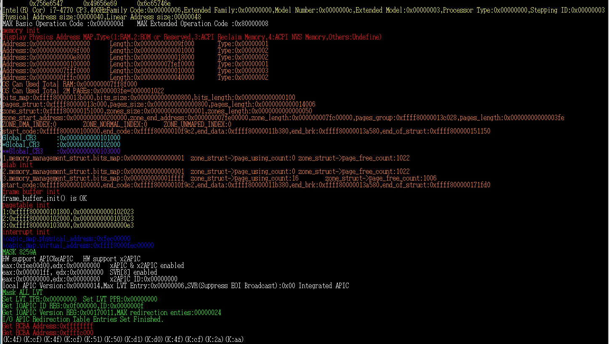
上圖為BOCHS虛擬機運行結果，從最後一行可觀察到按下按鍵時可產生對應的鍵盤掃描碼。

### 解析鍵盤掃描碼
```
kernel/keyboard.h

#define NR_SCAN_CODES   0x80
#define MAP_COLS        2

#define PAUSEBREAK      1
#define PRINTSCREEN     2
#define OTHERKEY        4
#define FLAG_BREAK      0x80
```
NR_SCAN_CODES用於表示按鍵數量共128個，MAP_COLS則是考慮按鍵包含普通按鍵與加上shift的兩種狀態。PAUSEBREAK、PAUSEBREAK與PRINTSCREEN為特殊按鍵。
```
unsigned char pausebreak_scode[]={0xE1, 0x1D, 0x45, 0xE1, 0x9D, 0xC5};

unsigned int keycode_map_normal[NR_SCAN_CODES * MAP_COLS];
```
pausebreak_scode此數組用於保存pausebreak的掃描碼值。keycode_map_normal則用於紀錄鍵盤掃描碼與按鍵的映射關係。

```
kernel/keyboard.c

unsigned char get_scancode()
{
    unsigned char ret  = 0;

    if (p_kb->count == 0)
        while(!p_kb->count)
            nop();
    
    if (p_kb->p_tail == p_kb->buf + KB_BUF_SIZE)
        p_kb->p_tail = p_kb->buf;

    ret = *p_kb->p_tail;
    p_kb->count--;
    p_kb->p_tail++;

    return ret;
}

void analysis_keycode()
{
    unsigned char x = 0;
    int i;
    int key = 0;
    int make = 0;

    x = get_scancode(); // 從緩衝區取得鍵盤掃描碼。
    
    if (x == 0xE1) { //pause break;
        key = PAUSEBREAK;
        for (i = 1; i < 6; i++) {
            if (get_scancode() != pausebreak_scode[i]) {
                key = 0;
                break;
            }
        }
    } else if (x == 0xE0) {  //print screen
        x = get_scancode();

        switch (x) {
            case 0x2A: // press printscreen
        
                if (get_scancode() == 0xE0) {
                    if (get_scancode() == 0x37) {
                        key = PRINTSCREEN;
                        make = 1;
                    }
                }
                break;

            case 0xB7: // UNpress printscreen
        
                if (get_scancode() == 0xE0) {
                    if (get_scancode() == 0xAA) {
                        key = PRINTSCREEN;
                        make = 0;
                    }
                }
                break;

            case 0x1d: // press right ctrl
        
                ctrl_r = 1;
                key = OTHERKEY;
                break;

            case 0x9d: // UNpress right ctrl
        
                ctrl_r = 0;
                key = OTHERKEY;
                break;
            
            case 0x38: // press right alt
        
                alt_r = 1;
                key = OTHERKEY;
                break;

            case 0xb8: // UNpress right alt
        
                alt_r = 0;
                key = OTHERKEY;
                break;
            default:
                key = OTHERKEY;
                break;
        }
    }


    if (key == 0) {
        unsigned int * keyrow = NULL;
        int column = 0;

        // make = x & FLAG_BREAK ? 0 : 1;
        make = !(x & FLAG_BREAK);

        keyrow = &keycode_map_normal[(x & 0x7F) * MAP_COLS];

        if (shift_l || shift_r)
            column = 1;

        key = keyrow[column];
        
        switch (x & 0x7F) {
            case 0x2a: //SHIFT_L:
                shift_l = make;
                key = 0;
                break;

            case 0x36: //SHIFT_R:
                shift_r = make;
                key = 0;
                break;

            case 0x1d: //CTRL_L:
                ctrl_l = make;
                key = 0;
                break;

            case 0x38: //ALT_L:
                alt_l = make;
                key = 0;
                break;

            default:
                if (!make)
                    key = 0;
                break;
        }

        if (key)
            color_printk(RED,BLACK,"(K:%c)\t",key);
    }
}
```
函式`get_scancode()`用於向keyboard_inputbuffer緩衝區取得鍵盤掃描碼。函式`analysis_keycode`則用於解析掃描碼。
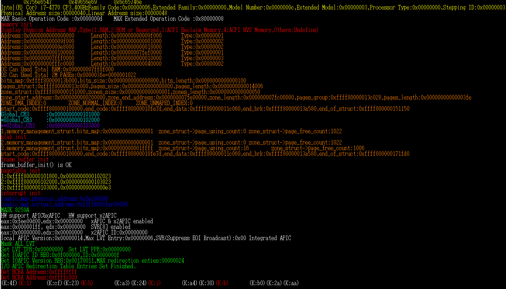
此為bochs虛擬機執行結果。

### 實現滑鼠驅動
滑鼠也是透過鍵盤控制器所控制，其初始化方法與鍵盤類似。唯一不同的是滑鼠的回傳數據為3byte，每個byte都有不同的意義，需要針對傳遞次數來決定數值的意義。
```
kernel/mouse.h

#define KBCMD_SENDTO_MOUSE      0xd4
#define MOUSE_ENABLE            0xf4
#define KBCMD_EN_MOUSE_INTFACE  0xa8

struct mouse_packet {
    unsigned char Byte0; // 7:Y overflow,6:X overflow,5:Y sign bit,4:X sign bit,3:Always,2:Middle Btn,1:Right Btn,0:Left Btn
    char Byte1;	// X movement
    char Byte2;	// Y movement
};

```
這裡定義了巨集與滑鼠數據包。其中巨集`KBCMD_SENDTO_MOUSE`表示向滑鼠設備發送數據的命令，`MOUSE_ENABLE`表示允許滑鼠發送數據包，`KBCMD_EN_MOUSE_INTFACE`為開啟滑鼠端口。
```
void mouse_init()
{
    struct IO_APIC_RET_entry entry;
    unsigned long i, j;

    ...

    register_irq(0x2c, &entry , &mouse_handler, (unsigned long)p_mouse, &mouse_int_controller, "ps/2 mouse");

    wait_KB_write();
    io_out8(PORT_KB_CMD, KBCMD_EN_MOUSE_INTFACE);

    for(i = 0; i < 1000; i++)
        for(j = 0; j < 1000; j++)
            nop();

    wait_KB_write();
    io_out8(PORT_KB_CMD, KBCMD_SENDTO_MOUSE);
    wait_KB_write();
    io_out8(PORT_KB_DATA, MOUSE_ENABLE);

    for(i = 0; i < 1000; i++)
        for(j = 0; j < 1000; j++)
            nop();

    wait_KB_write();
    io_out8(PORT_KB_CMD, KBCMD_WRITE_CMD);
    wait_KB_write();
    io_out8(PORT_KB_DATA, KB_INIT_MODE);
}
```
初始化大致與鍵盤相同。接著寫入RTE暫徂沁並註冊滑鼠中斷對應的0x2c中斷向量號，並將函式`mouse_handler`設為中斷處理函式。由於滑鼠將使用鍵盤控制器控制，每次輸入命令或參數時必須利用函式`wait_KB_write`確認輸入緩衝區是否已滿。並執行`nop`指令等待鍵盤控制器完成操作。
```
void analysis_mousecode()
{
    unsigned char x = get_mousecode();

    switch (mouse_count) {
        case 0:
            mouse_count++;
            break;

        case 1:
            mouse.Byte0 = x;
            mouse_count++;
            break;
        
        case 2:
            mouse.Byte1 = (char)x;
            mouse_count++;
            break;

        case 3:
            mouse.Byte2 = (char)x;
            mouse_count = 1;
            color_printk(RED, GREEN, "(M:%02x,X:%3d,Y:%3d)\n", mouse.Byte0, mouse.Byte1, mouse.Byte2);
            break;

        default:
            break;
    }
}
```
滑鼠數據的解碼就比較簡單，利用變數`mouse_count`確認回傳數據對應哪一個byte。  

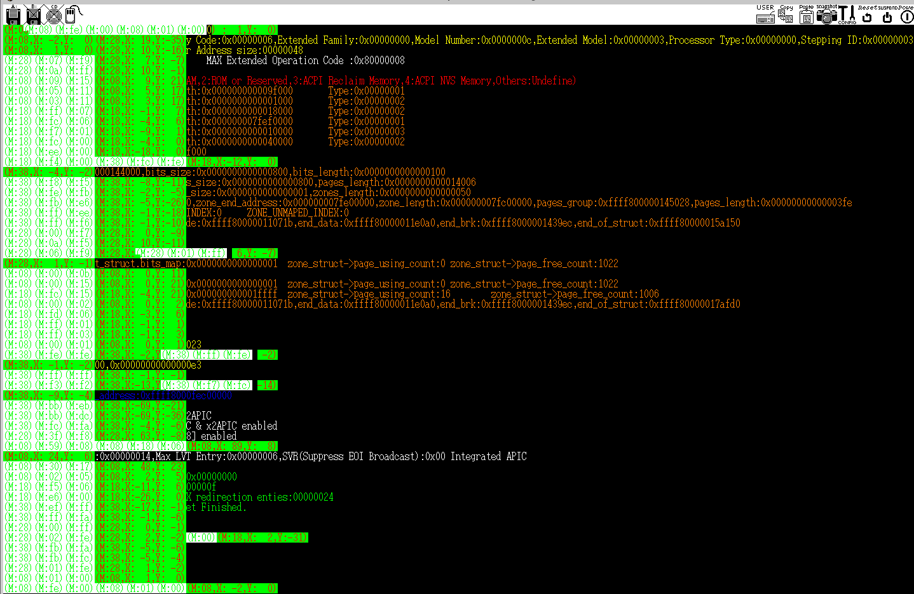
圖片為bochs虛擬機測試結果，測試時須將左上角的滑鼠按鈕打開否則滑鼠會沒有響應。  

## 硬碟驅動程式


STAT控制器用於操作硬碟與光碟等存儲設備，可透過ATA/ATAPI命令以操作存儲設備。為了兼容IDE(Integrated Drive Electronics，電子集成驅動器)介面的硬碟，SATA通常會支援IDE與AHCI操作模式，透過BIOS配置選項可在兩種模式中自由切換。  
IDE介面描述的為標準連接方式，ATA(Advanced Technology Attachment，AT附加設備)介面是這類硬碟的名子，以下為不同版本ATA規範的特點。  
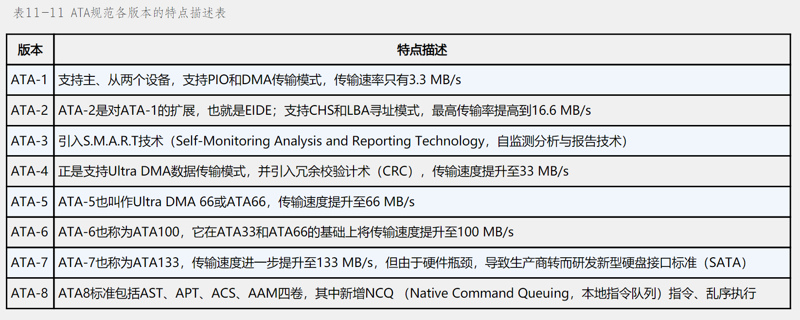

**ATA控制命令**  

ATA/ATAPI-8控制命令表

本書將透過IDE介面的PIO模式(Programming Input/Output Model，I/O端口編程模式)訪問硬碟設備，即通過I/O端口訪問。  
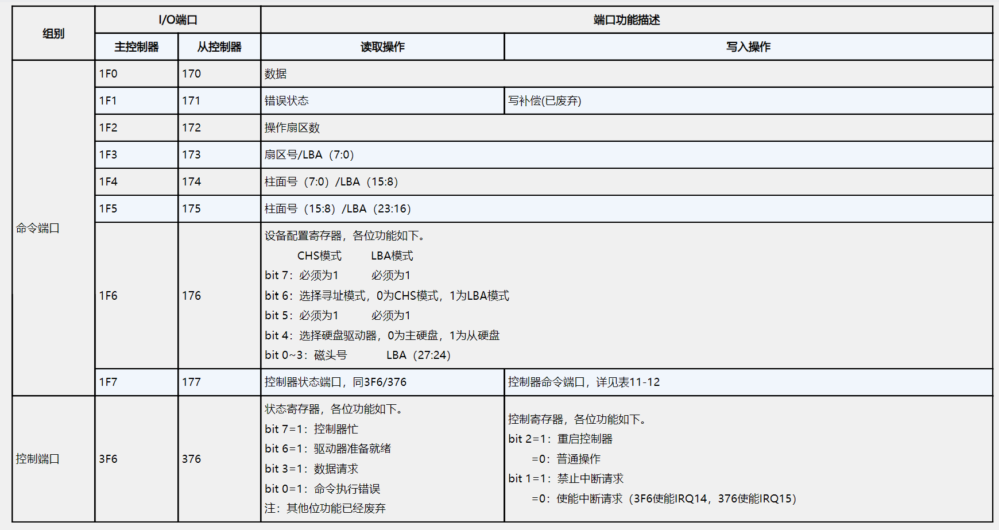

對於上表提及的錯誤狀態可用於描述命令錯誤狀態(執行命令時返回的錯誤)與診斷錯誤狀態(控制器自檢時返回的錯誤)。  
診斷錯誤狀態是系統通電或重啟時進入自檢狀態後，從I/O端口讀出的結果。  

I/O端口控制器並沒有指定特定的驅動器，可透過I/O端口1F6/176的第4位切換，以取得信息，每次只能操作一個驅動器。  

而命令錯誤狀態，則是在初始化完成並進入運行狀態時，透過1F1h取得的命令執行的錯誤狀態。  


### 取得硬碟設備識別信息
通過向I/跟h/177h寫入ECh命令即可獲取硬體設備識別信息，下表為ATA8規範的部分硬碟設備信息，這裡的字實際上就是2byte空間。  
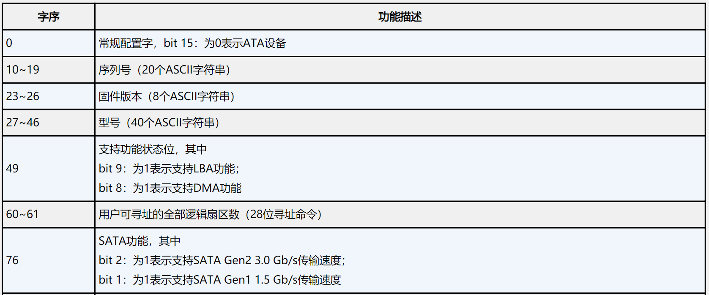

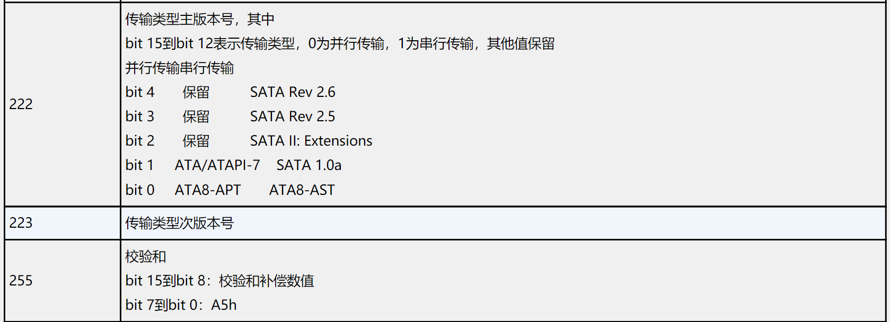

```
kernel/disk.h

#define PORT_DISK0_DATA          0x1f0
#define PORT_DISK0_ERR_FEATURE   0x1f1
#define PORT_DISK0_SECTOR_CNT    0x1f2
#define PORT_DISK0_SECTOR_LOW    0x1f3
#define PORT_DISK0_SECTOR_MID    0x1f4
#define PORT_DISK0_SECTOR_HIGH   0x1f5
#define PORT_DISK0_DEVICE        0x1f6
#define PORT_DISK0_STATUS_CMD    0x1f7

#define PORT_DISK0_ALT_STA_CTL   0x3f6

#define PORT_DISK1_DATA          0x170
#define PORT_DISK1_ERR_FEATURE   0x171
#define PORT_DISK1_SECTOR_CNT    0x172
#define PORT_DISK1_SECTOR_LOW    0x173
#define PORT_DISK1_SECTOR_MID    0x174
#define PORT_DISK1_SECTOR_HIGH   0x175
#define PORT_DISK1_DEVICE        0x176
#define PORT_DISK1_STATUS_CMD    0x177

#define PORT_DISK1_ALT_STA_CTL   0x376

#define DISK_STATUS_BUSY         (1 << 7)
#define DISK_STATUS_READY        (1 << 6)
#define DISK_STATUS_SEEK         (1 << 4)
#define DISK_STATUS_REQ          (1 << 3)
#define DISK_STATUS_ERROR        (1 << 0)
```
PORT系列的巨集為控制器1與控制器0所對應的命令與控制I/O端口。為了利於辨識這裡以定義巨集的形式代替數字輸入。而DISK_STATUS系列的巨集則用於表示讀取控制端口各位元的意義。
```
kernel/disk.c

void disk_init()
{
    struct IO_APIC_RET_entry entry;

    entry.vector = 0x2f; // 把硬碟的中斷設為0x2f
    entry.deliver_mode = APIC_ICR_IOAPIC_Fixed;
    entry.dest_mode = ICR_IOAPIC_DELV_PHYSICAL;
    entry.deliver_status = APIC_ICR_IOAPIC_Idle;
    entry.polarity = APIC_IOAPIC_POLARITY_HIGH;
    entry.irr = APIC_IOAPIC_IRR_RESET;
    entry.trigger = APIC_ICR_IOAPIC_Edge;
    entry.mask = APIC_ICR_IOAPIC_Masked;
    entry.reserved = 0;

    entry.destination.physical.reserved1 = 0;
    entry.destination.physical.phy_dest = 0;
    entry.destination.physical.reserved2 = 0;

    register_irq(0x2f, &entry, &disk_handler, 0, &disk_int_controller, "disk1"); // 註冊硬碟中斷

    io_out8(PORT_DISK1_ALT_STA_CTL, 0); // 啟用中斷。

    io_out8(PORT_DISK1_ERR_FEATURE, 0);
    io_out8(PORT_DISK1_SECTOR_CNT, 0); // 初始化(設定操作扇區數為0)
    io_out8(PORT_DISK1_SECTOR_LOW, 0); // LBA(7:0)
    io_out8(PORT_DISK1_SECTOR_MID, 0); // LBA(15:8)
    io_out8(PORT_DISK1_SECTOR_HIGH, 0); // LBA(23:16)
    io_out8(PORT_DISK1_DEVICE, 0xe0); // 設定為LBA模式，且選擇主硬碟為驅動目標。LBA(27:24)
    io_out8(PORT_DISK1_STATUS_CMD, 0xec); // 讀取硬碟識別資訊。
}

```
這段程式碼用於向APIC的RTE暫存器註冊中斷向量0x2f與中斷處理程式，並初始化硬碟狀態。首先輸入I/O端口`PORT_DISK1_ALT_STA_CTL`0x376輸入0表示執行普通操作並啟用中斷請求。`PORT_DISK1_ERR_FEATURE`此I/O端口的寫入操作書上說已廢棄可能是位兼容而留著。`PORT_DISK1_SECTOR_CNT`則初始化操作扇區數為0。  `PORT_DISK1_SECTOR_LOW`、`PORT_DISK1_SECTOR_MID`、`PORT_DISK1_SECTOR_HIGH`則用於設定操作扇區的起始LBA邏輯地址，這裡設為0。`PORT_DISK1_DEVICE`的輸入參數0xe0表示硬碟設備讀取方式為LBA，並且選擇主硬碟作為驅動目標，另外此參數的低4位用以表示LBA地址，這裡設為0。  
因此這一串指令的意義為，將驅動器的目標設為主硬碟，而操作硬碟的方式為LBA邏輯塊尋址，並將操作地址定義為第0扇區，操作的扇區數量責備初始化為0，同時啟用硬碟中斷。  
寫入`io_out8(PORT_DISK1_STATUS_CMD, 0xec)`後硬碟將發送中斷請求，並執行中斷處理函數。此時處理函數將可以取得由此控制命令所傳遞的硬碟識別資訊。  
```
kernel/disk.c

void disk_handler(unsigned long nr, unsigned long parameter, struct pt_regs *regs)
{
    int i = 0;
    struct Disk_Identify_Info a;
    unsigned short *p = NULL;
    port_insw(PORT_DISK1_DATA, &a, 256); // 讀取硬碟識別資訊。
    
    color_printk(ORANGE, WHITE, "\nSerial Number:");
    for(i = 0; i < 10; i++)
        color_printk(ORANGE, WHITE, "%c%c", (a.Serial_Number[i] >> 8) & 0xff, a.Serial_Number[i] & 0xff);
    
    color_printk(ORANGE, WHITE, "\nFirmware revision:");
    for(i = 0; i < 4; i++)
        color_printk(ORANGE, WHITE, "%c%c",(a.Firmware_Version[i] >> 8 ) & 0xff, a.Firmware_Version[i] & 0xff);
    
    color_printk(ORANGE, WHITE, "\nModel number:");
    for(i = 0; i < 20; i++)
        color_printk(ORANGE, WHITE, "%c%c", (a.Model_Number[i] >> 8) & 0xff, a.Model_Number[i] & 0xff);
    color_printk(ORANGE, WHITE, "\n");

    p = (unsigned short *)&a;
    for(i = 0; i < 256; i++)
        color_printk(ORANGE, WHITE, "%04x ", *(p+i));
}
```
目前個函式僅用於打印從控制命令0xec所返回的硬碟設備信息。此函數使用指令`port_insw`讀取從I/O端口0x170寫入的256字(512byte)的數據並存放在結構體`struct Disk_Identify_Info`中。

如果用bochs虛擬機模擬可能會遇到配置文件的問題，可以參考最下方的踩坑紀錄。

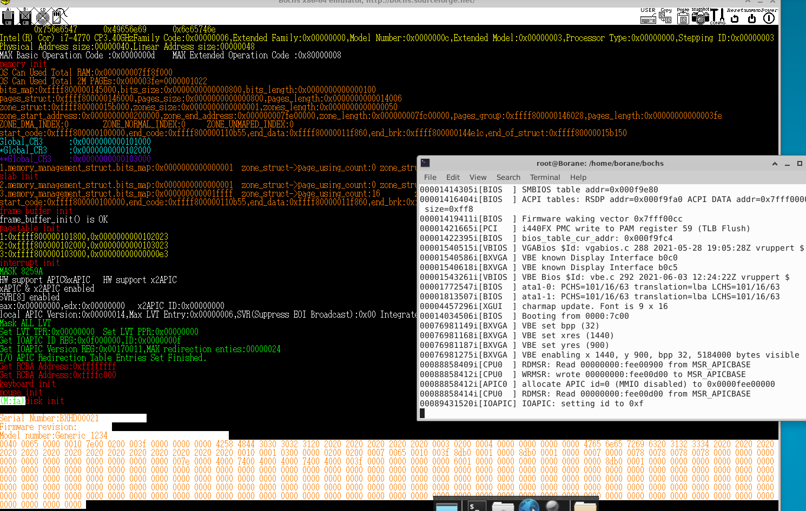
配置字信息與作者的不同是正常的。
以下為bochs官網在ata設備的描述。

bochs使用的版本為ata-6而書籍作者使用筆電的版本為ata-8在定義上有所不同。在bochs虛擬機模擬下配置字為0x0040，下圖為ata-6配置字定義。

0x0040 = 0b 0000 0000 0100 0000。bit15=0表示為ATA設備，bit8-14不使用，bit7=0表示為不可移動存儲設備，bit6官方文檔顯示Obsolete，bochs虛擬機保留這有可能是因為兼容性，bit2=0表示設備正常，因此0x40符合ATA-6規範。

### 訪問硬碟數據測試
```
void disk_init()
{
    ...
    io_out8(PORT_DISK1_ALT_STA_CTL, 0); // 啟用中斷。

    while (io_in8(PORT_DISK1_STATUS_CMD) & DISK_STATUS_BUSY);
    // 檢查硬碟是否處於忙碌狀態，無則退出循環
    color_printk(ORANGE, WHITE, "Read One Sector Starting:%02x\n", io_in8(PORT_DISK1_STATUS_CMD));

    io_out8(PORT_DISK1_DEVICE, 0xe0); // 設定為LBA模式，且選擇驅動器為主硬碟。
    io_out8(PORT_DISK1_ERR_FEATURE, 0);
    io_out8(PORT_DISK1_SECTOR_CNT, 1); // 讀取1扇區
    io_out8(PORT_DISK1_SECTOR_LOW, 0); // LBA(7:0)
    io_out8(PORT_DISK1_SECTOR_MID, 0); // LBA(15:8)
    io_out8(PORT_DISK1_SECTOR_HIGH, 0); // LBA(23:16)

    while(!(io_in8(PORT_DISK1_STATUS_CMD) & DISK_STATUS_READY)); // 等待驅動器準備完成
    
    color_printk(ORANGE, WHITE, "Send CMD:%02x\n", io_in8(PORT_DISK1_STATUS_CMD));
    io_out8(PORT_DISK1_STATUS_CMD, 0x20); // 讀取扇區
}
```
接著我們將指令更改為讀取扇區，在執行操作前需檢查硬碟是否處於忙碌狀態、驅動器是否準備完成，這兩步檢查可透過I/O端口1F7h、177h、3F6h、376h讀取，bit7代表控制器是否忙碌，bit6則表示驅動器使否準備完畢。將I/O端口`PORT_DISK1_SECTOR_CNT`讀取扇區數量設定為1，並發送控制命令0x20以實現讀取扇區(這是LBA 28位元尋址模式，如果要擴展至更大的容量需使用48位元此實用的命令是0x24)。
```
void disk_handler(unsigned long nr, unsigned long parameter, struct pt_regs *regs)
{
    int i = 0;
    unsigned char a[512];
    port_insw(PORT_DISK1_DATA, &a, 256); // 讀取一個扇區。
    
    color_printk(ORANGE, WHITE, "Read One Sector Finished:%02x\n", io_in8(PORT_DISK1_STATUS_CMD));
    for(i = 0; i < 512; i++)
        color_printk(ORANGE, WHITE, "%02x ",a[i]);
}
```
由於此時執行的操作式讀取硬碟扇區，刪除原先用於讀取設備信息的程式碼，並借助控制命令port_insw讀取512byte數據。

我在鏡像文件內未寫入任何內容，因此讀出的數據皆為0。

### 完善硬碟驅動程式

對於機械硬盤這類存儲設備的尋道時間往往比扇區的讀寫時間還長，並且寫操作的執行時間也較讀操作長。為了減少用於尋道的時間，Linux系統設計一套驅動結構模型，以縮短磁頭尋道時間為目標優化了扇區的操作流程。
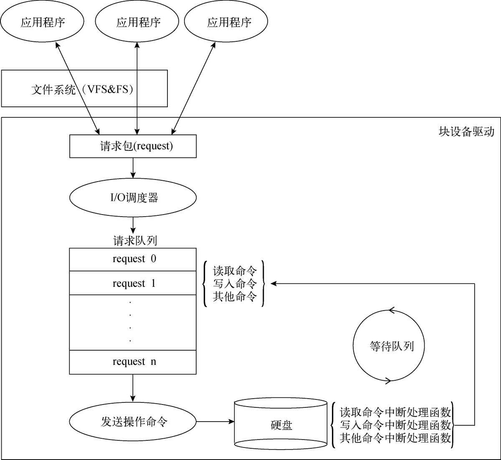


| 模組名          | 功能                                                                                       |
| --------------- | ----------------------------------------------------------------------------------------- |
| 應用程式        | 應用程式可訪問硬碟的文件或直接訪問扇區                                                               |
| 文件系統        | 用於管理硬碟內的文件，應用程序必須穿過虛擬文件系統(VFS)與文件系統(VS)才可以訪問文件                  |
| 塊設備驅動      | 應用程式與文件系統通過設備號調用塊設備驅動程式，將扇區操作請求發送道硬碟                             |
| 請求包(request) | 塊設備驅動程式將扇區操作封裝成請求包，每個請求包可以有多個請求，每個操作請求都可以追溯到對應的內存頁 |
| I/O調度器       | 根據請求包紀錄的扇區位置與讀寫方向，將請求插入道請求對列的合適位置，或將他與請求佇列的某個請求包合併 |
| 發送操作命令    | 硬碟驅動程式從請求佇列中提取請求包，並依照包的描述向硬碟發送操作命令及數據                           |
| 中斷處理函式    | 硬碟驅動程式根據操作命令，執行不同中斷處理程式的分支                                                 |
| 等待佇列        | 訪問硬碟屬於異步操作，向硬碟發送操作命令時，同時讓應用程式休眠，並在中斷處理函數中喚醒               |

塊設備驅動的I/O調度器由多種調度演算法組成，如Linux電梯調度演算法、Deadline調度演算法、Anticipatory調度演算法等。

在實際撰寫程式前，我們可以先規劃具體的實現步驟，釐清各函數的作用與調用關係。
在這個階段我們將建立以下函式。

| 函式          | 功能                                                                                   |
| ------------- | -------------------------------------------------------------------------------------- |
| disk_init     | 初始化硬碟註冊中斷處理調用函式。                                                       |
| disk_handler  | 硬碟中斷處理調用函式，調用end_handler所指向的函式。                                    |
| read_handler  | 讀取硬碟，被函式指針end_handler調用。                                                  |
| write_handler | 寫入硬碟，被函式指針end_handler調用。                                                  |
| other_handler | 目前僅支援查詢硬碟設備信息操作，被函式指針end_handler調用。                            |
| IDE_transfer  | 讀取、寫入硬碟操作的調用介面。   |
| IDE_ioctl     | 查詢硬碟設備信息的調用介面。                       |
| make_request  | 建立請求包。                   |
| submit        | 調用add_request將請求包添加到請求佇列。              |
| add_request   | 添加請求包到請求佇列。          |
| cmd_out       | 執行請求包並硬碟操作命令。       |
| end_request   | 宣告請求標執行完畢。 |

我們用一個實際的例子解釋調用關係。  
任何硬碟操作將從`IDE_device_operation`開始，假設我希望寫入一個扇區將會調用`IDE_device_operation.transfer`函式指針，這個指針指向`IDE_transfer`。`IDE_transfer`將調用`make_request`以建立請求包，取得請求包後調用`submit`將請求包送入請求佇列，同時`submit`將檢查當前是否有請求包正在被執行，若無則調用`cmd_out`向I/O端口輸入硬碟操作命令。如果當前有請求包正在被執行，則調用`wait_for_finish`等待請求包執行完成。  
當硬碟操作命令執行完成後會觸發中斷，此時APIC向CPU傳送中斷，CPU將根據中斷向量號調用處理函式`disk_handler`。`disk_handler`將從請求佇列中取得處理中的請求包，並調用請求包的函式指針`end_handler`。`end_handler`完成操作後將調用`end_request`已釋放請求包與更新變量`disk_flags`通知系統請求包已執行完成，最後檢查是否有請求包尚未執行完成並調用`cmd_out`執行下一個請求包。  

```
kernel/disk.h

// LBA採用48位尋址模式
#define ATA_READ_CMD            0x24
#define ATA_WRITE_CMD           0x34
#define GET_IDENTIFY_DISK_CMD   0xEC

struct block_buffer_node {
    unsigned int count;
    unsigned char cmd; // 執行命令
    unsigned long LBA; // 48位元LBA地址
    unsigned char *buffer; // 對應內存位
    void(*end_handler)(unsigned long nr, unsigned long parameter); // 後續處理方法
    struct List list;
};

struct request_queue {
    struct List queue_list; // 請求佇列
    struct block_buffer_node *in_using; // 處理中的請求
    long block_request_count; // 剩餘請求數量
};

struct request_queue disk_request;
struct block_device_operation IDE_device_operation;
```
如果硬碟大小大於128GB則需使用48位元LBA尋址模式，本書考慮到應用硬碟容量大小，將所有硬碟讀寫操作設定為48位元LBA尋址模式。結構體`struct block_buffer_node`為封裝後的請求包用於紀錄硬碟的操作方法、操作的扇區數量、目標LBA地址、與對應的讀寫內存地址和後續的處理函式。`struct request_queue`此結構體則作為請求佇列使用。  
```
kernel/block.h

struct block_device_operation {
    long (*open)();
    long (*close)();
    long (*ioctl)(long cmd, long arg);
    long (*transfer)(long cmd, unsigned long blocks, long count, unsigned char * buffer);
};

```
結構體block_device_operation為封裝硬碟操作的統一介面。  
```
kernel/disk.c

struct block_device_operation IDE_device_operation = {
    .open = IDE_open,
    .close = IDE_close,
    .ioctl = IDE_ioctl,
    .transfer = IDE_transfer
};
```
這個封裝結構體open與close用於啟用與關閉驅動程式、ioctl則用於傳遞控制命令(目前僅設定為讀取硬碟設備信息)、transfer則為實際處理硬碟訪問的處理函式。  
```
kernel/disk.c
long IDE_transfer(long cmd, unsigned long blocks, long count, unsigned char * buffer)
{
    struct block_buffer_node *node = NULL;
    if(cmd == ATA_READ_CMD || cmd == ATA_WRITE_CMD) {
        // 僅硬碟讀寫命令才操作
        node = make_request(cmd, blocks, count, buffer); // 建立請求包
        submit(node); // 提交請求包
        wait_for_finish(); // 等待
    } else {
        return 0;
    }
    return 1;
}
```
`IDE_transfer`目前僅能處理硬碟讀寫兩種命令。`IDE_transfer`函式會透過呼叫`make_request`來建立請求包，接著乎呼叫`submit(node)`提交請求包到請求佇列中。由於目前作業系統尚未實現任務喚醒與休眠，`wait_for_finish`將執行`nop`指令等待硬碟操作處理完成。  
```
kernel/disk.c

struct block_buffer_node *make_request(long cmd, unsigned long blocks, long count, unsigned char *buffer)
{
    struct block_buffer_node *node = (struct block_buffer_node*)kmalloc(sizeof(*node), 0);
    list_init(&node->list);
    switch (cmd) {
        case ATA_READ_CMD:
            node->end_handler = read_handler;
            node->cmd = ATA_READ_CMD;
            break;
        case ATA_WRITE_CMD:
            node->end_handler = write_handler;
            node->cmd = ATA_WRITE_CMD;
            break;
        default:
            node->end_handler = other_handler; // 目前僅有硬碟設備信息讀取命令
            node->cmd = cmd;
            break;
    }
    node->LBA = blocks;
    node->count = count;
    node->buffer = buffer;
    return node;
}
```
這段程式碼用於建立請求包。
```
kernel/disk.c

void submit(struct block_buffer_node *node)
{	
	add_request(node);
	
	if(disk_request.in_using == NULL)
		cmd_out();
}
```
這一段程式碼用於向請求佇列添加請求包，並偵測是否有處理中的請求，若沒有就執行`cmd_out`從請求對列提取請求並執行。  
```
kernel/disk.c

long cmd_out()
{
    struct block_buffer_node *node = disk_request.in_using = container_of(list_next(&disk_request.queue_list), struct block_buffer_node, list);
    list_del(&disk_request.in_using->list); // 從循環佇列中刪除
    disk_request.block_request_count--;

    while(io_in8(PORT_DISK0_STATUS_CMD) & DISK_STATUS_BUSY)
        nop(); // 等待硬碟

    switch (node->cmd) {
        case ATA_WRITE_CMD:	

            io_out8(PORT_DISK0_DEVICE, 0x40);

            io_out8(PORT_DISK0_ERR_FEATURE, 0);
            io_out8(PORT_DISK0_SECTOR_CNT, (node->count >> 8) & 0xff);
            io_out8(PORT_DISK0_SECTOR_LOW , (node->LBA >> 24) & 0xff);
            io_out8(PORT_DISK0_SECTOR_MID , (node->LBA >> 32) & 0xff);
            io_out8(PORT_DISK0_SECTOR_HIGH, (node->LBA >> 40) & 0xff);

            io_out8(PORT_DISK0_ERR_FEATURE,0);
            io_out8(PORT_DISK0_SECTOR_CNT, node->count & 0xff);
            io_out8(PORT_DISK0_SECTOR_LOW, node->LBA & 0xff);
            io_out8(PORT_DISK0_SECTOR_MID, (node->LBA >> 8) & 0xff);
            io_out8(PORT_DISK0_SECTOR_HIGH, (node->LBA >> 16) & 0xff);

            while(!(io_in8(PORT_DISK0_STATUS_CMD) & DISK_STATUS_READY))
                nop();
            io_out8(PORT_DISK0_STATUS_CMD, node->cmd); // 發送ATA命令

            while(!(io_in8(PORT_DISK0_STATUS_CMD) & DISK_STATUS_REQ))
                nop();
            port_outsw(PORT_DISK0_DATA, node->buffer, 256); // 寫入緩衝區
            break;

        case ATA_READ_CMD:

            io_out8(PORT_DISK0_DEVICE, 0x40);

            io_out8(PORT_DISK0_ERR_FEATURE,0);
            io_out8(PORT_DISK0_SECTOR_CNT,(node->count >> 8) & 0xff);
            io_out8(PORT_DISK0_SECTOR_LOW ,(node->LBA >> 24) & 0xff);
            io_out8(PORT_DISK0_SECTOR_MID ,(node->LBA >> 32) & 0xff);
            io_out8(PORT_DISK0_SECTOR_HIGH,(node->LBA >> 40) & 0xff);

            io_out8(PORT_DISK0_ERR_FEATURE,0);
            io_out8(PORT_DISK0_SECTOR_CNT,node->count & 0xff);
            io_out8(PORT_DISK0_SECTOR_LOW,node->LBA & 0xff);
            io_out8(PORT_DISK0_SECTOR_MID,(node->LBA >> 8) & 0xff);
            io_out8(PORT_DISK0_SECTOR_HIGH,(node->LBA >> 16) & 0xff);

            while(!(io_in8(PORT_DISK0_STATUS_CMD) & DISK_STATUS_READY))
                nop();
            io_out8(PORT_DISK0_STATUS_CMD,node->cmd);
            break;
            
        case GET_IDENTIFY_DISK_CMD:

            io_out8(PORT_DISK0_DEVICE, 0xe0);
            
            io_out8(PORT_DISK0_ERR_FEATURE, 0);
            io_out8(PORT_DISK0_SECTOR_CNT, node->count & 0xff);
            io_out8(PORT_DISK0_SECTOR_LOW, node->LBA & 0xff);
            io_out8(PORT_DISK0_SECTOR_MID, (node->LBA >> 8) & 0xff);
            io_out8(PORT_DISK0_SECTOR_HIGH, (node->LBA >> 16) & 0xff);

            while(!(io_in8(PORT_DISK0_STATUS_CMD) & DISK_STATUS_READY))
                nop();			
            io_out8(PORT_DISK0_STATUS_CMD, node->cmd);

        default:
            color_printk(BLACK,WHITE,"ATA CMD Error\n");
            break;
    }
    return 1;
}
```
函式`cmd_out`將根據請求包命令決定處理方法，目前僅支援硬碟寫入扇區、讀取扇區與取得設備信息。  

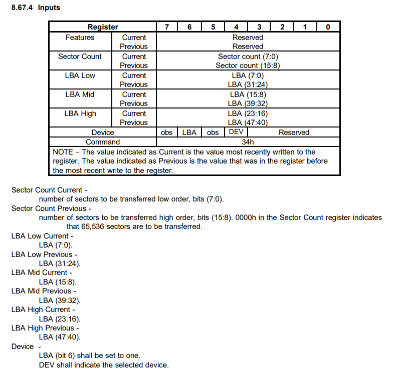
這是控制命令0x34(48位元尋址模式)的暫存器配置，由於暫存器僅有8位元執行命令前將LBA地址拆成兩部分並填入LBA Low、LBA Mid、LBA High暫存器。  
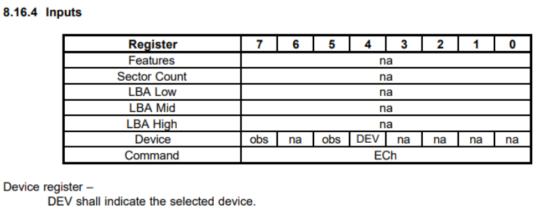
這是控制命令0xec用於取得硬碟設備信息，根據在ATA6文件中的描述這個命令只需要設定device暫存器就好。而作者為什麼透過I/O端口向LBA等等的暫存器賦值，可能是因為要統一操作。實際上那些賦值得操作我認為可以刪除，在bochs虛擬機上測試並不會產生影響。  
```
kernel/disk.c

void disk_handler(unsigned long nr, unsigned long parameter, struct pt_regs *regs)
{
    struct block_buffer_node *node = ((struct request_queue *)parameter)->in_using;
    node->end_handler(nr, parameter);
}
```
此為註冊在IDT上的處理函式，APIC傳送中斷給CPU後調用。這個函式調用請求包的end_handler。目前僅實現`read_handler`、`write_handler`、`other_handler`三個函式，分別對應讀取、寫入與打印硬碟設備識別信息。  
```
kernel/disk.c

void read_handler(unsigned long nr, unsigned long parameter)
{
    struct block_buffer_node *node = ((struct request_queue*)parameter)->in_using;
    
    if(io_in8(PORT_DISK0_STATUS_CMD) & DISK_STATUS_ERROR)
        color_printk(RED, BLACK, "read_handler:%#010x\n", io_in8(PORT_DISK0_ERR_FEATURE));
    else
        port_insw(PORT_DISK0_DATA, node->buffer, 256);
    end_request();
}

void write_handler(unsigned long nr, unsigned long parameter)
{
    if(io_in8(PORT_DISK0_STATUS_CMD) & DISK_STATUS_ERROR)
        color_printk(RED, BLACK, "write_handler:%#010x\n", io_in8(PORT_DISK0_ERR_FEATURE));

    end_request();
}

void other_handler(unsigned long nr, unsigned long parameter)
{
    struct block_buffer_node *node = ((struct request_queue *)parameter)->in_using;

    if(io_in8(PORT_DISK0_STATUS_CMD) & DISK_STATUS_ERROR)
        color_printk(RED, BLACK, "other_handler:%#010x\n", io_in8(PORT_DISK0_ERR_FEATURE));
    else
        port_insw(PORT_DISK0_DATA, node->buffer, 256);
    end_request();
}
```
這是3個處理函式的具體實現，在`read_handler`與`other_handler`中會調用`port_insw`從I/O端口取得從硬碟讀取的信息。所有處理函數最終會調用`end_request`來宣告操作請求執行完畢。  
```
kernel/disk.c

void disk_init()
{
    struct IO_APIC_RET_entry entry;
    entry.vector = 0x2e;
    entry.deliver_mode = APIC_ICR_IOAPIC_Fixed;
    entry.dest_mode = ICR_IOAPIC_DELV_PHYSICAL;
    entry.deliver_status = APIC_ICR_IOAPIC_Idle;
    entry.polarity = APIC_IOAPIC_POLARITY_HIGH;
    entry.irr = APIC_IOAPIC_IRR_RESET;
    entry.trigger = APIC_ICR_IOAPIC_Edge;
    entry.mask = APIC_ICR_IOAPIC_Masked;
    entry.reserved = 0;

    entry.destination.physical.reserved1 = 0;
    entry.destination.physical.phy_dest = 0;
    entry.destination.physical.reserved2 = 0;

    register_irq(0x2e, &entry, &disk_handler, (unsigned long)&disk_request, &disk_int_controller, "disk0"); // 註冊硬碟中斷

    io_out8(PORT_DISK0_ALT_STA_CTL, 0); // 啟用中斷。

    list_init(&disk_request.queue_list);
    disk_request.in_using = NULL;
    disk_request.block_request_count = 0;
    disk_flags = 0;

}
```
最後將修改初始化函式，並將請求佇列地址作為參數註冊到APIC中，並初始化請求佇列與相關全局變量。
以下為測試環節。  
```
void Start_Kernel(void)
{
    char buf[512];
    ...
    color_printk(PURPLE, BLACK,"disk write:\n");
    memset(buf, 0x44, 512);
    IDE_device_operation.transfer(ATA_WRITE_CMD, 15, 1, (unsigned char*)buf);

    color_printk(PURPLE, BLACK,"disk read:\n");
    memset(buf, 0x00, 512);
    IDE_device_operation.transfer(ATA_READ_CMD, 15, 1, (unsigned char*)buf);

    for(i = 0 ;i < 512 ; i++)
       color_printk(BLACK, WHITE, "%02x", buf[i]);

    color_printk(PURPLE, BLACK, "\ndisk read end\n");
    ...
}
```
這裡向LBA地址15寫入一個扇區的資料，並讀取。  
在這一步可能會遇到編譯器與bochs虛擬機模擬的問題，解決方法我放在最下面的踩坑紀錄中。  

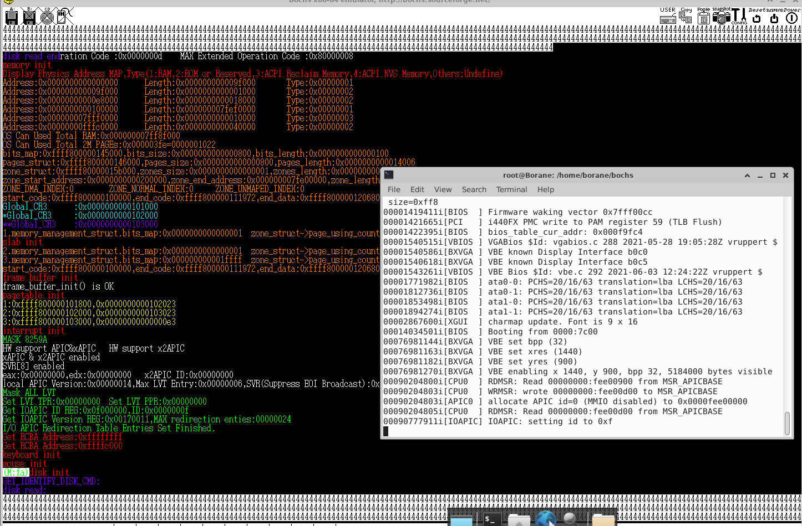
圖片為bochs虛擬機的執行結果可看到扇區可正常寫入與讀取。

## 踩坑紀錄
### bochs設定問題
如果根據作者所提供的.bochsrc文件模擬硬碟讀取將會出現以下問題。  
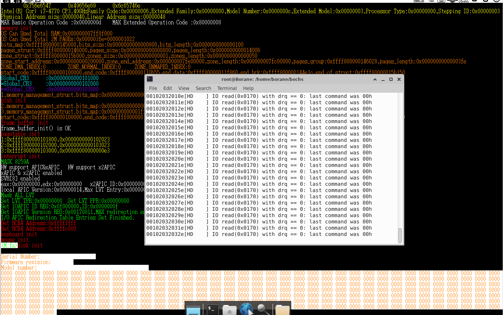
此為在bochs虛擬機的執行結果，從bochs回報的信息DRQ==0代表設備沒準備號傳輸數據，並且bochs發送給硬碟控制器的命令為0x00這不是任何有效的ATA指令，這是因為.bochsrc文件中沒有配置硬碟。  
以下內容節錄自作者提供的.bochsrc檔案。  
```
.bashrc
...
ata0: enabled=1, ioaddr1=0x1f0, ioaddr2=0x3f0, irq=14
ata0-master: type=none
ata0-slave: type=none
ata1: enabled=1, ioaddr1=0x170, ioaddr2=0x370, irq=15
ata1-master: type=none
ata1-slave: type=none
...
```
硬碟驅動器ata0與ata1雖有開啟，但是type=none表示尚未搭載任何的硬碟設備，因此我們需要手動新增鏡像文件以提供bochs模擬硬碟設備。  
```
.bashrc
...
ata0: enabled=1, ioaddr1=0x1f0, ioaddr2=0x3f0, irq=14
ata0-master: type=disk, path="disk1.img", mode=flat, translation=lba
ata0-slave: type=disk, path="disk2.img", mode=flat, translation=lba
ata1: enabled=1, ioaddr1=0x170, ioaddr2=0x370, irq=15
ata1-master: type=disk, path="disk3.img", mode=flat
ata1-slave: type=disk, path="disk4.img", mode=flat
...
```
另外這裡的mode=flat表示讓bochs將硬碟看成連續二進制文件，鏡像檔的內容會直接映射到虛擬機的虛擬硬碟，並不做任何額外處理。translation=lba則是希望bochs以lba模式尋址。  
接著建立鏡像文件`disk.img`，以下為bximage建立鏡像文件的設定，將鏡像文件放入bochs模擬即可。  
```
Do you want to create a floppy disk image or a hard disk image?
Please type hd or fd. [hd] hd

What kind of image should I create?
Please type flat, sparse, growing, vpc or vmware4. [flat] flat

Choose the size of hard disk sectors.
Please type 512, 1024 or 4096. [512] 512

Enter the hard disk size in megabytes, between 10 and 8257535
[10] 50

What should be the name of the image?
[c.img] disk1.img

```
設定完成後即可正常運作。  

### 編譯器問題

假設使用的編譯器與我的版本相同為gcc version 11.4.0，執行作者提供的程式碼會出現以下問題。

注意看下面出現的錯誤信息。RIP指針的地址為0x00。這表示結構體`IDE_device_operation`所封裝的函式指針沒有正確指向處理函式。這是因為作者在disk.h中有以下宣告。  
```
kernel/disk.h
struct block_device_operation IDE_device_operation;
```
而在disk.c中則宣告並初始化IDE_device_operation。  
```
kernel/disk.c
struct block_device_operation IDE_device_operation = {
    .open = IDE_open,
    .close = IDE_close,
    .ioctl = IDE_ioctl,
    .transfer = IDE_transfer
};
```
disk.c的IDE_device_operation由於有初始化所以屬於強定義，而disk.h僅有宣告IDE_device_operation為弱定義。  
在main.c中會使用頭文件disk.h，因此產生的目標文件會包括IDE_device_operation符號(弱定義)。  
Linux環境下，鏈結器linker會根據以下規則處理多重定義的符號名:  
>規則1:不允許有多個強符號。  
>規則2:如果有一個強符號與多個弱符號則使用強符號。  
>規則3:如果只有多個弱符號，則從這些弱符號中取一個。  

根據上面的規則以作者的寫法disk.c的`IDE_device_operation`屬於強定義，因此所有的`IDE_device_operation`都要定位到到disk.c的這一個定義。  
但是現代gcc編譯器默認-fno-common選項，這代表每一個全局變量都會被視為一個獨特的定義(我還不清楚編譯過程為何沒出現多重定義錯誤)。
如果我們分別打印main.c與disk.c的`IDE_device_operation.transfer`會發現兩者的地址並不相同。反組譯system後可看到disk.c這一個指針指向函式`IDE_transfer`的地址，而main.c的則指向地址0處。  
以下為我的解決方法:  
>1.刪除disk.h中的宣告struct block_device_operation IDE_device_operation;  
>2.在會調用硬碟操作的檔案中添加extern struct block_device_operation IDE_device_operation;  

修改完畢後可以解決錯誤信息。
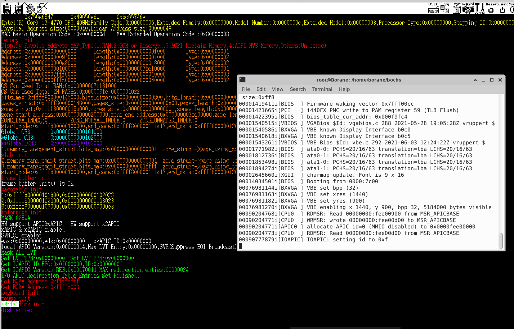
此為bochs的執行結果，屏幕上並無跳出錯誤信息。但仔細觀察輸出結果螢幕上並沒有正常打印出扇區讀取的信息，這個問題放到下一個區塊再討論。  

### bochs模擬環境硬碟操作問題
上一區塊中我們看到扇區並沒有正常讀取，檢查暫存器的值可以發現rip停在ffff8000_001115ff。  
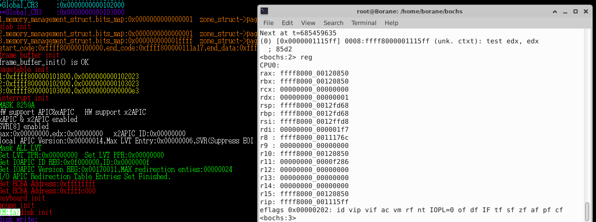
反組譯system後可以觀察到以下結果。  
```
ffff8000001115c2 <wait_for_finish>:
...
ffff8000001115ff:	85 d2                	test   %edx,%edx
ffff800000111601:	75 ee                	jne    ffff8000001115f1 <wait_for_finish+0x2f>
ffff800000111603:	90                   	nop
ffff800000111604:	90                   	nop
...
```
機械碼對應的程式碼為:  
```
void wait_for_finish()
{
    disk_flags = 1;
    while (disk_flags)
        nop();
}
```
這樣問題就找到了由於`disk_flags`的值為1使得程式碼無法脫離`while (disk_flags)`的循環。那問題來了是甚麼原因導致`disk_flags`無法歸0?  
硬碟執行完請求包指定的操作後會傳遞中斷信號給CPU，而CPU執行中斷處理函式的尾聲會調用`end_request`。  
```
void end_request()
{
	kfree((unsigned long *)disk_request.in_using);
	disk_request.in_using = NULL;

	disk_flags = 0;

	if(disk_request.block_request_count)
		cmd_out();
}
```
所以在`wait_for_finish`設定的`disk_flags = 1;`應當在`end_request`執行`disk_flags = 0;`歸零。那為什麼`disk_flags`的值始終為1?  
如果我們追蹤程式碼的執行可發覺`end_request`是有執行的，而`disk_flags`也有歸零過。這樣我們就找到了問題所在，在作者的程式碼中有一個假設函式調用`wait_for_finish`始終在中斷處理函式發生後`disk_handler`，觀察以下程式碼:  
```
long IDE_transfer(long cmd, unsigned long blocks, long count, unsigned char *buffer)
{
    struct block_buffer_node *node = NULL;
  
    if(cmd == ATA_READ_CMD || cmd == ATA_WRITE_CMD) {
        node = make_request(cmd, blocks, count, buffer);
        submit(node);
        wait_for_finish();
    } else {
        return 0;
    }
    return 1;
}
```
`submit`函式可在請求佇列無執行中的請求包時，調用`cmd_out`透過I/O端口發送操作命令給硬碟。假設硬碟處理的速度非常快那中斷有可能在調用`wait_for_finish`前發生使得`wait_for_finish`無法跳出等待的循環。機械硬碟的尋道時間大約為5-10ms，作者這種寫法可以在物理機上運行，這個執行時間足以讓函式進入`wait_for_finish`中並執行`nop()`等待中斷處理函式執行`disk_flags = 0;`。但是bochs虛擬機中默認的模擬硬碟的執行速度非常快，這就導致了`disk_flags = 0;`發生在調用`wait_for_finish`前。  
解決方法為調整程式碼讓`disk_flags = 1;`始終發生在`disk_flags = 0;`前。
```
long cmd_out()
{
    ...
    disk_flags = 1;
    ...
}

void wait_for_finish()
{
    while (disk_flags)
        nop();
}
```
由於函式`cmd_out`會向硬碟發送操作命令，因此在這裡設置`disk_flags = 1`可以保證程式執行順序不會出錯。  
但需要注意的是這不是正確解法，這只是妥協而已，實際上`disk_flags`的操作應該要轉化成讓任務休眠，並在中斷時恢復這個任務。但在這個階段作業系統尚未完成，沒辦法自由控制任務切換、休眠與喚醒，不得已只能做出這個替代方案。  
