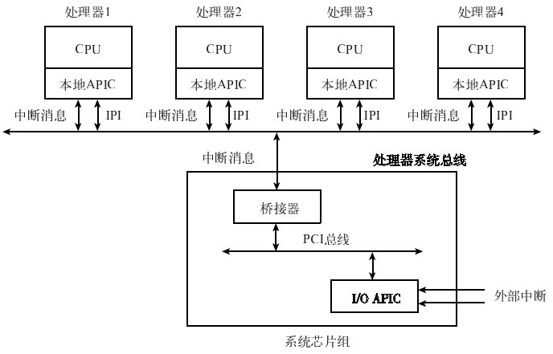
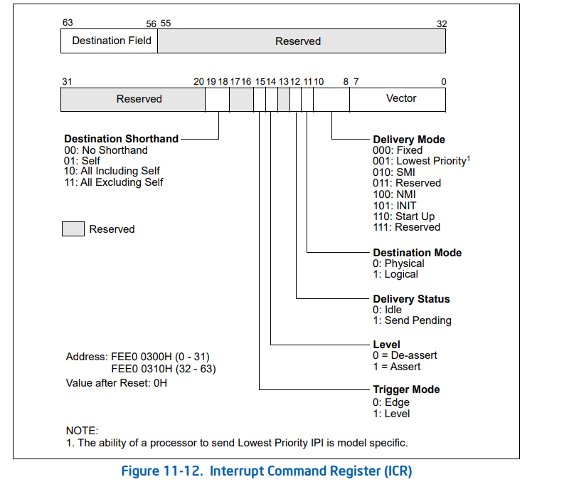
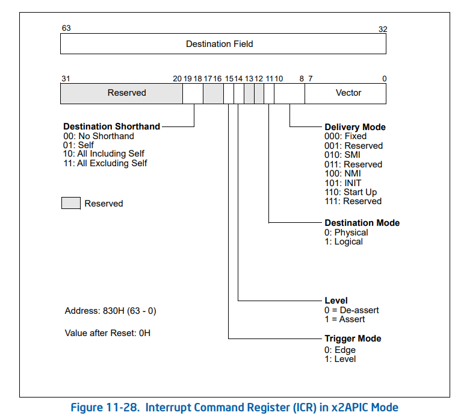
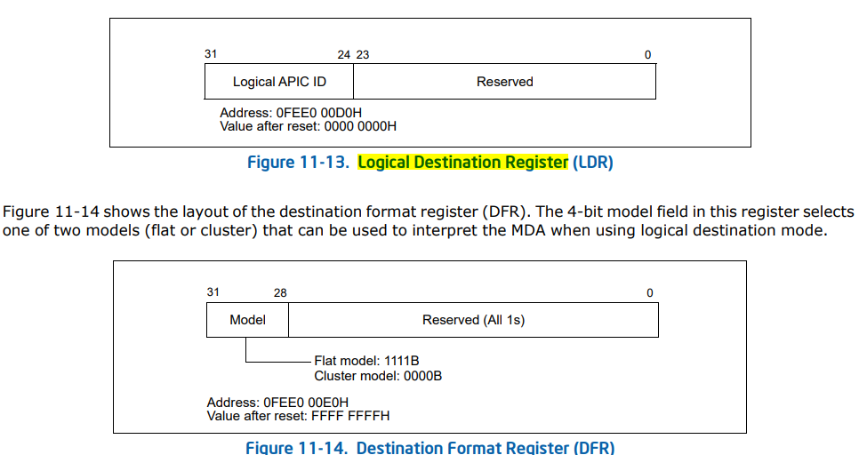
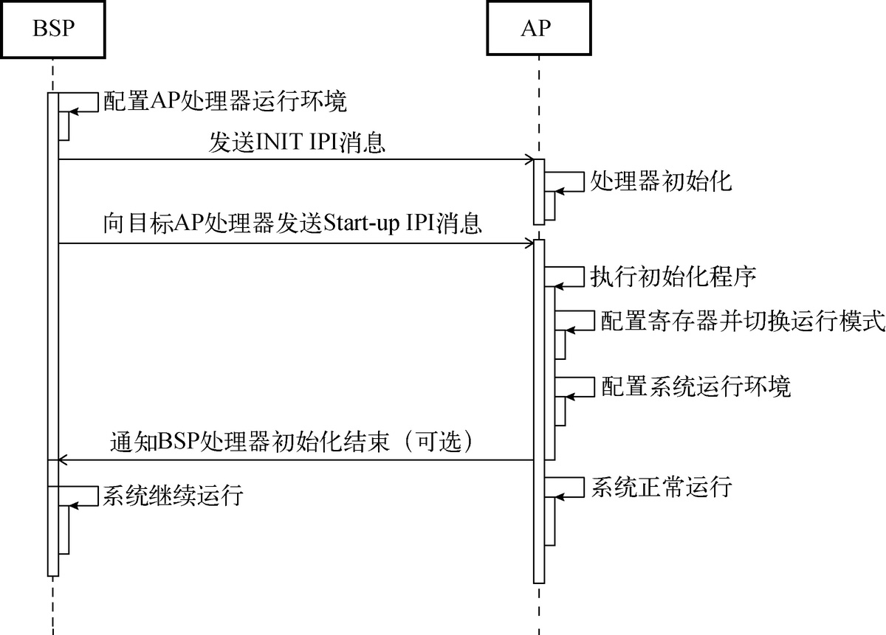
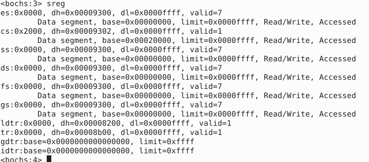

# <<一個64位操作系統的設計與實現>> 第十二章 行程管理(process management) 學習筆記

在這章之前的章結都是描述單核環境下的程式執行。從這章開始則需討論行程的同步與調度。  

## 多核處理器
### 多核基本概念
>由於在繁體中文中kernel譯為核心，為了區分multi-core與multi-kernel，前者將翻譯成多核與中國大陸的用詞相同。  

在Intel x86體系下多處理功能晶片經過4個階段演變，分別為對稱式多處理器結構(SMP Architecture)、超執行緒(Hyper Threading)、多核結構(Multi-coreArchitecture)、多核超執行緒(Multi-core Hyper Threading Architecture)結構。  
請注意這裡多處理器指的是一個體系結構上放置多個處理器(CPU)，而多核則是指在同一個處理器上放置多個執行單元(core，核)，兩者有所區別。

**超執行緒**
雖然多處理器結構透過安裝多個CPU以提升計算機的性能，但實際上CPU單元並沒有得到充分利用。比如處理器遇到總線/內存瓶頸(頻寬有限)就會使得CPU使用率下降從而影響執行性能。此外這一時期大多數的執行緒並缺乏ILP(Instruction-Level Parallelism，指令層級平行)支持，這使得CPU性能無法完全發揮。為了進一步發揮處理器性能，Intel提出了超執行緒技術讓一個CPU可同時執行多執行緒從而提高處理器執行效能。  
超執行緒技術可讓兩個邏輯處理單元(Logical Processor)融入到一個處理器核心內，這兩個邏輯處理單元大部分的暫存器與功能互相獨立，但是他們共享同一個執行引擎(Execution Engine)、處理器快取(L1、L2 Cache)、與總線接口。由於執行引擎只有一個所以這兩個邏輯處理單元的任務只能並行(Concurrency)處理(請注意這裡是並行而非平行Parallelism)。

表一、邏輯處理單元獨享的硬體資源  
| 硬體資源           | 暫存器名稱                                     |
| ------------------ | ---------------------------------------------- |
| 通用暫存器         | RAX、RBX、RCX、RDX、RSI、RDI、RSP、RBP、R8-R15 |
| 段暫存器           | CS、DS、FS、SS、ES、GS                         |
| x87 FPU暫存器組    | ST0-ST7                                        |
| MMX暫存器組        | MM0-MM7                                        |
| XMM暫存器組        | XMM0-XMM15                                     |
| YMM暫存器組        | YMM0-YMM15                                     |
| 控制暫存器組       | CR0-CR15(部分暫存器無效)                       |
| 系統表暫存器       | GDTR、LDTR、IDTR、TR                           |
| 調適暫存器         | DR0-DR15(部分暫存器無效)                       |
| 標誌暫存器         | RFLAGS                                         |
| 指令指標暫存器     | RIP                                            |
| Local APIC暫存器組 | 這裡不一一列舉                                      |
| MSR暫存器          | 大部分獨享                                     |

一部分的MSR暫存器與MTRR(Memory Type Range Register)暫存器組將被兩個邏輯處理單元共享使用。  
超執行緒技術特的關鍵就是充分利用那些閒置的資源，當處理器執行程式碼時往往不會使用到所有的運算能力，這使得部分運算能力處於閒置狀態。比如一個執行緒遇到缺頁異常(Page Fault)而需要等待數據慢慢加載到快取中才可以繼續執行，此時就可以切換到另外一個邏輯處理單元去處理其他的執行緒而不用等待I/O執行完畢。  
另外雖然這個技術可以同時執行兩個執行緒，但如果兩個執行緒同時需要利用某一個資源時，其中一個就必須停止並讓出資源直到資源閒置後才能繼續，此外這兩個邏輯單元共享同一個快取、這意味著超執行緒技術會增加快取未命中(Cache Miss)的機率，所以超執行緒的性能仍然比不上兩個CPU的性能。  

**多核結構與多核超執行緒結構**
多核結構就是在同一個CPU晶片上中放置兩個執行核，及兩套執行單元，如ALU、FPU與L2 Cache等。由於加入了多個執行核因此他的指令是真正的平行，而非超執行緒的使用閒置資源。而多核超執行緒就是整合多核與超執行緒技術將每個執行核分成為兩個或多個邏輯執行單元，在硬體上實現多任務的平行處理。  

### 多處理器計算機的啟動過程
在處理器啟動時，硬體系統將選擇一個邏輯處理單元當作引導處理器(Bootstrap Processor, BSP)而其他邏輯處理單元將當作應用處理器(Application Processor, AP）使用，兩類處理器的功能如下。
**BSP**:負責執行引導程式並配置APIC執行環境、系統運行環境、初始化並啟動AP。IA32＿APIC＿BASE.BSP[8]用於決定BSP處理器，任何時刻只能有一個處理單元的BSP標誌位被置位，此處理器就是BSP。
**AP**:AP邏輯處理單元將完成最小的自我配置動作，隨後等待BSP發送Start-up IPI信息。當AP處理器接收到Start-up IPI時將依據此信息提供的引導程式地址開始執行。

每個邏輯處理單元都有為APIC ID值，這個值依據APIC控制器版本可分為8位(CPUID.01h:EBX[31:24])與32位(X2APIC模式，CPUID.0Bh:EDX)。  


<p class="text-center">
圖一、APIC ID
</p>

表二、APIC ID結構

| 名稱                   | 功能                                                               |
| ---------------------- | ------------------------------------------------------------------ |
| 簇ID，Cluster ID       | 在多處理器環境中，可能會有多個CPU組成一個簇                        |
| 包ID，Package ID       | 一個包代表一個多處理器系統兩個或多個核組成                         |
| 核ID，Core ID          | 一個核可具有一個或是多個邏輯處理單元，這些邏輯處理單元共享執行引擎 |
| 同時多執行緒ID，SMT ID | 一個邏輯處理單元                                                   |

APIC ID的結構不一定是4層，並且位寬也不是固定值，必須透過CPUID.0Bh枚舉APIC ID的大部分層級位寬。
這裡書中說明CPUID.0Bh只能夠枚舉出SMT與Core兩個層級，Package將使用剩餘位寬，Cluster則尚未提供查詢方法。

```
kernel/SMP.c
void SMP_init(void)
{
    int i;
    unsigned int a, b, c, d;
    for (i = 0; ; i++) {
        get_cpuid(0xb, i, &a, &b, &c, &d);
        if ((c >> 8 & 0xff) == 0)
            break;
        color_printk(WHITE, BLACK, "local APIC ID Package_../Core_2/SMT_1,type(%x) Width:%#010x,num of logical processor(%x)\n", c >> 8 & 0xff, a & 0x1f, b & 0xff);
    }
    color_printk(WHITE, BLACK, "x2APIC ID level:%#010x\tx2APIC ID the current logical processor:%#010x\n", c & 0xff, d);
}
```
這段程式碼向CPUID指令輸入主功能號0Bh，並向ECX寫入子功能號i，從i = 0開始枚舉值到返回值ECX[15:8]為0為止。每次執行枚舉時ECX[15:8]都會返回層級類型(0:無效，1:SMT，2:Core，3-255:保留)，而EAX[4:0]則返回層級的位寬。枚舉完後ECX[7:0]將返回最大的層級數，EDX則返回邏輯處理單元的2xAPIC ID。  

 

<p class="text-center">
圖二、bochs虛擬機執行結果
</p>

這是bochs虛擬機的執行結果，並沒有正確的返回枚舉結果，書中有說明在2.6.8版本的bochs虛擬機中，CPUID.0Bh的枚舉結果可能有誤。
在.bochsrc文件中我們所模擬的處理器為corei7_haswell_4770應當支援CPUID.0Bh的基礎功能號，我在BOCHS虛擬機中輸入指令CPUID.0h並檢查返回值EAX以查找支援的最大基礎功能號，從返回結果來看bochs所模擬的處理器也支援功能號CPUID.0Bh的，至於為什麼CPUID.0Bh的返回都是0我不清楚，目前也不太想查找原因。  


<p class="text-center">
圖三、bochs虛擬機執行結果(CPUID.0h)
</p>

### 多處理器之間的通信
處理器之間的通信以Local APIC與I/O APIC為載體發送中斷，藉由中斷投遞(IPI，處理器間中斷)來與其他處理器進行通信。通過給中斷附加動作，處理器可在某種程度上彼此控制。  



<p class="text-center">
圖四、處理器與APIC
</p>

多核處理器為IPI通信提供一系列的暫存器，以實現不同種類中斷投遞的處理器通信，此過程將圍繞ICR(Interrupt Command Register，中斷命令暫存器)展開，處理器會根據ICR的標誌位有選擇的使用其他附屬暫存器將IPI發送到目標處理器。






<p class="text-center">
圖五、ICR暫存器，APIC、xAPIC(上)與2xAPIC(下) 
</p>

在APIC與xAPIC中最多只能有256個核，因此其投遞目標僅使用ICR[63-56]共8位元表示，在x2APIC則擴展到32位元可支持$2^{32}$個核心因此使用ICR[63-32]來表示投遞目標。而低32位原則與RTE暫存器類似，只有ICR[14]與ICR[19-18]這兩處的定義不同。下圖為書中的描述。  


<p class="text-center">
圖六、ICR[14]與ICR[19-18]功能描述
</p>

ICR暫存器中特別引入Start up投遞模式，BSP處理器可透過此模式向其他AP處理器發送引導程式的起始地址，此地址由Interrupt Vector負責提供其格式為000VV000h(VV是Interrupt Vector的位域值)。此外如果Start up信息投遞失敗，Local APIC不會重新發送，因此Intel建議項目目標處理器發送兩次Start up信息。  

另外在APIC與xAPIC模式下，ICR由2個32位元暫存器組成，並且寫入低32位元就會直接發送信息，因此必須先寫入高32位元再寫入低32位元。  



<p class="text-center">
圖七、LDR與DFR(APIC、xAPIC) 
</p>


<p class="text-center">
圖八、LDR(x2APIC) 
</p>

在邏輯目標投遞模式下，Local APIC將根據LDR(Logical Destination Register，邏輯目標暫存器)與DFR(Destination Format Register，目標格式暫存器)對Logical APIC ID仲裁以決定是否處理IPI信息。(請注意這裡是指APIC與xAPIC)。
在APIC與xAPIC下邏輯目標格式有平坦模式(Flat Model)與集群模式(Cluster Model)兩種，這兩種模式透過DFR暫存器切換。但在x2APIC下僅支援集群模式，因此廢除了DFR暫存器，以下為Intel x2APIC在這方面的描述。
>• The Destination Format Register (DFR): The DFR, supported at offset 0E0H in xAPIC mode, is not supported in x2APIC mode. There is no MSR with address 80EH.  
>• The Interrupt Command Register (ICR): The two 32-bit registers in xAPIC mode (at offsets 300H and 310H) are merged into a single 64-bit MSR in x2APIC mode (with MSR address 830H). There is no MSR with address 831H.  
>• The SELF IPI register. This register is available only in x2APIC mode at address 83FH. In xAPIC mode, there is no register defined at offset 3F0H.  

另外為了提升處理器向自己發送IPI的速度，在x2APIC下引入了SELF IPI暫存器，只要寫入中斷向量號此IPI信息就會在IRR、ISR、TMR暫存器中紀錄。  


<p class="text-center">
圖九、SELF IPI(x2APIC) 
</p>

### 多核處理器的IPI測試


<p class="text-center">
圖十、SMP下的AP處理器初始化 
</p>



<p class="text-center">
圖十一、ASMP下的AP處理器初始化 
</p>


圖十與圖十一介紹SAM與ASMP兩種結構下的AP處理器初始化流程，大致如下:  

>1.BSP啟動後會為AP準備運行環境，這包括將AP的初始化程式複製到目標物理地址處，此時AP運行在實模式下，尋址能力僅有1MB。  
>2.BSP向AP發送INIT IPI（中斷請求信息），這可以是廣播或逐個發送。AP在接收到INIT IPI後會進行自身的初始化。  
>3.BSP接著向AP發送Start-up IPI，並提供引導程式的起始地址。AP將執行引導程式，配置自身的各項功能並切換運行模式。如果Start-up IPI發送失敗，系統不會自動重新發送，因此可以多次發送Start-up IPI以確保AP初始化成功。  
>4.在對稱多處理（SMP）系統中，BSP發送Start-up IPI後會進入等待狀態，等待所有AP發送初始化完成信號。而AP在發送初始化完成信號後會進入HLT（等待中斷）狀態，等待系統指派任務。對於非對稱多處理（ASMP）系統，AP可能不會發送初始化完成信號給BSP，並直接開始執行自己的任務，BSP也不會等待AP初始化完成。  

這本書將採用SMP結構以實現多核處理器的初始化。 

**實現INIT IPI與Start-up IPI信息傳遞**  

在BOCHS虛擬機中.bochsrc文件將描述虛擬機模擬的處理器數量。
```
cpu: count=x:y:x
```
此為.bochsrc配置文件的描述，其中x表示CPU數量，y表示CPU內具有的執行核數量，z則為每個核具有的邏輯處理單元數量(Hyper Threading)。為了簡化初始化流程這裡暫且將參數設定為1:1:2，即有兩個邏輯處理單元的處理器。
```
    *(unsigned char*)0xffff800000020000 = 0xf4; // hlt

    __asm__ __volatile__( "movq $0x00,    %%rdx \n\t"
                          "movq $0xc4500, %%rax \n\t"
                          "movq $0x830,   %%rcx \n\t" // INIT IPI
                          "wrmsr                \n\t"
                          "movq $0x00,    %%rdx \n\t"
                          "movq $0xc4620, %%rax \n\t"
                          "movq $0x830,   %%rcx \n\t" // Start-up IPI
                          "wrmsr                \n\t"
                          "movq $0x00,    %%rdx \n\t"
                          "movq $0xc4620, %%rax \n\t"
                          "movq $0x830,   %%rcx \n\t" // Start-up IPI
                          "wrmsr                \n\t"
                          :::"memory");
```
這一段程式碼用於測試處理器之間的IPI。  
0x830為ICR暫存器的MSR地址，rdx用於暫存器的高32位，rax寫入暫存器的低32位，rcx用於寫入控制字。0xc4500表示向除自身以外所有處理器發送IPI，傳遞模式為101(INIT)，目標模式為物理模式。INIT IPI可以將AP從低功號的狀態喚醒。  
0Xc4620則是將傳遞模式更改為110(Start-up)，並設定中斷向量號為0x20。在Start up投遞模式中，中斷向量號0x20將被解釋為引導程式的起始地址，此地址為0x20000。而地址0x20000則的值為0xf4表示指令`HLT`讓處理器處於閒置狀態。  


<p class="text-center">
圖十二、bochs虛擬機執行結果
</p>

從圖十二顯示的信息可知APIC確實發送Start-up IPI到CPU1中。警告信息`HLT instruction with IF=0`是因為AP的初始狀態IF=0不能響應中斷，而指令`HLT`需要透過中斷喚醒。接著我們在bochs中輸入`set $cpu=1`切換處理器。  



<p class="text-center">
圖十三、bochs虛擬機執行結果
</p>

可觀察到CS暫存器的值為0x2000確實對應Start up IPI的指定地址0x20000。  
接下來將為AP處理器撰寫引導程式，將AP處理器從實模式切換到IA-32e長模式。

### 多核處理器初始化配置
```
kernel/APU_boot.S

#include "linkage.h"

.balign  0x1000

.text
.code16

ENTRY(_APU_boot_start)

_APU_boot_base = .

    cli
    wbinvd

    mov     %cs,    %ax
    mov     %ax,    %ds
    mov     %ax,    %es
    mov     %ax,    %ss
    mov     %ax,    %fs
    mov     %ax,    %gs
    
    movl    $(_APU_boot_tmp_Stack_end - _APU_boot_base),    %esp
```
偽指令`.balign 0X1000`負責讓`location counter`以4KB邊界對齊。在撰寫bootloader時我們使用大量使用`.align`來對齊邊界，我覺得這裡有必要說明兩者的差別。  
`.balign`的對齊單位是用位元組(byte)計算的，而`.align`則必須看系統定義，比如i386處理器的ELF格式是以位元組為單位對齊，以下擷選自[gas-2.9.1編譯器](https://ftp.gnu.org/old-gnu/Manuals/gas-2.9.1/html_chapter/as_7.html)的說明。  
```
.align abs-expr, abs-expr, abs-expr
...
The way the required alignment is specified varies from system to system. For the a29k, hppa, m68k, m88k, w65, sparc, and Hitachi SH, and i386 using ELF format, the first expression is the alignment request in bytes. For example `.align 8' advances the location counter until it is a multiple of 8. If the location counter is already a multiple of 8, no change is needed.

For other systems, including the i386 using a.out format, it is the number of low-order zero bits the location counter must have after advancement. For example `.align 3' advances the location counter until it a multiple of 8. If the location counter is already a multiple of 8, no change is needed.
...

.balign[wl] abs-expr, abs-expr, abs-expr

Pad the location counter (in the current subsection) to a particular storage boundary. The first expression (which must be absolute) is the alignment request in bytes. For example `.balign 8' advances the location counter until it is a multiple of 8. If the location counter is already a multiple of 8, no change is needed.
...
```
由於AP處理器被喚醒後處於實模式(16位元)因此使用偽指令`.code16`加以修飾。`ENTRY(_APU_boot_start)`將透過頭文件`linkage.h`的巨集轉換成全局地址標誌符，此標示符將作為程式的入口。`_APU_boot_base = .`則與鏈結表本的.意義相似表示程式定位器的當前地址。  
指令`CLI`將禁止AP處理器響應中斷，指令`WBINVD`負責將處理器的快取同步到物理內存中，並刷新快取。

```
kernel/APU_boot.S

#   get base address

    mov     %cs,    %ax
    movzx   %ax,    %esi
    shll    $4,     %esi

#   set gdt and 32&64 code address

    leal    (_APU_Code32 - _APU_boot_base)(%esi),   %eax
    movl    %eax,   _APU_Code32_vector - _APU_boot_base

    leal    (_APU_Code64 - _APU_boot_base)(%esi),   %eax
    movl    %eax,   _APU_Code64_vector - _APU_boot_base

    leal    (_APU_tmp_GDT - _APU_boot_base)(%esi),  %eax
    movl    %eax,   (_APU_tmp_GDT + 2 - _APU_boot_base)
```
由於核心(kernel)的地址被鏈結腳本放置在1MB以後這屬於實模式無法訪問的地址，因此我們必須將這段程式碼複製到實模式可訪問的位置。為了保證訪問地址的正確性就必須將地址重新計算一遍，定義執行實的物理地址。
由於我們希望程式在0x20000被執行，所有的地址都是相對於這個值，就必須以這個值作為基準並加上相對偏移量才可。對於每一個標籤將與`_APU_boot_base`相減以取得相對偏移量。舉例來說標誌符_APU_Code32被位移後的地址就會是`0x20000 + _APU_Code32 - _APU_boot_base`，這個地址將被放到_APU_Code32_vector中。
```
kernel/APU_boot.S

#   load idt gdt
    
    lidtl   _APU_tmp_IDT - _APU_boot_base
    lgdtl   _APU_tmp_GDT - _APU_boot_base

#   enable protected mode

    smsw    %ax
    bts     $0  ,%ax
    lmsw    %ax

#   go to 32 code
    ljmpl   *(_APU_Code32_vector - _APU_boot_base)
```
指令`LMSW`與`SMSW`用於操作CR0暫存器的低16位元這裡用於開啟保護模式。另外這裡的程式碼可以用`movl %eax, cr0`等代替但是要加上0x66前綴才能執行32位元指令。最後透過遠跳轉指令開啟保護模式，此時執行的都是32位元指令，並且從_APU_Code32的地址開始執行。
```
kernel/APU_boot.S

.code32
.balign 4
_APU_Code32:

#   go to 64 code
    
    mov     $0x10,  %ax
    mov     %ax,    %ds
    mov     %ax,    %es
    mov     %ax,    %ss
    mov     %ax,    %fs
    mov     %ax,    %gs

    leal    (_APU_boot_tmp_Stack_end - _APU_boot_base)(%esi),   %eax
    movl    %eax,   %esp

#   open PAE

    movl    %cr4,   %eax
    bts     $5,     %eax
    movl    %eax,   %cr4

#   set page table

    movl    $0x90000,   %eax
    movl    %eax,   %cr3

#   enable long mode

    movl    $0xC0000080,    %ecx
    rdmsr

    bts     $8, %eax
    wrmsr

#   enable PE & paging

    movl    %cr0,   %eax
    bts     $0,     %eax
    bts     $31,    %eax
    movl    %eax,   %cr0

    ljmp    *(_APU_Code64_vector - _APU_boot_base)(%esi)
```
這段程式碼為IA-32e模式準備環境，由於這只是過渡模式所以使用BSP處理器的臨時頁表(定義在loader.asm中)，物理基地址為0x90000。最後使用`ljmp`遠眺轉來完成模式切換。
```
kernel/APU_boot.S

.code64
.balign 4
_APU_Code64:
#   go to head.S
    movq    $0x20,  %rax
    movq    %rax,   %ds
    movq    %rax,   %es
    movq    %rax,   %fs
    movq    %rax,   %gs
    movq    %rax,   %ss

    hlt
```
進入IA-32e模式後重新初始化暫存器並載入第5個GDT描述符。執行指令`HLT`進入閒置狀態等待中段喚醒。
```
kernel/APU_boot.S

.balign 4
_APU_tmp_IDT:
    .word   0
    .word   0,  0

.balign 4
_APU_tmp_GDT:
    .short  _APU_tmp_GDT_end - _APU_tmp_GDT - 1
    .long   _APU_tmp_GDT - _APU_boot_base
    .short  0
    .quad   0x00cf9a000000ffff
    .quad   0x00cf92000000ffff
    .quad   0x0020980000000000
    .quad   0x0000920000000000
_APU_tmp_GDT_end:

.balign 4
_APU_Code32_vector:
    .long   _APU_Code32 - _APU_boot_base
    .word   0x08,   0

.balign 4
_APU_Code64_vector:
    .long   _APU_Code64 - _APU_boot_base
    .word   0x18,   0

.balign 4
_APU_boot_tmp_Stack_start:
    .org    0x400
_APU_boot_tmp_Stack_end:

ENTRY(_APU_boot_end)
```
這是剩下的程式碼，但有一部份我比較疑惑作者建立的臨時GDT描述符並不規範，他將第一個GDT描述符的位置放置了載入GDTR暫存器的值，但正常來說這裡應該要放一個NULL描述符(提供#GP使用，但IDT尚未建立無法起作用就是了)。有可能是因為這只是過度用，用於啟用保護模式與IA-32e而臨時建立GDT表，之後可能會替換掉。

```
kernel/SMP.h

extern unsigned char _APU_boot_start[];
extern unsigned char _APU_boot_end[];
```
在SMP.h中建立兩個參數標示標示符`_APU_boot_start`與`_APU_boot_end`所指向的內存地址，添加外部定義`extern`後即可在C語言文件中使用。
```
kernel/SMP.c
void SMP_init(void)
{
 ...
    memcpy(_APU_boot_start, (unsigned char *)0xffff800000020000, (unsigned long)&_APU_boot_end - (unsigned long)&_APU_boot_start);
}
```
這樣就可以將APU_boot.S搬運到物理地址0x20000處。  


<p class="text-center">
圖十四、bochs虛擬機執行結果
</p>

bochs虛擬機上的CPU1為AP處理器(CPU1)從日誌信息可知目前成功進入了64位元的IA-32e模式。  
```
kernel/APU_boot.S

.code64
.balign 4
_APU_Code64:
#   go to head.S
    movq    $0x20,  %rax
    movq    %rax,   %ds
    movq    %rax,   %es
    movq    %rax,   %fs
    movq    %rax,   %gs
    movq    %rax,   %ss

    movq    $0x100000,   %rax
    jmpq    *%rax
```
AP處理器與BSP處理器的初始化流程是相同的，這裡可以借用head.S的程式碼，將AP處理器跳轉到0x100000處執行以完成初始化。  
```
kernel/head.S

entry64:
    movq    $0x10,  %rax
    movq    %rax,   %ds
    movq    %rax,   %es
    movq    %rax,   %gs
    movq    %rax,   %ss
    movq	_stack_start(%rip), %rsp // rsp address

    movq    $0x1b,  %rcx
    rdmsr
    bt      $8,    %rax
    jnc     start_smp       // 如果是AP就跳轉到start_smp執行
```
由於在BSP出理器初始化時已經建立了GDT、IDT、Page table等，這些工作不需要AP處理器處理，因此AP處理器在載入GDTR、IDTR與CR3暫存器即可。  
在MSR地址0x1b的這個暫存器的第8位元可以判斷處理器是AP還是BSP，指令`bt`則用於判斷指定的位元是否是1，如果是則令CF=1。如果是AP處理器則跳轉到標示符`start_smp`中執行。  
```
kernel/head.S

start_smp:
    movq    go_to_SMP_kernel(%rip), %rax     /* movq address */
    pushq   $0x08   // lretq的段選擇子
    pushq   %rax    // lretq的跳轉地址
    lretq

go_to_SMP_kernel:
    .quad   Start_SMP
```
最後透過遠跳轉指令`LRET`至標示符`Start_SMP`處執行程式。`LRET`在返回時會從stack上彈出CS與EIP以恢復執行狀態，因此這裡手動執行`PUSH`指令將跳轉地址壓入stack上。  
```
kernel/SMP.c

void Start_SMP()
{
    unsigned int x, y;
    color_printk(RED, YELLOW, "APU starting......\n");

    // 以下程式碼來自APIC.c的Local_APIC_init初使化函式。
    __asm__ __volatile__( "movq $0x1b, %%rcx \n\t"
                        "rdmsr             \n\t"
                        "bts $10,   %%rax  \n\t"
                        "bts $11,   %%rax  \n\t"
                        "wrmsr             \n\t"
                        "mov $0x1b, %%rcx  \n\t"
                        "rdmsr             \n\t"
                        :"=a"(x), "=d"(y)
                        :
                        :"memory");

    if (x & 0xc00)
        color_printk(WHITE, BLACK, "xAPIC & x2APIC enabled\n");

    __asm__ __volatile__( "movq $0x80f, %%rcx \n\t"
                          "rdmsr              \n\t"
                          "bts  $8,  %%rax    \n\t"
                          "wrmsr              \n\t"
                          "mov $0x80f, %%rcx  \n\t"
                          "rdmsr              \n\t"
                          :"=a"(x), "=d"(y)
                          :
                          :"memory");
    if(x & 0x100)
        color_printk(WHITE, BLACK, "SVR[8] enabled\n");
    // get local APIC ID
    __asm__ __volatile__( "movq $0x802, %%rcx \n\t"
                          "rdmsr              \n\t"
                          :"=a"(x), "=d"(y)
                          :
                          :"memory");
    color_printk(RED, YELLOW, "x2APIC ID:%#010x\n", x);
    hlt();
}
```

此函式用於將AP暫存器的Loval APIC初始化。由於我們尚未給AP處理器指派工作，所以這裡暫時以函式`hlt`使AP處理器休眠。  
接著進入測試環節。  


<p class="text-center">
圖十五、bochs虛擬機執行日誌
</p>

從日誌信息上可以看到CPU1訪問了一個無效的地址最後使得系統崩潰讓bochs虛擬機重啟。此錯誤是發生載入CR3暫存器後。  
在BSP中我們為了令應用層與核心層分離將page table的0x0與0xffff800000000000的映射關係清除，這使得載入CR3暫存器後AP處理器找不到對應的物理頁而崩潰，因此在這裡先修改函式`init_memory`中註銷映射關係的程式碼。  


<p class="text-center">
圖十六、bochs虛擬機執行結果
</p>

恢復映射關係後程式可正常執行。  

```
kernel/head.S

GDT_Table:
    ...
    .fill   100, 8, 0                   /*10 ~ 11 TSS (jmp one segment <9>) in long-mode 128-bit 50*/
```
所有處理器的GDT描述符表是共用的，為了保證所有處理器都有自己獨立的TSS描述符，這裡用`.fill`填充多餘的空間作為TSS描述符使用。在這裡要提醒一點TSS描述符與LDT描述符必須放在GDT描述符表中(因為他們需要與段選擇子一起工作)，而IDT描述符表則自己獨立成一張表。  
接下來就要為每個AP處理器配置TSS描述符與結構體。  
```
kernel/gate.h

static inline void set_tss_descriptor(unsigned int n, void *addr)
{
    unsigned long limit = 103; // TSS64結構體大小
    *(unsigned long *)(GDT_Table + n) = 
        limit & 0xffff | ((unsigned long)addr & 0xffff) << 16 |
        ((unsigned long)addr >> 16 & 0xff) << 32 |
        0x89UL << 40 | (limit >> 16 & 0xf) << 48 |
        ((unsigned long)addr >> 24 & 0xff) << 56;	//89 is attribute
    *(unsigned long *)(GDT_Table + n + 1) = ((unsigned long)addr >> 32 & 0xffffffff);
}
```
此函數用於在GDT描述符表中加入TSS描述符。須注意的是TSS描述符大小為16byte，考慮到對齊問題輸入參數n必須為2的倍數。  
```
kernel/main.c

void Start_Kernel(void)
{
    ...
    set_tss64(TSS64_Table, _stack_start, _stack_start, _stack_start, 
             0xffff800000007c00, 0xffff800000007c00, 0xffff800000007c00,
             0xffff800000007c00, 0xffff800000007c00, 0xffff800000007c00,
             0xffff800000007c00);
    ...
    //prepare send Start-up IPI
   
    _stack_start = (unsigned long)kmalloc(STACK_SIZE, 0) + STACK_SIZE;
    tss = (unsigned int *)kmalloc(128, 0);  // 配給32KB空間作為AP的stack

    set_tss_descriptor(12, tss);
    set_tss64(tss, _stack_start, _stack_start, _stack_start, _stack_start,
              _stack_start, _stack_start, _stack_start, _stack_start, _stack_start,
              _stack_start);
    // 申請並配置TSS結構體
    wrmsr(0x830, 0xc4620);	//Start-up IPI
    wrmsr(0x830, 0xc4620);	//Start-up IPI
    while (1);
}
```
這段程式碼為AP處理器的stack配置32KB的空間，目前程式碼用於測試故先讓此TSS64結構體中不同權級與異常處理函式共用同一個stack，並註冊TSS描述到GDT描述符表中，並配給編號12。  
請注意在這裡函式`set_tss64`輸入參數有更改，由於TSS64結構體不能共用所以`set_tss64`增加了一個入參`unsigned int *Table`指定TSS64結構體的地址。  

```
kernel/SMP.c

void Start_SMP()
{
    ...
    load_TR(12);
    x = 1/0;
    hlt();
}
```

在這裡我們向AP處理器的TR暫存器寫入對應的TSS描述符，另外在head.S中也向IDTR暫存器填入IDT描述符表，此時AP處理器將具有異常捕獲效果。因此這裡寫入`x = 1/0`以檢查AP處理器是否可正常觸發#DE異常。  


<p class="text-center">
圖十七、bochs虛擬機執行結果
</p>

由圖十七打印的螢幕信息可知#DE異常有正常觸發，因此AP處理器已擁有異常捕獲能力。  

### 多核處理器加鎖

```
bochs/.bochsrc
...
cpu: count=1:2:2
```
為了解多核處理器的鎖機制，這裡增加了處理器數量，此時bochs虛擬機具有4個邏輯處理單元。  
此時的處理器數量大於2個，配置AP處理器時就必須分配不同的TSS描述符供TR暫存器存取。因此在這裡我們將INIT IPI的投遞方式改成指定投遞目標(Destination Field)。  
在intel Intel® 64 and IA-32 Architectures Software Developer’s Manual Vol.3A的11.6.1有針對此投遞方法進行描述。
>101 (INIT): Delivers an INIT request to the target processor or processors, which causes them to perform an INIT. As a result of this IPI message, all the target processors perform an INIT. The vector field must be programmed to 00H for future compatibility.  
>101 (INIT Level De-assert): Sends a synchronization message to all the local APICs in the system to set their rbitration IDs (stored in their Arb ID registers) to the values of their APIC IDs (see Section 11.7, “System and APIC Bus Arbitration”). For this delivery mode, the level flag must be set to 0 and trigger mode flag to 1. This IPI is sent to all processors, regardless of the value in the destination field or the destination shorthand field; however, software should specify the “all including self” shorthand.   

為了可分別初始化AP處理器這裡必須採取`INIT Level De-assert`模式。關於此模式intel手冊在同意楬有以下描述。
>Level: For the INIT level de-assert delivery mode this flag must be set to 0; for all other delivery modes it must be set to 1.  

因此對於訊號驅動電平(level)需要設定為0(無效)，而投遞目標速記值`Destination Shorthand`必須指定為0才能讓ICR暫存器檢索指定投遞目標。  
為了方便修改這些值，我們定義以下結構體用於描述ICR暫存器。  
```
kernel/SMP.h

struct ICR_REG_entry {
    unsigned int vector: 8,
                 deliver_mode: 3,
                 dest_mode: 1,
                 deliver_state:1,
                 reserved1: 1,
                 level: 1,
                 trigger: 1,
                 reserved2: 2,
                 dest_shorthand: 2,
                 reserved3: 12;
    union {
        unsigned int x2APIC;
        unsigned int reserved: 24,
                     xAPIC: 8;
    } dest_field;
} __attribute__((packed));
```
需要注意的是在x2APIC中`deliver_state`這個位置會被替換成保留位必須設定為0。有了這些定義可以近一步修改`Start_Kernel`的程式碼以實現Start Up IPI信息投遞。  

```
kernel/main.c

int global_i = 0;
void Start_Kernel(void)
{
    struct ICR_REG_entry icr_entry = {0};
    ...
    
    icr_entry.vector = 0;
    icr_entry.deliver_mode = APIC_ICR_IOAPIC_INIT;
    icr_entry.dest_mode = ICR_IOAPIC_DELV_PHYSICAL;
    icr_entry.deliver_state = 0;
    icr_entry.reserved1 = 0;
    icr_entry.level = ICR_LEVEL_DE_ASSERT; // 這裡切換成de-assert的INIT投遞模式
    icr_entry.trigger = APIC_ICR_IOAPIC_Edge;
    icr_entry.reserved2 = 0;
    icr_entry.dest_shorthand = ICR_ALL_EXCLUDE_Self;
    icr_entry.reserved3 = 0;
    icr_entry.dest_field.x2APIC = 0;

    wrmsr(0x830, *(unsigned long *)&icr_entry);	//INIT IPI
    // prepare send Start-up IPI    

    for (global_i = 1; global_i < 4; global_i++) {
        _stack_start = (unsigned long)kmalloc(STACK_SIZE, 0) + STACK_SIZE; // 為每個AP配給32KB的stack空間
        tss = kmalloc(128, 0);
        set_tss_descriptor(10 + global_i * 2, tss);
        set_tss64(tss, _stack_start, _stack_start, _stack_start, _stack_start,
            _stack_start, _stack_start, _stack_start, _stack_start, _stack_start,
            _stack_start);
        icr_entry.vector = 0x20; // 在Start-up IPI模式下用於指定AP處理器的程式執行地址。
        icr_entry.deliver_mode = ICR_Start_up;
        icr_entry.dest_shorthand = ICR_No_Shorthand; // 當速記值為0時才會從dest_field檢索目標處理器。
        icr_entry.dest_field.x2APIC = global_i;
        wrmsr(0x830, *(unsigned long *)&icr_entry);
    }

    while (1);
}
```
這裡使用全局變數`global_i`指定TSS描述符與初始化的AP處理器順序。  
但此時執行程式碼會出現一個問題，全局變數`global_i`同時也用於指定TSS描述符，在各個AP處理器載入TR暫存器時必須同步到全局變數`global_i`。而目前的程式碼尚未加入鎖的機制，這使得AP處理器讀取到的`global_i`變數值不一定是期望的值。下圖為bochs虛擬機的執行日誌，AP處理器因讀取到無效的TSS描述符使得bochs虛擬機崩潰重啟，因此在下一階段必須加入鎖透過同步來解決問題。  


<p class="text-center">
圖十八、bochs虛擬機日誌信息
</p>

intel處理器提供指令前綴`LOCK`實現處理器間的鎖機制，當處理器執行具有`LOCK`前綴的指令時會鎖住硬體平台的前端總線，阻止其他處理器訪問系統內存。`LOCK`指令只能用於修飾`ADD`、`ADC`、`BTC`、`BTR`、`BTS`、`CMPXCHG`、`CMPXCHG168`、`DEC`、`INC`、`NOT`、`OR`、`SBB`、`SUB`、     `XOR`、`XADD`、`XCHG`。並且目標操作數是內存單元時`LOCK`才會生效。如果這些指令使用`LOCK`前綴時的源操作數是內存則會觸發#UD(未定義指令)，或是用`LOCK`前綴修飾其他不在上述的指令也會觸發#UD。  
```
typedef struct {
    __volatile__ unsigned long lock; // 1:unlock, 0:lock
} spinlock_t;

static inline void spin_init(spinlock_t *lock)
{
    lock->lock = 1;
}

static inline void spin_lock(spinlock_t *lock)
{
    __asm__ __volatile__( "1:           \n\t"
                          "lock decq %0 \n\t"
                          "jns  3f      \n\t"
                          "2:           \n\t"
                          "pause        \n\t"
                          "cmpq $0,  %0 \n\t"
                          "jle  2b      \n\t"
                          "jmp  1b      \n\t"
                          "3:           \n\t"
                          : "=m" (lock->lock)
                          :
                          : "memory");
}
```
這裡定義了自旋鎖變量`spinlock_t`，其中`_t`用於提示這是經過`typedef`定義的，同時使用關鍵字`volatile`修飾此變數的所有操作都會經過內存而不會被編譯器優化。自旋鎖變量為1時表示上鎖，為0時表示解鎖。  
而函式`spin_lock`則是讓目標執行緒在獲取鎖時等待，直到鎖變的可用。`lock decq %0`將鎖的值減少1。如果鎖的值為0，則表示鎖是可用的。`jns 3f`這條指令會檢查減法結果是否為非負數，如果是，則跳轉到標示符3，表示鎖已成功獲得並結束函式。`pause`會在等待時減少處理器的資源佔用，防止自旋鎖頻繁地佔用處理器，降低能耗。`cmpq $0, %0`和`jle 2b`這些指令檢查鎖的值是否小於或等於0。如果是，會跳回標籤 2，繼續等待。`jmp 1b`會跳回標示符1，重新嘗試獲取鎖。  
```
static inline void spin_unlock(spinlock_t *lock)
{
    __asm__ __volatile__( "movq $1, %0 \n\t"
                          : "=m" (lock->lock)
                          :
                          : "memory");
}
```
解鎖的定義則簡單得多直接將變數`lock`設為0即可。  
```
kernel/printk.h

struct position {
    ...
    spinlock_t printk_lock;
} Pos;

kernel/printk.c
int color_printk(unsigned int FRcolor, unsigned int BKcolor, const char *fmt, ...)
{
    ...
    spin_lock(&Pos.printk_lock);
    for (count = 0; count < 1 || line; count++) {
        ...
    }
    ...
    spin_unlock(&Pos.printk_lock);
    return i;
}
```
由於我們不希望同時有兩個以上的執行緒共享操作資源，使得螢幕顯示的信息為亂序插入，因此在`color_printk`函式中添加自旋鎖。而自旋鎖的定義則添加在全局變數`Pos`中。  
回到我們前面講述的問題AP處理器的TSS描述符沒有正確被載入，此時就可以利用自旋鎖解決此問題。  
```
kernel/main.c

extern spinlock_t SMP_lock;

void Start_Kernel(void)
{
    ...
    for (global_i = 1; global_i < 4; global_i++) {
        spin_lock(&SMP_lock);
        ...
    }

    while (1);
}

kernel/SMP.c
void Start_SMP()
{
    ...
    spin_unlock(&SMP_lock);
    hlt();
}
```
以上程式碼由BSP處理器加鎖並發送IPI到AP處理器使AP處理器執行初始化，當AP處理器初始化完成並解鎖後，BSP處理器才可以發送下一個IPI信息到其他的AP處理器。  
但這裡我有一個疑惑全局變數`global_i`的值實際上是由for迴圈控制。考慮第一組循環的狀態。我們利用`global_i`指定傳遞的AP處理器ID與AP處理器的TR暫存器載入的TSS描述符位置。但有可能出現一種狀況發送Start Up IPI時`global_i = 1`但是BSP處理器就馬上進入下一個循環到`global_i = 2`了，雖然這個時候BSP會被自旋鎖`spin_unlock(&SMP_lock)`擋住值到等待AP處理器解鎖完畢，但是這完全有可能讓AP處理器載入的`global_i = 2`而非預期的1，這使得載入的TSS描述符的位置是2*2+10=14而非目標的1*2+10=12。  
我認為這一部份程式碼應該改成讓變數`global_i`是在加鎖後操作。  


<p class="text-center">
圖十九、bochs虛擬機執行日誌
</p>

觀察執行日誌可得出結論，bochs虛擬機的AP處理器CPU1因為載入了無效的TSS描述符使得系統崩潰。這證明了AP處理器此時感受到變數`global_i`不是預期的1而是2，而對應於`global_i`為2的TSS描述符在下一循環執行而BSP加鎖的操作就使得TSS描述符沒有被設置，所以才在CPU1處崩潰。  

```
kernel/SMP.c
    for (global_i = 0; global_i < 3;) {
        spin_lock(&SMP_lock);
        global_i++;
        ...
    }
```
這裡將變數`global_i`調整到在自旋鎖內操作，這可以保證在解鎖前變數`global_i`值的一致性。  
經修改後bochs虛擬機執行正常。


<p class="text-center">
圖二十、bochs虛擬機執行結果
</p>

附註:後來仔細的檢查書上的程式碼才看到作者修改了`Start_SMP`，他將`load_TR(10 + global_i * 2)`改成`load_TR(10 + (global_i - 1) * 2)`，所以才沒有遇到崩潰問題。是我沒看清楚書上的內容。  

### 多核的中斷處理
這一節中將實現處理器間的IPI通信中斷處理。  
首先定義IPI信息對應的中斷向量號(IDT描述符表)為200(0xc8)-209(0xd1)共10個中斷向量號。  
```
kernel/interrupt.h
irq_desc_t SMP_IPI_desc[10] = {0};
...
extern void (*SMP_interrupt[10])(void);


kernel/interrupt.c

// IPI中斷向量號
Build_IRQ(0xc8)
Build_IRQ(0xc9)
Build_IRQ(0xca)
Build_IRQ(0xcb)
Build_IRQ(0xcc)
Build_IRQ(0xcd)
Build_IRQ(0xce)
Build_IRQ(0xcf)
Build_IRQ(0xd0)
Build_IRQ(0xd1)

void (*SMP_interrupt[10])(void) = {
    IRQ0xc8_interrupt,
    IRQ0xc9_interrupt,
    IRQ0xca_interrupt,
    IRQ0xcb_interrupt,
    IRQ0xcc_interrupt,
    IRQ0xcd_interrupt,
    IRQ0xce_interrupt,
    IRQ0xcf_interrupt,
    IRQ0xd0_interrupt,
    IRQ0xd1_interrupt,
};
```
函式指針`SMP_interrupt`用於放置IPI中斷處理函式的地址。  
```
kernel/SMP.c

void SMP_init()
{
    ...
    for (i = 200; i < 210; i++) {
        set_intr_gate(i, 2, SMP_interrupt[i - 200]);
    }
    memset(SMP_IPI_desc, 0, sizeof(irq_desc_t) * 10);
}
```
函式`set_intr_gate`用於註冊中斷向量號。  
所有中斷信息將經由函式`do_IRQ`處理，故須在函式`do_IRQ`區分各種類型的中斷。這裡將以0x80為邊界，以下的中斷請求屬於8259A、I/O APIC等外部中斷，0x80以上的中斷則屬於處理器Local APIC。  
```
kernel/APIC.c

void do_IRQ(struct pt_regs *regs, unsigned long nr)
{
    switch (nr & 0x80) {
        case 0x00:
            irq_desc_t *irq = &interrupt_desc[nr - 32];

            if(irq->handler)
                irq->handler(nr, irq->parameter, regs);
            if(irq->controller && irq->controller->ack)
                irq->controller->ack(nr);
        break;

        case 0x80:
            color_printk(RED, BLACK, "SMP IPI :%d\n", nr);
            Local_APIC_edge_level_ack(nr);
            break;
        
        default:
 		    color_printk(RED, BLACK, "do_IRQ receive:%d\n", nr);
            break;
    }
}
```
我其實不太喜歡這種寫法，雖然`nr & 0x80`沒錯，但這僅僅是建立在中斷向量號只有256個，在這個前提下所有大於0x80的數字與0x80做與運算後會變成0x80，但這種寫法我覺得容易混淆。  
```
kernel/main.c

void Start_Kernel(void)
{
    ...
    icr_entry.vector = 0xc8; // 定義中斷向量號。
    icr_entry.dest_field.x2APIC = 1; // 設定目標處理器為1。
    icr_entry.deliver_mode = APIC_ICR_IOAPIC_Fixed;
    wrmsr(0x830, *(unsigned long *)&icr_entry);
    icr_entry.vector = 0xc9;
    wrmsr(0x830, *(unsigned long *)&icr_entry);
    ...
}

```
在初始化AP暫存器後，我們向CPU1發送兩個IPI信號測試。測試結果如圖二十一所示，可看到這個中斷發送成功。  


<p class="text-center">
圖二十一、bochs虛擬機執行結果
</p>

## 行程調度器
行程調度器主要負責位行程分配時間片(Time Quantum)並規劃執行順序，當處理器進入閒置狀態或當前行程的執行時間到期後，調度器會從等待佇列(Wait queue)中選取優先級最高的行程，並遷移到處理器內運行。根據行程消耗時間片的方式可概分為I/O消耗型與處理器消耗型。
**I/O消耗型**:這類行程頻繁收發I/O信息，大部分時間都處於等待I/O信息的阻塞狀態，時間片消耗慢。
**處理器消耗型**:這類行程I/O處理少，大部分時間片都消耗在程式執行。

行程的時間片長度決定了行程的實時性，比如每個行程的時間片減少可讓單位時間內有更多的行程被執行。但是頻繁的切換行程會導致調度處理浪費大量性能，使處理器消耗型的行程其性能大受影響。  


<p class="text-center">
圖二十二、行程運行狀態
</p>

**運行狀態**:處理器正在執行的行程與準備好(Ready Queue中)等待被調度器遷移到處理器內執行的行程屬於此狀態。  
**僵死狀態**:行程執行結束，但資源尚未被回收的行程，系統會保存這個行程的相關信息並等待被父行程或是初始化行程(1號)回收。在Linux中會等待父行程調用`wait`或是`waitpid`，如果父行程已執行完則會透過初始化行程回收。  
**暫停狀態**:主要用於行程調適。  
**可中斷狀態**:滿足一些等待條件時行程會處於此狀態，一但條件滿足或是提供喚醒信號就可以喚醒處於可中斷狀態的行程。  
**不可中斷狀態**:指狀態與可中斷狀態，但不可以用信號提前喚醒。  

### Linux行程調度器
Linux作業系統為了保證互動式行程的響應速度，調度策略會偏向I/O消耗型行程。

**實時調度策略**:實時行程不存在時間片的概念，一旦執行除非實時行程主動放棄執行，否則會一直運行下去。這種行程不依賴調度算法，只要此類行程處於準備好的狀態啜頁系統就會將其遷移到處理器中執行。
**普通調度策略**:大部分的行程屬於此類，行程調度器將依據任務的急迫性將普通型行程劃分為不同優先級，這些行程將依照時間片輪流在處理器中執行。為縮短高優先級行程的響應時間，行程管理單元加入了搶佔功能(Preemptive)，此功能可在當前行程時間片消耗完畢前，讓高優先級的行程取得使用權並其早執行。  

搶佔功能可分為用戶搶佔與核心搶佔，這兩種搶佔可以在中斷、異常、系統調用等處理函式返回時，或在核心可以安全調度的地方執行搶佔檢測。如果搶佔後返回到應用層就是用戶搶佔，返回到核心層則為核心搶佔。  
Linux核心將行程的時間片縮短到1 ms，因此作業系統的實時響應速度可保持在1 ms。但這是以犧牲性能為代價，提高響應速度就代表系統需要花費更多資源在行程切換，而非行程執行。Linux核心考慮到處理器負載均衡因素，將部分行程從繁忙的處理器任務佇列中切換到相對空閒的處理器中執行。而遷移行程所花費的資源則需要看處理器之間的距離，如果是在同一個核的邏輯處理單元中切換就很快，但如果處於不同的核就需要花大量時間與資源進行切換。因此Linux中有處理器親和性這個概念，用戶可透過API設定行程與各處理器的親和度，當發生任物遷移時，調度器會儘可能將任務分配到高親和度的處理器任務佇列上。  

### 行程調度演算法

以下的行程調度演算法為Linux核心採用過的演算法。  

**O(1)行程調度演算法**
此演算法強調任務的切換時間為常數。為了讓調度的時間複雜度下降到常數級別，O(1)行程調度演算法建立了兩個相同的執行佇列，一個為活動佇列另一個為過期佇列，每個佇列將依據任務的緊迫性分成多個優先級的子佇列。處理器會將優先級最高的任務從活動佇列中取出並執行，並在處理結束後放到過期佇列，當執行完活動佇列的所有任務時行程調度器會將活動佇列與過期佇列交換，並從新的活動佇列提取最高優先級的任務執行。 這個演算法在在切換行程是具有優勢但在動態調整行程優先級特別花時間。


<p class="text-center">
圖二十三、O(1)行程調度演算法
</p>

**SD與RSDL樓梯行程調度演算法**
SD樓梯行程調度演算法在O(1)調度演算法的基礎上將行程的時間片分拆為細顆粒度時間片與粗顆粒時間片，同時廢除過期佇列。細顆粒度時間片用於描述行程在每個優先級佇列使用的時間片，讓任務執行完時間片時就會被遷移到優先級較低的子佇列中。粗顆粒度時間片則時任務從初始優先級遷移到最低優先級可消耗的所有時間片。當所有的時間片被消耗完畢時佇列將會負最開始優先級的分布狀態。  


<p class="text-center">
圖二十四、SD與RSDL樓梯行程調度演算法
</p>

對於I/O消耗型行程，由於其時間片的消耗較慢，即使經過多次優先級降級，仍可保持較高的優先級，因此可以被優先執行。相反，處理器消耗型行程會迅速消耗完所有時間片，並被降級到最低優先級。這意味著它們必須等到所有行程的時間片都用完並重置優先級佇列後，才能重新獲得新的時間片和執行機會，這可能導致這類行程長時間處於等待狀態。  
RSDL（The Rotating Staircase Deadline Schedule）調度演算法為SD調度演算法的改進版，旨在解決處理器消耗型行程的等待問題。RSDL演算法為每個優先級子佇列設置了最長可運行時間。當子佇列中的累計運行時間超過設定的閾值時，調度器會將該子佇列中的所有行程進行降級處理。這樣，調度器能夠更有效地預測處理器消耗型行程的等待時間，從而減少它們長時間處於等待狀態的問題。  

**CFS調度演算法**
CFS（Completely Fair Schedule，完全公平排程器）弱化了優先級與行程類型概念在調度決策的地位，儘量保證所有行程都可以公平的使用處理器的時間片。CFS調度演算法將行程的運行時間轉化為虛擬運行時間(就是依據優先級等因素設置不同的時間增長比例)。CFS調度演算法將使用的資料結構從鏈結串列修改成紅黑樹(RB-Tree)可保證新的行程節點插入時時間複雜度為O(log n)。行程調度器每次會從紅黑樹中取出虛擬時間最小的行程(最左邊的根結點)並執行。  
附註:在處理大量節點新增和刪除的場景中，紅黑樹通常比AVL樹執行速度更快。AVL樹的高度最多為$1.44×log(n+2)$，而紅黑樹的高度則為$2×log(n+1)$。儘管AVL樹的節點分布比紅黑樹更為密集，但AVL樹在調整節點時需要花費更多的代價來維護平衡，每次新增或刪除節點時，AVL樹需要進行3次旋轉操作來保持樹的高度，而紅黑樹則只需2次。因此，雖然AVL樹在搜尋速度上優於紅黑樹，但其維護成本較高，尤其在需要大量新增和刪除節點的情況下，AVL樹的性能會劣於紅黑樹。  


<p class="text-center">
圖二十五、CFS調度演算法
</p>

### 時鐘與定時器

在x86平台中設備是向前兼容的，通常會支援幾種與時間有關的設備，如:RTC（Real-Time Clock，實時時鐘)、PIT（programmable  Interval Timer，可程式設計間隔定時器)、HPET（High Precision Event Timer，高精度事件定時器)、Local APIC定時器等。  

**RTC**:用於紀錄真實世界的時間。  
**Intel 8253/8254 PIT**:可程式設計的定時器，精度範圍為100-500ns。  
**HPET**:時間精度約為69ns。  
**Local APIC定時器**:時間精度取決於處理器總線時鐘或是晶振頻率。  

此系統將以RTC取得真實時間，並使用HPET作為系統定時器。  

**顯示真實時間**  

RTC的數據儲存於CMOS儲存器中，此設備並沒有內存記憶體映射(MMIO)必須透過I/O端口0x70與0x71訪問。0x70端口用於選擇RTC暫存器，0x71端口則用於向RTC暫存器寫入或讀取數值。RTC採用8421編碼方式的BCD碼保存時間數據。這種編碼方式將以4個位元為一組表示一個十進位的數字，舉例來說數字45的編碼為0b 0100 0101。  
在Linux系統可透過以下指令檢索I/O端口地址的所對應的設備，但如果使用的是WSL顯示的I/O地址會不正確因為WSL並不完全模擬所有的硬體介面。  
>cat /proc/ioports  

| RTC暫存器索引值 | 描述 | 取值範圍           |
| --------------- | ---- | ------------------ |
| 0x00            | 秒   | 0-59               |
| 0x02            | 分鐘 | 0-59               |
| 0x04            | 小時 | 12H:1-12，24H:0-23 |
| 0x06            | 星期 | 1-7                |
| 0x07            | 日   | 1-31               |
| 0x08            | 月   | 1-12               |
| 0x09            | 年   | 0-99               |
| 0x32            | 世紀 | 0-99               |

根據以上的表格可以寫下此結構體以記錄時間。  
```
struct time {
    int second; // 0x00
    int minute; // 0x02
    int hour;   // 0x04
    int day;    // 0x07
    int month;  // 0x08
    int year;   // 0x032 + 0x09
};
```
右邊的註解為RTC暫存器的索引值，最後一項年我們將世紀與年兩項資料合併。
```
#define COMS_READ(addr) ({ \
    io_out8(0x70, 0x80 | addr); \
    io_in8(0x71); \
})

int get_cmos_time(struct time *time)
{
    cli();
    do {
        time->year = COMS_READ(0x09) + COMS_READ(0x32) * 0x100;
        time->month = COMS_READ(0x08);
        time->day = COMS_READ(0x07);
        time->hour = COMS_READ(0x04);
        time->minute = COMS_READ(0x02);
        time->second = COMS_READ(0x00);
    } while (time->second != COMS_READ(0x00));
    io_out8(0x70, 0x00);
    sti();
    return 0;
}
```
從RTC暫存器讀取資料可分成以下兩步驟，由I/O端口0x70寫入索引值選取要讀取的時間。另外索引值需或上0x80是因為要屏蔽NMI中斷請求(置位第7位即可即0x80)，此操作可壁面NMI中斷干擾讀取結果。接收數據為採用8421編碼方式的BCD碼，他用每一個16進位數字表示十進位數字比如0x12對應十進位的12，依照此編碼變數`time->year`讀取世紀時需乘上0x100而非100。  
圖二十六為bochs虛擬機執行結果，可觀察到時間正常顯示。  


<p class="text-center">
圖二十六、bochs虛擬機執行結果
</p>

**HPET驅動程式**  

這部分的內容可以查看這份規格書[IA-PC HPET (High Precision Event Timers Specification )](https://www.intel.com/content/dam/www/public/us/en/documents/technical-specifications/software-developers-hpet-spec-1-0a.pdf)。  


HPET晶片位於主板晶片組中(位於主板上有MSR地址)，有8個定時器，每個定時器都由數個暫存器組成，定時器的配置流程與I/O APIC類似。系統上電時，HPET處於禁用狀態，需設置HPTC（High Performance Event Timer Configuration）暫存器中的地址映射標誌位（第7位）來啟用HPET。  

表三、HPET各配置暫存器功能

| 暫存器索引 | 助記名    | 暫存器              | 默認值                     |
| ---------- | --------- | ---------------- | ------------------------- |
| 000h-007h  | GCAP_ID   | 整體機能暫存器      | 0429h、B17Fh、8086h、A701h |
| 010h-017h  | GEN_CONF  | 整體配置暫存器      | 0000h、0000h、0000h、0000h |
| 020h-027h  | GINTR_STA | 整體中斷狀態暫存器  | 無                         |
| 0F0h-0F7h  | MAIN_CNT  | 主計數器          | 無                         |
| 100h-107h  | TIM0_CONF | 定時器0的配置暫存器 | 無                         |
| 108h-10Fh  | TIM0_COMP | 定時器0的比較暫存器 | 無                         |
| 120h-127h  | TIM1_CONF | 定時器1的配置暫存器 | 無                         |
| 128h-12Fh  | TIM1_COMP | 定時器1的比較暫存器 | 無                         |
| 140h-147h  | TIM2_CONF | 定時器2的配置暫存器 | 無                         |
| 148h-14Fh  | TIM2_COMP | 定時器2的比較暫存器 | 無                         |
| 160h-167h  | TIM3_CONF | 定時器3的配置暫存器 | 無                         |
| 168h-16Fh  | TIM3_COMP | 定時器3的比較暫存器 | 無                         |
| 180h-187h  | TIM4_CONF | 定時器4的配置暫存器 | 無                         |
| 188h-18Fh  | TIM4_COMP | 定時器4的比較暫存器 | 無                         |
| 1A0h-1A7h  | TIM5_CONF | 定時器5的配置暫存器 | 無                         |
| 1A8h-1AFh  | TIM5_COMP | 定時器5的比較暫存器 | 無                         |
| 1C0h-1C7h  | TIM6_CONF | 定時器6的配置暫存器 | 無                         |
| 1C8h-1CFh  | TIM6_COMP | 定時器6的比較暫存器 | 無                         |
| 1E0h-1E7h  | TIM7_CONF | 定時器7的配置暫存器 | 無                         |
| 1E8h-1EFh  | TIM7_COMP | 定時器7的比較暫存器 | 無                         |


<p class="text-center">
圖二十七、HPET配置暫存器(實際上就是表三的內容)
</p>


<p class="text-center">
圖二十八、Intel官方網站上的HPTC暫存器描述
</p>

圖二十八為HPTC暫存器的描述，詳細資訊可查閱Intel Chipset On-Package Platform Controller Hub Online Register Database，各晶片都有自己的規格書。  

**GCAP_ID暫存器**  


<p class="text-center">
圖二十九、GCAP_ID暫存器
</p>

圖二十九為官方文檔描述，這是一個64位元的暫存器並且只讀不可寫入，此暫存器的功能描述。  
**主計數器時間精度(bit 63-32)**:這是一個固定值用來表示計數器的時間精度，在官方文檔中一句描述The value in this field must be less than or equal to 05F5E100h (100 ns).因此HPET的時間解析度小於等於100 ns，常見的設備值有0429B17Fh(69.841279 ns)。  
**供應商ID(bit 31-16)**:設備供應商的ID。  
**舊設備中斷路由功能(bit 15)**:表示是否支援8259A中斷控制器的中端請求鏈路，置位(1)表示支持  
**計數器位寬(bit 13)**:定時器/計數器的位寬，置位(1)表示為64位元，復位(0)表示32位元。  
**定時器數量(bit 12:8)**:晶片具有的定時器數量，07h表示有8個定時器，可與圖二十七保留定時器的索引值offset做對應。  
**修訂版本號(bit 7:0)**:HPET的修訂版本號，此值不為0(書上說默認值為1)  


<p class="text-center">
圖三十、GEN_CONF暫存器
</p>

這是一個64位可讀寫元暫存器，目前僅有最低兩位元可使用。  
**舊設備中斷路由兼融標誌位(bit 1)**:置位(1)時定時器0與定時器1會改變中請求的接收引腳，定時器0會往8259A IRQ0或I/O APIC IRQ2發送(這兩個引腳是定時器)，定時器1則發往8259A IRQ5或I/O APIC IRQ8。  
**定時器組啟用標誌位(bit 0)**:置位時(1)HPET才會發生中斷，復位(0)時所有定時器偷會停擺。  


<p class="text-center">
圖三十一、GINTR_STA暫存器
</p>

圖三十一是GINTR_STA暫存器各位元的描述圖，請注意這張圖是早期的版本(2005)此時只支援3個定時器，所以只有最低的3位元可使用，而目前我們模擬的CPU intel i7 具有8個暫存器，所以可使用bit7-0，有分兩種觸發方式，邊緣觸發與電平觸發。邊緣觸發時該位元始終為0可以忽略，電平觸發時應題會自動誌位對一的定時器位元，軟體必須向終斷觸發標誌位寫入1才可復位，寫入0是無效操作。  


<p class="text-center">
圖三十二、MAIN_CNT暫存器
</p>

這個定時器只有在主計數器停止時可以寫入，讀取這個暫存器將獲得主計數器的值。  


<p class="text-center">
圖三十三、TIMn_CONF暫存器
</p>

**定時器終斷路由Tn_INT_ROUTE_CAP**:這裡的32位元代表IRQ0-IRQ31，實際上並非32個引腳都做為定時器終斷對應的引腳使用，下表為本書定時器與中斷請求引腳的關係。  

表五、中斷請求引腳
| Timer | 引腳                              |
| ----- | --------------------------------- |
| 0     | IRQ20、IRQ21、IRQ22、IRQ23        |
| 1     | IRQ11、IRQ20、IRQ21、IRQ22、IRQ23 |
| 2     | IRQ12、IRQ20、IRQ21、IRQ22、IRQ23 |

而定時器4、5、6、7的值為0，必須透過TIMERn_PROCMSG_ROUT來投遞中斷信息。  

**定時器中斷消息投遞Tn_FSB_INT_ DEL_CAP（bit 15）**:只讀，置位(1)表示HPET支援直接透過前端總線傳輸定時器終斷。  
**定時器中斷消息啟用Tn_FSB_EN_CNF（bit 14）**:與bit 15同時置位(1)，此時就不使用I/O APIC或是8259A投遞中斷到處理器，並轉用TIMERn_PROCMSG_ROUT來投遞中斷，同時(bit 13-9會失效)。  
**定時器中斷路由Tn_INT_ROUTE_CNF(bit 13-9)**:決定中斷投遞到哪個引腳，可以投遞的引腳會在Tn_FSB_INT_ DEL_CAP中描述。  
**計數器位寬模式Tn_32MODE_CNF(bit 8)**:目前就定時器0可以設定計數器位寬模式為64位(1)或32位(0)，其餘定時器都示32位(0)。  
**定時器設置Tn_VAL_SET_CNF(bit 6)**:只對運行於周期模式的定時器有效，置位(1)時軟體可以直接修改定時器的值，僅定時器0可用。  
**定時器位寬Tn_SIZE_CAP(bit 5)**:只讀，用於表示計數器的位寬，1表示64位，0為32位，目前僅有定時器0為64位元。  
**週期定時功能Tn_PER_INT_CAP(bit 4)**:只讀，1表示支援週期定時，目前僅有定時器0支援。  
**定時器類型Tn_TYPE_CNF(bit 3)**:1表示週期性產生中斷，0為一次性中斷。  
**定時器中斷啟用Tn_INT_ENB_CNF(bit 2)**:0為禁止中斷(定時器仍在計數)，1為允許中斷，默認處於禁止狀態。  
**中斷觸發模式Tn_INT_TYPE_CNF(bit 1)**:0為邊緣，1為電平。  

TIMn_COMP暫存器為只讀暫存器，用來記錄定時器的定時值，只有MAIN_CNT暫存次與此暫存器值相等時才發生中斷。  

```
kernel/HPET.c

void HPET_init()
{
    unsigned int x;
    unsigned int *p;
    unsigned char *HPET_addr = Phy_To_Virt(0xfed00000); // HPET暫存器組的地址映射從這裡開始。
    struct IO_APIC_RET_entry entry;

    // get RCBA address
    io_out32(0xcf8, 0x8000f8f0);
    x = io_in32(0xcfc);
    x &= 0xffffc000;

    if (x > 0xfec00000 && x < 0xfee00000) {
        p = (unsigned int *)Phy_To_Virt(x + 0x3404UL); // 3034h是HPTC在晶片組的位移。
    }
    // 我覺得這個條件判斷沒甚麼用。

    *p = 0x80; // 開啟HPET暫存器的地址映射，低2位用來決定開啟地址映射的範圍。
    io_mfence(); // 內存屏障。
    entry.vector = 34;
    entry.deliver_mode = APIC_ICR_IOAPIC_Fixed;
    entry.dest_mode = ICR_IOAPIC_DELV_PHYSICAL;
    entry.deliver_status = APIC_ICR_IOAPIC_Idle;
    entry.polarity = APIC_IOAPIC_POLARITY_HIGH;
    entry.irr = APIC_IOAPIC_IRR_RESET;
    entry.trigger = APIC_ICR_IOAPIC_Edge;
    entry.mask = APIC_ICR_IOAPIC_Masked;
    entry.reserved = 0;
    entry.destination.physical.reserved1 = 0;
    entry.destination.physical.phy_dest = 0;
    entry.destination.physical.reserved2 = 0;

    register_irq(34, &entry, &HPET_handler, NULL, &HPET_int_controller, "HPET");
    color_printk(RED, BLACK, "HPET - GCAP_ID:<%#018lx>\n", *(unsigned long *)HPET_addr);
    *(unsigned long*)(HPET_addr + 0x10) = 3; // 配置GEN_CONF，啟用中斷並讓8259A或I/O APIC接收來自定時器0與定時器1的中斷請求。
    io_mfence();

    //edge triggered & periodic
    *(unsigned long *)(HPET_addr + 0x100) = 0x004c; // 啟用定時器0的中斷並設置為周期性模式。
    io_mfence();

    *(unsigned long *)(HPET_addr + 0x108) = 14318179; // 設定定時器0的定時值14318179而每次定時器調動時間約為69.84ns，因此約1s產生一次中斷。
    io_mfence();

    get_cmos_time(&time);
    *(unsigned long *)(HPET_addr + 0xf0) = 0; // 設定主計數器的值為0。
    io_mfence();
    color_printk(RED, BLACK, "year%0x,month:%x,day:%x,hour:%x,mintue:%x,second:%x\n",
                 time.year,time.month,time.day,time.hour,time.minute,time.second);
}
```
HPET配置暫存器必須開啟HPTC暫存器的標誌位才能夠過內存映射訪問，而HPTC暫存器位於晶片組的3034h位移處必須透過RCBA暫存器取得晶片暫存器組的物理內存基地址後進行訪問。將HPTC暫存器的值設為0x80即可開啟內存映射，由於低2位為0因此開啟內存映射的地址為FED00000h-FED003FFh。地址`HPET_addr + 0x10`為GEN_CONF暫存器(僅低2位可用)設置為3時代表開啟HPET定時器並設定定時器0與1可透過APIC或是8259A傳遞中斷請求。  
目前系統啟用APIC並且讓IRQ2與IRQ8分別接收來自定時器0與1的中斷信號，因此必須位這兩個暫存器設定APIC的RTE值暫存器，變數`entry`用來完成註冊RTE暫存器，目前暫時用於測試定時器0。地址`HPET_addr + 0x10`為定時器0的配置暫存器，0x4c代表開啟中斷並設置定時器0為週期模式(定期產生中斷)，`HPET_addr + 0x108`為對比暫存器，寫入`14318179`表示計數器跳動`14318179`產生一次中斷，大個時間大約為1秒。(這裡是假設跳動一次的時間為69ns，但這不是固定值intel手冊只有說這個值為小於100 ns)  


<p class="text-center">
圖三十四、bochs虛擬機執行結果
</p>

bochs的HPET是默認開啟的，只要註冊了中斷向量號就可以產生中斷。bochs的HPET.h頭文件HPET暫存器組的起始地址為0xfed00000，與我們程式碼的設定相同。但目前初始化HPET遇到了一些問題，我測試了一些暫存器目前僅有操作GEN_CONF暫存器只有bit1有反應並取在置位後會跳出一行日誌HPET切換成legacy mode。而定時器0的對比暫存器可寫入數值但無法調控定時器產生中斷的速度，並且產生中斷的速度非常快。我嘗試打印主計數器的值發現打印的值毫無變化，目前不知道是甚麼問題。至少現在仍可以值行，只是中斷產生的次數比我預想的多很多會導一部分的性能浪費在HPET中斷處理中。先用這個嘗試，假設這個中斷真的嚴重影響性能在使用其他定時器如APIC Timer等。  

### 核心定時器

這一節中將把定時器中斷分成上下兩部分，這是因為如果將定時與CPU排程放入都讓中斷描述符指向的處理函式完成會花費大量時間始得其他中斷因IF標誌位被置位而降低響應速度。因此在這裡切分是為了縮短中斷的禁止時間。  
```
kernel/softirq.h

struct softirq {
    void (*action)(void *data);
    void *data;
};

struct softirq softirq_vector[64] = {0};

kernel/softirq.c
void set_softirq_status(unsigned long status)
{
    softirq_status |= status;
}

unsigned long get_softirq_status()
{
    return set_softirq_status;
}

void register_softirq(int nr, void (*action)(void *data), void *data)
{
    softirq_vector[nr].action = action;
    softirq_vector[nr].data = data;
}

void unregister_softirq(int nr)
{
    softirq_vector[nr].action = NULL;
    softirq_vector[nr].data = NULL;    
}

void do_softirq()
{
    int i;
    sti();
    for (i = 0; i < 64 && softirq_status; i++) {
        if (softirq_status & (1UL << i)) {
            softirq_vector[i].action(softirq_vector[i].data);
            softirq_status &= ~(1 << i); // clear bit
        }
    }
    cli();
}

void softirq_init()
{
    softirq_status = 0;
    memset(softirq_vector, 0, sizeof(struct softirq) * 64);
}
```
頭文件中定義了結構體`softirq`此結構體用於放置下半部的中斷處理函式與傳入的資料，同時宣告變數`softirq_vector`用於存放64個中斷的`softirq`結構體。變數`softirq_status`用於表示那些中斷尚未被處理，每當有中斷要被處理時就會透過函式`set_softirq_status`置位`softirq_status`對應的位元。函式`do_softirq`是所有的中斷下半部的入口，將從這裡決定要處理哪個中斷，如果同時有多個中斷等待被處理將會從中斷向量號較小的中斷開始執行。  

```
kernel/HPET.c

void HPET_handler(unsigned long nr, unsigned long parameter, struct pt_regs *regs)
{
    jiffies++;
    set_softirq_status(TIMER_SIRQ);
}
```
修改HPET的中斷處理函式，變數`jiffies`將記錄HPET的中斷觸發次數，並調用`set_softirq_status`觸發軟中斷。  

```
kernel/entry.S

ret_from_exception:
    /*GET_CURRENT(%ebx)	need rewrite*/
ENTRY(ret_from_intr)
    movq    $-1,    %rcx
    testq   softirq_status(%rip),   %rcx
    jnz     softirq_handler
    jmp     RESTORE_ALL

softirq_handler:
    callq   do_softirq
    jmp     RESTORE_ALL
```
當中斷處理函式的上半部執行完並返回後將檢查變數`softirq_status`確認是否有軟中斷等待處理，如果有則調用中斷處理函式do_softirq。


<p class="text-center">
圖三十五、bochs虛擬機執行結果
</p>

需要注意的不要在中斷內寫入非異步安全的函式，舉例來說如果中斷處理函式寫入`printf`同書中的`color_printk`，此函式執行時會加入鎖，如果處理器在執行`printf`生中斷，由於stdout文件被上鎖此時中斷函式將無法向stdout輸出而形成死鎖。  
這裡只是為了實現書中的效果才寫入的。  

```
kernel/timer.h
struct timer_list {
    struct List list;
    unsigned long expire_jiffies;
    void (*func)(void *data);
    void *data;
};
struct timer_list timer_list_head;
```
這裡用於設定定時器佇列，每個節點都會包含期望執行時間`expire_jiffies`、處理方法`func`與傳入參數`data`。同時定義一個頭節點`timer_list_head`所有節點都會掛此節點之後。`timer_list_head`同時也是哨兵節點其`expire_jiffies`為ULLONG_MAX。  

```
kernel/timer.c

void init_timer(struct timer_list *timer, void (*func)(void *data), void *data, unsigned long expire_jiffies) {
    list_init(&timer->list);
    timer->func = func;
    timer->data = data;
    timer->expire_jiffies = expire_jiffies;
}

void add_timer(struct timer_list *timer) {
    struct timer_list *tmp = container_of(list_next(&timer_list_head.list), struct timer_list, list);
    if (!list_is_empty(&timer_list_head.list)) { // 這裡的判斷可省，因為初始化時加入了哨兵定時器
        while (tmp->expire_jiffies < timer->expire_jiffies)
            tmp = container_of(list_next(&tmp->list), struct timer_list, list);
    }
    list_add_to_behind(&tmp->list, &timer->list);
}

void del_timer(struct timer_list *timer) {
    list_del(&timer->list);
}
```
此為定時器佇列的初始化、新增與刪除函式，`init_timer`為初始化函式用於將指定元素填入定時器。`add_timer`為新增函式，添加定時器會依據定時器`expire_jiffies`插入佇列中，確保佇列的有序性。`del_timer`為刪除函式。  

```
kernel/timer.c

void timer_init()
{
    struct timer_list *tmp = NULL;
    jiffies = 0;
    init_timer(&timer_list_head, NULL, NULL, -1UL); // 哨兵定時器 -1UL = ULLONG_MAX
    register_softirq(0, &do_timer, NULL);

    tmp = (struct timer_list*)kmalloc(sizeof(*tmp), 0);
    init_timer(tmp, &test_timer, NULL, 500);
    add_timer(tmp);
}

void do_timer(void *data)
{
    struct timer_list *tmp = container_of(list_next(&timer_list_head.list), struct timer_list, list);
    while (!list_is_empty(&timer_list_head.list) && tmp->expire_jiffies <= jiffies) {
        del_timer(tmp);
        tmp->func(tmp->data);
        tmp = container_of(list_next(&timer_list_head.list), struct timer_list, list);
    }
    color_printk(RED, WHITE, "(HPET:%ld)", jiffies);
}
```
`timer_init`為定時器初始化函式，這裡初始化哨兵節點`timer_list_head`並設定執行時間`expire_jiffies`為$-1UL = ULLONG_MAX$。並將定時器的處理函式添加到軟中斷的0號位置，並設定輸入參數為0。  
書上設定第1個定時器的`expire_jiffies`為5，表示定時器的時間為5秒，但目前我尚未解決bochs虛擬機下HPET的問題無法控制定時器0的中斷產生速度，並且我希望打印信息可出現在畫面的最下面，因而設為500，當發生500次中斷後才執行定時器任務函式。  

```
kernel/HPET.c

void HPET_handler(unsigned long nr, unsigned long parameter, struct pt_regs *regs)
{
    jiffies++;
    struct timer_list *timer;
    timer = container_of(list_next(&timer_list_head.list), struct timer_list, list);
    if (timer->expire_jiffies <= jiffies)
        set_softirq_status(TIMER_SIRQ);
}

```
當任務的定時值小於`jiffies`置位`softirq_status`，在中斷處理函式返回前會檢查變數`softirq_status`若值不為0將觸發軟中斷並執行`do_softirq`。  


<p class="text-center">
圖三十六、bochs虛擬機執行結果
</p>

### 實現行程調度功能


<p class="text-center">
圖三十七、行程調度處理過程
</p>

```
kernel/task.h

struct task_struct {

    volatile long state;
    unsigned long flags;
    long signal;

    struct mm_struct *mm;
    struct thread_struct *thread;
    struct List list;

    unsigned long addr_limit;   /*0x0000,0000,0000,0000 - 0x0000,7fff,ffff,ffff user*/
                                /*0xffff,8000,0000,0000 - 0xffff,ffff,ffff,ffff kernel*/
    long pid;
    long priority;
    long vrun_time;
};

// struct task_struct->flags:
#define PF_KTHREAD      (1UL << 0)
#define NEED_SCHEDULE   (1UL << 1)

```
作者在這裡重新定義了結構體`struct task_struct`，刪除變數`counter`並新增`vtun_timer`與`signal`分別代表虛擬運行時間與信號。變量`flags`新增巨集`NEED_SCHEDULE`用於表示當前行程是否可被調度。  

```
kernel/task.h 

#define INIT_TASK(tsk)                  \
{                                       \
    .state = TASK_UNINTERRUPTIBLE,      \
    .flags = PF_KTHREAD,                \
    .signal = 0,                        \
    .mm = &init_mm,	                    \
    .thread = &init_thread,             \
    .addr_limit = 0xffff800000000000,   \
    .pid = 0,                           \
    .priority = 2,                      \
    .vrun_time = 0                      \
}
```
這裡修改初始化巨集添加.vrun_time的初始化。  

行程的調度時機為觸發定時器中斷後，處理器將檢查標誌位`NEED_SCHEDULE`確認行程是否處於可調度狀態。若處於可調度狀態將調用函式`reschedule`。  
```
kernel/entry.S

ENTRY(ret_from_intr)
    movq    $-1,    %rcx
    testq   softirq_status(%rip),   %rcx
    jnz     softirq_handler
    GET_CURRENT(%rbx)
    movq    TSK_FLAGS(%rbx),    %rcx
    testq   $2,     %rcx
    jnz     reschedule
    jmp     RESTORE_ALL

softirq_handler:
    callq   do_softirq
    GET_CURRENT(%rbx)
    movq    TSK_FLAGS(%rbx),    %rcx
    testq   $2,     %rcx
    jnz     reschedule    
    jmp     RESTORE_ALL

reschedule:
    callq   schedule
    jmp     RESTORE_ALL

```
巨集`GET_CURRENT`可定位當前執行行程的任務結構體(struct task_struct放置在stack的底部)，`TSK_FLAGS`可定位到結構體成員`flags`。`TSK_FLAGS`是依據struct task_struct成員順序定義的位移量。指令`testq`將對兩個操作數執行與運算(&)並置位`RFLAGS`，如果結果不為0則表示行程可被調度，此時調用`reschedule`調度行程。  

```
kernel/schedule.h

struct schedule {
    long running_task_count;
    long CPU_exec_task_jiffies;
    struct task_struct task_queue;
};
```
成員`running_task_count`用於紀錄任務佇列中有多少任務，`task_queue`則為ready queue的佇列頭，`CPU_exec_task_jiffies`用於在調度行程時保存行程的可執行時間片數量。  

```
kernel/schedule.c
void schedule_init()
{
    memset(&task_schedule, 0, sizeof(task_schedule));
    list_init(&task_schedule.task_queue.list);
    task_schedule.task_queue.vrun_time = 0x7fffffffffffffff;
    task_schedule.running_task_count = 1;
    task_schedule.CPU_exec_task_jiffies = 4;
}
```
任務佇列初始化時會將idle行程的時間值設為最大作為哨兵節點，只有當所有任務執行完時才會執行idle行程，此行程將循環執行指令讓系統保持在低功耗狀態。  
```
kernel/schedule.c

void schedule()
{
    struct task_struct *tsk = NULL;
    current->flags &= ~NEED_SCHEDULE;
    tsk = get_next_task(); // 從佇列中取得下一任務。
    color_printk(RED, BLACK, "#schedule:%d\n", jiffies);
    if (current->vrun_time >= tsk->vrun_time) {
        if (current->state == TASK_RUNNING)
            insert_task_queue(current);
        if (!task_schedule.CPU_exec_task_jiffies) {
            // 重新分配新時間片，這裡假設分配任務數量任務小於等於4，將4個時間片平均分配到任務上。
            switch (tsk->priority) {
                case 0:
                case 1:
                    task_schedule.CPU_exec_task_jiffies = 4 / task_schedule.running_task_count;
                    break;
                case 2:
                default:
                    task_schedule.CPU_exec_task_jiffies = 4 / task_schedule.running_task_count * 3;
                    break;                    
            }
        }
        switch_to(current, tsk); // 切換任務
    } else {
        insert_task_queue(tsk); // current執行的緊迫性比tsk高，將tsk放回任務佇列。
        if (!task_schedule.CPU_exec_task_jiffies) {
            switch (tsk->priority) {
                case 0:
                case 1:
                    task_schedule.CPU_exec_task_jiffies = 4 / task_schedule.running_task_count;
                    break;
                case 2:
                default:
                    task_schedule.CPU_exec_task_jiffies = 4 / task_schedule.running_task_count * 3;
                    break;                    
            }
        }
    }
}
```
函式`schedule`用於調度行程，首先調用`get_next_task`從任務佇列中取得下一個任務`tsk`(取出任務時將從佇列中刪除)。比較`tsk`與`current`的虛擬時間大小，如果`current`的虛擬時間大於`tsk`則需執行緊迫性較大的任務`tsk`，調用函式`switch_to`以切換任務，反之則維持任務`current`運行。此外若需要切換任務執行，可從`current`的狀態以決定是否需將放回佇列中等待下一輪執行。如果任務佇列的粗時間片使用完畢，將依據佇列中等待執行的任務數量平均分配時間片。  

```
kernel/schedule.c

void insert_task_queue(struct task_struct *tsk)
{
    if (tsk == &init_task_union.task)
        return;

    struct task_struct *tmp = container_of(list_next(&task_schedule.task_queue.list), struct task_struct, list);
    
    if (!list_is_empty(&task_schedule.task_queue.list)) {
        while (tmp->vrun_time < tsk->vrun_time) {
            tmp = container_of(list_next(&task_schedule.task_queue.list), struct task_struct, list);
        }
    }
    list_add_to_before(&tmp->list, &tsk->list);
    task_schedule.running_task_count++;
}

// 從ready queue選取優先最高的任務，並從佇列中刪除他
struct task_struct *get_next_task()
{
    struct task_struct *tsk = NULL;
    if (list_is_empty(&task_schedule.task_queue.list))
        return &init_task_union.task; // 所有任務都執行完
    tsk = container_of(list_next(&task_schedule.task_queue.list), struct task_struct, list);
    list_del(&tsk->list);
    task_schedule.running_task_count -= 1;
    return tsk;
}
```
函式`insert_task_queue`用於將新任務放入等待佇列中執行，新加入的任務將遍歷佇列上的節點並依據虛擬時間大小插入合適的位置，以保持佇列的有序性。  
函式`get_next_task`則從任務佇列中取出第一個任務並提供給函式`schedule`調度，取出的同時會將任務從佇列中刪除。  
對於這兩個函式如果遇到idle行程則甚麼都不做並返回。  

```
kernel/task.c
unsigned long do_execve(struct pt_regs *regs)
{
    unsigned long addr = 0x800000;
    unsigned long *tmp;
    unsigned long *virtual = NULL;
    struct Page *p = NULL;

    regs->rdx = 0x800000; //RIP
    regs->rcx = 0xa00000; //RSP
    regs->rax = 1;
    regs->ds = 0;
    regs->es = 0;
    color_printk(RED, BLACK, "do_execve task is running\n");

    // 下面的操作為註冊新的頁表。
    tmp = (unsigned long*)(((unsigned long)Get_gdt()) & ~0xfffUL);

    tmp = Phy_To_Virt(tmp + ((addr >> PAGE_GDT_SHIFT) & 0x1ff)); // 查找二級頁表
    virtual = kmalloc(PAGE_4K_SIZE, 0); // 註冊4KB的新頁，用於放置二級頁表
    set_mpl4t(tmp, mk_mpl4t(Virt_To_Phy(virtual), PAGE_USER_GDT));

    tmp = Phy_To_Virt((unsigned long *)(*tmp & ~0xfffUL) + ((addr >> PAGE_1G_SHIFT) & 0x1ff));
    virtual = kmalloc(PAGE_4K_SIZE, 0);
    set_pdpt(tmp, mk_pdpt(Virt_To_Phy(virtual), PAGE_USER_Dir));

    tmp = Phy_To_Virt((unsigned long*)(*tmp & ~0xfffUL) + ((addr >> PAGE_2M_SHIFT) & 0x1ff));
    p = alloc_pages(ZONE_NORMAL, 1, PG_PTable_Maped);
    set_pdt(tmp, mk_pdt(p->PHY_address, PAGE_USER_Page));

    flush_tlb(); // 刷新快取

    if(!(current->flags & PF_KTHREAD))
        current->addr_limit = 0xffff800000000000;
    
    // 將應用程式複製到0x8000000處等待被執行。
    memcpy(user_level_function, (void *)0x800000, 1024); // 定義與string.h的函式有區別，為memcpy(src,dst,size);
    return 0;
}
```
函式`do_execve`將為應用程式註冊頁表，並將指定應用程式複製到地址0x800000處。  

```
kernel/task.c

unsigned long init(unsigned long arg)
{
    ...
    current->flags = 0;
    ...
}

unsigned long do_fork(struct pt_regs *regs, unsigned long clone_flags, unsigned long stack_start, unsigned long stack_size)
{
    ...
    tsk->priority = 2;
    ...
    memset(thd, 0, sizeof(*thd));	
    ...
    insert_task_queue(tsk);
    return 1;
}
```
這裡將針對`struct task_struct`新增的成員做初始化。  
```
kernel/printk.c
int color_printk(unsigned int FRcolor, unsigned int BKcolor, const char *fmt, ...)
{
    ...
    if (get_rflags() & 0x200UL)
        spin_lock(&Pos.printk_lock);
    ...
    if (get_rflags() & 0x200UL)
        spin_unlock(&Pos.printk_lock);
    ...
}
```
`color_printk`函式會在可響應中斷的情況下進行鎖操作，以避免中斷上下文中發生鎖競爭並產生死鎖。  
為了保證打印信息的完整性，可將打印任務從中斷處理程序中移出，包裝成一個工作任務。這樣雖無法保證信息的打印順序，但可以保證信息的完整性不會因中斷插入而受影響。  
接著在main函式內啟用之前註銷的`init_task`即可開始測試程式。  
在測試中我遇到了兩個問題，如果你也遇到了相同問題可參考採坑紀錄。  
>1.巨集GET_CURRENT展開錯誤  
>entry.S:68: Error: junk 'andq %rsp' after expression 
>2.函式schedule任務切換錯誤問題(巨集current取得的地址為0xffff800000000000而非預期的0xffff800000130000)  


<p class="text-center">
圖三十八、bochs虛擬機執行結果
</p>

## 核心同步方法  
在計算機科學中atomic用以表達「不可拆分的」，atomic operation指的是執行過程中無法被拆分或中斷的最小操作。這意味著執行操作時不會受到任何事件的干擾，包括中斷。  
這一節中將實現atomic_t與信號量signal以操作共享資源。  

### atomic_t與signal
```
kernel/atomic.h

typedef struct {
    __volatile__ long value;
} atomic_t;

static inline void atomic_sub(atomic_t *atomic, long value) {
    __asm__ __volatile__( "lock subq %1, %0  \n\t"
                          : "=m" (atomic->value) 
                          : "r" (value)
                          : "memory");
}

static inline void atomic_inc(atomic_t *atomic) {
    __asm__ __volatile__( "lock incq %0     \n\t"
                          : "=m" (atomic->value) 
                          : "=m" (atomic->value)
                          : "memory");
}

static inline void atomic_dec(atomic_t *atomic) {
    __asm__ __volatile__( "lock decq %0     \n\t"
                          : "=m" (atomic->value) 
                          : "=m" (atomic->value)
                          : "memory");
}

static inline void atomic_set_mask(atomic_t *atomic, long mask) {
    __asm__ __volatile__( "lock orq %1, %0  \n\t"
                          : "=m" (atomic->value) 
                          : "r" (mask)
                          : "memory");
}

static inline void atomic_clear_mask(atomic_t *atomic, long mask) {
    __asm__ __volatile__( "lock andq %1, %0  \n\t"
                          : "=m" (atomic->value) 
                          : "r" ((~mask))
                          : "memory");
}
```
這裡定義atomic_t保證每次操作時數值都會同步到內存中。為了讓保證此便量的操作是atomic的，我們需要為此變量定義專用函式，每當操作此類函式時前綴`LOCK`會將硬體的前端總線鎖住，避免其他處理器訪問或修改內存。  

信號量是用於管理系統資源的休眠鎖，如果行程有一個「無閒置資源」的信號量，這個行程就會被信號量鎖住並加入等待佇列中休眠，直到資源可用後被信號喚醒。  

```
kernel/semaphore.h

typedef struct {
    struct List wait_list;
    struct task_struct *tsk;
} wait_queue_t;

typedef struct {
    atomic_t counter;
    wait_queue_t wait;
} semaphore_t;
```
這裡定義了兩個結構`wait_queue_t`用於放置休眠中等待被喚醒的任務，`semaphore_t`信號量定義。  

```
kernel/semaphore.h

void wait_queue_init(wait_queue_t *wait_queue, struct task_struct *tsk)
{
    list_init(&wait_queue->wait_list);
    wait_queue->tsk = tsk;
}

void semaphore_init(semaphore_t *semaphore, unsigned int count)
{
    atomic_set(&semaphore->counter, count);
    wait_queue_init(&semaphore->wait, NULL);
}

```
`wait_queue_init`函式負責讓休眠的任務`tsk`加入`wait_queue`，並交由信號量維護。函式`semaphore_init`的參數`count`用於設定信號量擁有的資源數。  

```
kernel/semaphore.h

void __down(semaphore_t *semaphore)
{
    wait_queue_t wait;
    wait_queue_init(&wait, current); // 任務休眠。
    current->state = TASK_UNINTERRUPTIBLE;
    list_add_to_before(&semaphore->wait.wait_list, &wait.wait_list);
    schedule(); // 切換任務。
}

void semaphore_down(semaphore_t *semaphore)
{
    // 嘗試獲取資源
    if (atomic_read(&semaphore->counter) > 0)
        atomic_dec(&semaphore->counter); // 獲取成功則減少資源計數。
    else
        __down(semaphore); // 資源不可用則休眠。
}

void __up(semaphore_t *semaphore)
{
    wait_queue_t *wait = container_of(list_next(&semaphore->wait.wait_list), wait_queue_t, wait_list);
    list_del(&wait->wait_list);
    wait->tsk->state = TASK_RUNNING;
    insert_task_queue(wait->tsk);
}

void semaphore_up(semaphore_t *semaphore)
{
    // 釋放資源後的操作
    if (list_is_empty(&semaphore->wait.wait_list))
        atomic_inc(&semaphore->counter); // 無任務等待喚醒，則增加資源計數。
    else
        __up(semaphore); // 喚醒任務。
}
```
函式`semaphore_down`用於判斷當前任務是否有資源可執行，當`counter`大於零時，則配給資源給此任務並減少計數器，而`counter`為零時代表沒有資源可使用，則調用函式`__down`讓任務休眠。  
函式`semaphore_up`則是資源被釋放時的操作，當系統有閒置資源時檢查`wait_queue`是否有任務等待被喚醒，如果有則調用`__up`喚醒任務，若無則增加`counter`資源計數。  

### 完善自旋鎖  

如果系統支持搶佔（preempt）功能，則需要考慮共享資源的問題。例如，當一個行程被另一個行程搶佔時，若搶佔的行程可以訪問被搶佔行程的內存，則可能會導致錯誤。  
在Linux系統中使用自旋鎖以標記非搶佔區域，只有在自旋鎖釋放時行程才可以被搶佔。  
```
kernel/task.h

struct task_struct {

    volatile long state;
    unsigned long flags;
    long preempt_count;
    ...
};
```
變數`preempt_count`用以記錄自旋鎖的持有數量。  

```
kernel/entry.S

ENTRY(ret_from_intr)
    ...
    GET_CURRENT(%rbx)
    movq    TSK_PREEMPT(%rbx),  %rcx // check preempt
    cmpq    $0,     %rcx // 檢查自旋鎖數量是否為0
    jne     RESTORE_ALL // 行程處於上鎖階段直接返回

    movq    TSK_FLAGS(%rbx),    %rcx // try schedule
    testq   $2,     %rcx
    jnz     reschedule
    jmp     RESTORE_ALL

softirq_handler:
    callq   do_softirq
    GET_CURRENT(%rbx)
    movq    TSK_PREEMPT(%rbx),  %rcx
    cmpq    $0,     %rcx
    ...

```
觸發中斷時，將檢查PCB的`preempt_count`是否為零，不為零表示行程處於上鎖階段此時將不進行任何操作從中斷處理程式中返回。只有當`preempt_count`為零時可發生搶占。  
```
kernel/spinlock.h

#define preempt_enable() \
    do { \
        current->preempt_count--; \
    } while (0)

#define preempt_disable() \
    do { \
        current->preempt_count++; \
    } while (0)
```
這裡定義兩個巨集用以操作自旋鎖變量。接下來須往自旋鎖的函式添加計數功能。  
```
kernel/spinlock.h

static inline void spin_lock(spinlock_t *lock)
{
    preempt_disable();
    ...
}

static inline void spin_unlock(spinlock_t *lock)
{
    ...
    preempt_enable();
}

static inline long spin_trylock(spinlock_t *lock)
{
    unsigned long tmp = 0;
    preempt_disable();
    __asm__ __volatile__( "xchgq $0, %1 \n\t"
                          : "=q"(tmp), "=m"(lock->lock)
                          : "0"(0)
                          : "memory");
    if (!tmp)
        preempt_enable();
    return tmp;
}
```
我們向函式`spin_lock`與`spin_unlock`添加自旋鎖計數。  
函式`spin_trylock`則用於獲取鎖的資訊，指令`XCHGQ`有`LOCK`的效果，這裡用於交換變數`Lock->lock`與`tmp`。如果`tmp`為0則代表鎖已經被佔有。  

### 完善行程管理單元
在建立任務管理模組前，我們使用TSS_64Table代替init_tss的角色，但既然相關管理模組已建立同使也設定init_tss用於管理所有處理器的TSS64描述結構體
，我們應把TSS_64Table的定義放入init_tss中，讓init_tss管理所有處理器。  

```
kernel/gate.h
// extern unsigned int TSS64_Table[26];
```
同時重新調整head.S文件中設定BSP處理器TSS描述符的定義。  
```
head.S
setup_TSS64:
    leaq    init_tss(%rip), %rdx
...

//=======   TSS64_Table

// .globl  TSS64_Table

//TSS64_Table:
//    .fill    13,8,0
//TSS64_END:

```
除了BSP處理器外AP處理器的TSS64結構體也應交由init_tss管理，`struct task_struct`也應加上CPU id用於紀錄行程所在的處理器  
```
kernel/main.c

void Start_Kernel(void)
{
    ...
    load_TR(10);
    set_tss64((unsigned int*)&init_tss[0], _stack_start, _stack_start, _stack_start, 
             0xffff800000007c00, 0xffff800000007c00, 0xffff800000007c00,
             0xffff800000007c00, 0xffff800000007c00, 0xffff800000007c00,
             0xffff800000007c00);
    ...
    
    slab_init();

    ptr = (unsigned char*)kmalloc(STACK_SIZE, 0) + STACK_SIZE;
    ((struct task_struct*)(ptr - STACK_SIZE))->cpu_id = 0;
    init_tss[0].ist1 = (unsigned long)ptr;
    init_tss[0].ist2 = (unsigned long)ptr;
    init_tss[0].ist3 = (unsigned long)ptr;
    init_tss[0].ist4 = (unsigned long)ptr;
    init_tss[0].ist5 = (unsigned long)ptr;
    init_tss[0].ist6 = (unsigned long)ptr;
    init_tss[0].ist7 = (unsigned long)ptr;
    ...
    for (global_i = 0; global_i < 3;) {
        spin_lock(&SMP_lock);
        global_i++;
        ptr = (unsigned char*)kmalloc(STACK_SIZE, 0); // AP處理器的stack
        _stack_start = (unsigned long)ptr + STACK_SIZE;
        memset(&init_tss[global_i], 0, sizeof(struct tss_struct));
        init_tss[global_i].rsp0 = _stack_start;
        init_tss[global_i].rsp1 = _stack_start;
        init_tss[global_i].rsp2 = _stack_start;

        ptr = (unsigned char*)kmalloc(STACK_SIZE, 0) + STACK_SIZE; // AP處理器異常中斷的stack
        ((struct task_struct *)(ptr - STACK_SIZE))->cpu_id = global_i; // 處理器ID

        init_tss[global_i].ist1 = (unsigned long)ptr;
        init_tss[global_i].ist2 = (unsigned long)ptr;
        init_tss[global_i].ist3 = (unsigned long)ptr;
        init_tss[global_i].ist4 = (unsigned long)ptr;
        init_tss[global_i].ist5 = (unsigned long)ptr;
        init_tss[global_i].ist6 = (unsigned long)ptr;
        init_tss[global_i].ist7 = (unsigned long)ptr;

        set_tss_descriptor(10 + global_i * 2, &init_tss[global_i]);
        ...
    ...
    }
}
```
對於BSP處理器我們將TSS64結構體的處理拆成兩分，進入`Start_Kernel`時系統配置尚未完成，必須手動設定。當初始化slab分配後才可分配32KB的空間作為異常處理程式使用。  
所有的處理器的TSS64結構體統一交由init_tss管理，並且每個CPU只會有一個TSS64結構體。  
有了cpu_id的定義只要查找current->cpu即可迅速知道此行程在哪個處理器中處理。  
```
kernel/SMP.h

#define SMP_cpu_id()    (current->cpu_id)
```
到這裡所有對init_tss結構體的修改適用於所有處理器。  

```
kernel/task.c

void task_init()
{
    ...
    init_tss[SMP_cpu_id()].rsp0 = init_thread.rsp0;
    
    list_init(&init_task_union.task.list); // 初始化任務佇列

    kernel_thread(init, 10, CLONE_FS | CLONE_FILES | CLONE_SIGNAL); // 建立init行程

    init_task_union.task.preempt_count = 0;
    init_task_union.task.state = TASK_RUNNING; // 修改成運行狀態。
}
```
函式`task_init`專為BSP處理器建立。將有關TSS_table註銷。`init_thread.rsp0`為`init_task_union + 32768`定義，與head.S中定義的`_stack_start`相同，這裡並沒有改變stack的位置。  
```
kernel/task.c

unsigned long do_fork(struct pt_regs *regs, unsigned long clone_flags, unsigned long stack_start, unsigned long stack_size)
{
    ...
    tsk->priority = 2;
    tsk->pid++;
    tsk->preempt_count = 0;
    tsk->cpu_id = SMP_cpu_id();
    tsk->state = TASK_UNINTERRUPTIBLE;
    ...
}

void __switch_to(struct task_struct *prev, struct task_struct *next)
{
    unsigned int color = 0;
    // process會共用同一個TSS，1個處理器具有1個TSS，這些TSS由全局變數init_tss數組管理。
    init_tss[SMP_cpu_id()].rsp0 = next->thread->rsp0;

    ...
    if(SMP_cpu_id() == 0)
        color = WHITE;
    else
        color = YELLOW;
    ...
    color_printk(color, BLACK, "prev->thread->rsp0:%#018lx\t", prev->thread->rsp0);
    color_printk(color, BLACK, "prev->thread->rsp :%#018lx\n", prev->thread->rsp);
    color_printk(color, BLACK, "next->thread->rsp0:%#018lx\t", next->thread->rsp0);
    color_printk(color, BLACK, "next->thread->rsp :%#018lx\n", next->thread->rsp);
    color_printk(color, BLACK, "CPUID:%#018lx\n", SMP_cpu_id());
}
```
為了方便觀察任務切換是來自於BSP還是AP處理器，這裡設定文字顏色區分，若是BSP則打印的文字為白色，若為AP處理器則打印白色。  


<p class="text-center">
圖三十九、bochs虛擬機執行結果
</p>

修改後的程式碼可正常執行，需要注意的是字串`Hello World!`是在應用層輸入並透過指令`SYSENTER`返回核心層後調用`sys_printf`打印。但目前程式碼尚未考慮定時器中斷發生在系統調用時的情況，若恰好發生中斷會因為沒有保存行程的`RIP`的信息到`struct thread_struct *thread`而使程式碼無法返回發生中斷的地方。這時候系統調用就不會執行到了。另外系統應用層與核心層的切換是透過指令`SYSENTER`與`SYSEXIT`實現，這部分程式碼尚未完成。  
圖三十九這打印出`Hello World!`是因為我註銷了entry.S中`system_call`的指令`STI`讓系統無法響應中斷，使得上述描述的狀況不會發生，僅做為測試使用。這裡僅僅是用於表示程式可正常執行，測試完後一樣要恢復`STI`。  

```
kernel/trap.c

void do_divide_error(struct pt_regs *regs, unsigned long error_code)
{
    color_printk(RED, BLACK, "do_divide_error(0),ERROR_CODE:%#018lx,RSP:%#018lx,RIP:%#018lx,CPU:%#018lx\n", error_code, regs->rsp, regs->rip, SMP_cpu_id());
    while(1);
}
```
在初級篇中，我們的異常處理函式僅僅接收錯誤碼和RSP作為參數，並從RSP中提取stack上的暫存器信息。為了提高程式碼的可讀性，我們應該改用`struct pt_regs`結構體來傳遞這些信息。`struct pt_regs`提供全面的暫存器狀態信息，讓異常處理過程更加直觀。此外，考慮到我們已經定義了CPU ID，應該將其納入異常處理函式中，以便識別錯誤來自哪個處理器。  


<p class="text-center">
圖四十、bochs虛擬機執行結果
</p>

可以觀察到此時螢幕上的輸出信息`do_divide_error`可顯示異常來自於哪個處理器。  
另外我在`color_printk`中修改(前面僅設定BSP處理器執行時加入鎖的操作)自旋鎖的使用使所有的處理器都必須等待鎖被釋放後才能打印信息。  

### 完善行程調度器與AP處理器引導程式
到了這一部可以讓所有處理器都可執行行程調度。首先將全局變量`task_schedule`變更為數組`task_schedule[NR_CPUS]`，處理器將依據各自的CPU ID編號取得相應的`task_schedule`。  
```
kernel/schedule.h

void schedule_init()
{
    int i;
    memset(task_schedule, 0, sizeof(struct schedule) * NR_CPUS);
    for (i = 0; i < NR_CPUS; i++) {
        list_init(task_schedule[i].task_queue.list);
        task_schedule[i].task_queue.vrun_time = 0x7fffffffffffffff;
        task_schedule[i].running_task_count = 1;
        task_schedule[i].CPU_exec_task_jiffies = 4;
    }
}

```
首先是針對初始化函式的修改。另外書上說這裡將所有處理器的ready queue都定義成同一個值是為了保證SMP結構體系中ready queue具有相同的地位。  
另外我們定義stack的底部會放置`struct task_struct`(PCB)因此當BSP處理器為AP處理器建立stack空間時就間接地建立了PCB。我們可以根據AP處理器的RSP初始化PCB。  

```
kernel/SMP.c
void Start_SMP()
{
    ...
    color_printk(RED, YELLOW, "x2APIC ID:%#010x\n", x);

    current->state = TASK_RUNNING;
    current->flags = PF_KTHREAD;
    current->mm = &init_mm;

    list_init(&current->list);
    current->addr_limit = 0xffff800000000000;
    current->priority = 2;
    current->vrun_time = 0;

    current->thread = (struct thread_struct*)(current + 1);
    memset(current->thread, 0, sizeof(struct thread_struct));

    current->thread->rsp0 = _stack_start;
    current->thread->rsp = _stack_start;
    current->thread->fs = KERNEL_DS;
    current->thread->gs = KERNEL_DS;
    init_task[SMP_cpu_id()] = current;

    load_TR(10 + global_i * 2);

    spin_unlock(&SMP_lock);
    current->preempt_count = 0; // 歸零

    sti();

    while (1)
        hlt();
}
```
初始化AP處理器時變量`_stack_start`與`global_i`都是在自旋鎖內操作，可以保證BSP處理器與AP處理器之間信息的同步。巨集`current`可取得stack的起始地址以訪問`struct task_struct`。  
`spin_unlock`會修改PCB的自旋鎖數量。但為了同步BSP與AP處理器的信息，我們將加鎖操作定義於BSP處理器解鎖則定義在AP處理器，這將使得自旋鎖數量不正確，因此這裡需要額外歸零。  

```
kernel/HPET.c

void HPET_handler(unsigned long nr, unsigned long parameter, struct pt_regs *regs)
{
    struct timer_list *timer = NULL;
    struct INT_CMD_REG icr_entry;
    jiffies++;

    memset(&icr_entry, 0, sizeof(struct INT_CMD_REG));
    icr_entry.vector = 0xc8;
    icr_entry.dest_shorthand = ICR_No_Shorthand;
    icr_entry.trigger = APIC_ICR_IOAPIC_Edge;
    icr_entry.dest_mode = ICR_IOAPIC_DELV_PHYSICAL;
    icr_entry.destination.x2apic_destination = 3;
    icr_entry.deliver_mode = APIC_ICR_IOAPIC_Fixed;
    wrmsr(0x830, *(unsigned long *)&icr_entry);
    ...
//    if (task_schedule[SMP_cpu_id()].CPU_exec_task_jiffies <= 0)
//        current->flags |= NEED_SCHEDULE;
}
```
這裡先屏蔽BSP的行程調度功能，先確定IPI信息是否可以被傳遞到其他AP處理器。  
```
kernel/APIC.c

void do_IRQ(struct pt_regs *regs, unsigned long nr)
{
    switch (nr & 0x80) {
        ...
        case 0x80:
            color_printk(RED, BLACK, "SMP IPI :%d\n", nr);
            Local_APIC_edge_level_ack(nr);
            task_schedule[SMP_cpu_id()].CPU_exec_task_jiffies -= 2;
            current->vrun_time++;
            if (task_schedule[SMP_cpu_id()].CPU_exec_task_jiffies <= 0)
                current->flags |= NEED_SCHEDULE;
            color_printk(RED, BLACK, "CPU_exec_task_jiffies:%d\n", 
                        task_schedule[SMP_cpu_id()].CPU_exec_task_jiffies);
            break;
        ...
    }
}
```
當`HPET_handler`的IPI信息傳遞到指定AP處理器時，將會在螢幕上打印CPU剩餘的`jiffies`。  


<p class="text-center">
圖四十一、bochs虛擬機執行結果
</p>

在bochs虛擬機中成功輸出IPI信息。  


```
kernel/interrupt.c

int register_IPI(unsigned long irq,
                 void *arg,
                 void (*handler)(unsigned long nr, unsigned long parameter, struct pt_regs *regs),
                 unsigned long parameter,
                 hw_int_controller *controller,
                 char *irq_name)
{
    irq_desc_t *p = &SMP_IPI_desc[irq - 200];
    p->controller = NULL;
    p->parameter = parameter;
    p->irq_name = irq_name;
    p->flags = 0;
    p->handler = handler;

    return 1;
}
```
IPI中斷是透過寫入`MSR`傳遞(0x830)，因使不需要控制介面`controller`。  

```
kernel/SMP.c

void SMP_init()
{
    ...
    memset(SMP_IPI_desc, 0, sizeof(irq_desc_t) * 10);
    register_IPI(200, NULL, &IPI_0x200, NULL, NULL, "IPI_0x200");
}

void IPI_0x200(unsigned long nr, unsigned long parameter, struct pt_regs *regs)
{
    switch(current->priority) {
        case 0:
        case 1:
            task_schedule[SMP_cpu_id()].CPU_exec_task_jiffies--;
            current->vrun_time++;
            break;
        case 2:
        default:
            task_schedule[SMP_cpu_id()].CPU_exec_task_jiffies -= 2;
            current->vrun_time += 2;
            break;
    }

    if (task_schedule[SMP_cpu_id()].CPU_exec_task_jiffies <= 0)
        current->flags |= NEED_SCHEDULE;
}
```
這裡註冊中斷向量號0xc8(200)測試AP處理器的行程調度。  

```
kernel/HPET.c

void HPET_handler(unsigned long nr, unsigned long parameter, struct pt_regs *regs)
{
    ...
    icr_entry.vector = 0xc8;
    icr_entry.dest_shorthand = ICR_ALL_EXCLUDE_Self; // 傳遞給所有處理器，但不包含自己。
    icr_entry.trigger = APIC_ICR_IOAPIC_Edge;
    icr_entry.dest_mode = ICR_IOAPIC_DELV_PHYSICAL;
    icr_entry.deliver_mode = APIC_ICR_IOAPIC_Fixed;
    wrmsr(0x830, *(unsigned long *)&icr_entry);
    ...
    if (task_schedule[SMP_cpu_id()].CPU_exec_task_jiffies <= 0)
        current->flags |= NEED_SCHEDULE;
}
```
在先前的測試中，IPI的投遞模式傳遞給特定處理器（CPU_ID=3）進行測試。為了讓所有AP處理器可參與行程調度，這裡調整IPI的投遞方式，使其可以傳遞BSP以外的所有處理器。  

```
kernel/APIC.c

void do_IRQ(struct pt_regs *regs, unsigned long nr)
{
    switch (nr & 0x80) {
        case 0x00:
            {
                irq_desc_t *irq = &interrupt_desc[nr - 32];

                if(irq->handler)
                    irq->handler(nr, irq->parameter, regs);
                if(irq->controller && irq->controller->ack)
                    irq->controller->ack(nr);
            }
        break;

        case 0x80:
            Local_APIC_edge_level_ack(nr);
            {
                irq_desc_t *irq = &SMP_IPI_desc[nr - 200];
                if (irq->handler)
                    irq->handler(nr, irq->parameter, regs);
            }
            break;
        ...
    }
}
```
這裡用{}僅僅是為了限定參數的作用域，在`case 0x00:`與`case 0x80:`都有宣告`irq_desc_t *irq`，為了避免重複宣告可以用{}大括弧限定其作用域。  


<p class="text-center">
圖四十二、bochs虛擬機執行結果
</p>

我目前尚無法調整BOCHS虛擬機HPET定時器速度，因此在HPET中斷處理函式會添加大量的`nop`，讓螢幕上打印的信息不會因為被大量的行程調度信息覆蓋，方便觀察CPU ID、任務切換是否成功、AP處理器是否成功執行應用層程式等。另外AP處理器需等待IPI中斷才能維護行程的時間片，而BSP處理器則是可以在HPET中斷中調用處理函式維護，這使得AP處理器打印的信息將比BSP處理器的信息滯後。  
圖四十二底部的黃色文字顯示AP處理器確實成功執行任務切換，並且在頂部的部分可以看到`Hello World`字樣，這表示AP處理器成功轉換到應用層並透過系統調用返回核心層打印信息。  


## 踩坑紀錄
### 巨集GET_CURRENT展開錯誤
這是我的GAS版本
> GNU assembler (GNU Binutils for Ubuntu) 2.38

執行entry.S的巨集展開時出現以下錯誤。  
```
entry.S:68: Error: junk `andq %rsp' after expression
entry.S:68: Error: too many memory references for `movq'
entry.S:76: Error: junk `andq %rsp' after expression
entry.S:76: Error: too many memory references for `movq'
```
此錯誤出現在GET_CURRENT巨集，此巨集的定義為。  
```
#define GET_CURRENT(reg)    \
    movq    $-32768, reg    \
    andq    %rsp, reg
```
而在entry.s中則被展開成以下狀況。  
```
    movq $-32768, %rbx andq %rsp, %rbx
```
因此可斷定錯誤來自於巨集的錯誤展開。  
因為entry.S使用GAS編譯器編譯，可考慮直接使用GAS巨集做展開，詳情可見此[連結](https://ftp.gnu.org/old-gnu/Manuals/gas-2.9.1/html_node/as_107.html#SEC109)。  
以下為官方文件提供的格式範例:  
```
    .macro  sum from=0, to=5
    .long   \from
    .if     \to-\from
    sum     "(\from+1)",\to
    .endif
    .endm
With that definition, `SUM 0,5' is equivalent to this assembly input:
    .long   0
    .long   1
    .long   2
    .long   3
    .long   4
    .long   5
```
另外我自己書寫時發現加上分號;後，此巨集可被正確展開，但我還不知道實際原因。  
```
#define GET_CURRENT(reg)    \
    movq    $-32768, reg;   \
    andq    %rsp, reg
```
下面為反組譯文件system的結果可看到巨集`GET_CURRENT`有正確被展開。  
```
ffff800000104025 <ret_from_intr>:
...
ffff80000010403f:	48 8b 4b 08          	mov    0x8(%rbx),%rcx
ffff800000104043:	48 f7 c1 02 00 00 00 	test   $0x2,%rcx
...
```

### 函式schedule任務切換錯誤問題
在作業系統中所有行程(process)的`struct task_struct`都會放在stack的底部，目前我們定義stack的大小為32KB並且stack的地址須為32KB對齊，因此獲取任意行程的`struct task_struct`都可以透過將巨集`GET_CURRENT`得到。  
但為什麼每次切換行程時`GET_CURRENT`取得的函式地址為`0xffff800000000000`?這裡我們得先回到entry.S中討論。  
```
kernel/entry.S

ENTRY(ret_from_intr)
    movq    $-1,    %rcx
    testq   softirq_status(%rip),   %rcx
    jnz     softirq_handler
    GET_CURRENT(%rbx)
    movq    TSK_FLAGS(%rbx),    %rcx
    testq   $2,     %rcx
    jnz     reschedule
    jmp     RESTORE_ALL
    RESTORE_ALL
    
    ...

reschedule:
    callq   schedule
    jmp     RESTORE_ALL
```
觀察程式碼可以發覺調用函式`schedule`是在中斷中進行的，因此`GET_CURRENT`得到的地址實際上指向中斷的stack底部。而誰決定中斷調用時的STACK地址呢?是TSS64結構體。回到maic.c文件我們可但到TSS64結構體的定義。  
```
kernel/main.c

void Start_Kernel(void)
{
    ...
    set_tss64(TSS64_Table, _stack_start, _stack_start, _stack_start, 
             0xffff800000007c00, 0xffff800000007c00, 0xffff800000007c00,
             0xffff800000007c00, 0xffff800000007c00, 0xffff800000007c00,
             0xffff800000007c00);
    ...
}
```
作者將TSS64結構體中STACK(ist0-ist7)的基地址設為`0xffff800000007c00`對應物理地址的`0x7c00`，每次觸發timer中斷後調用`schedule`取得的`current`地址為`0xffff800000000000`。而這個地址並不屬於當前行程的stack，自然我們也無法成功切換任務。  
那如何解決這個問題?  
在IDT描述符中可透過指定BIT34-32這三個位元來決定使用TSS64結構體的哪一個ist，而當我們定義這個值為0時，發生中斷時RSP就不會切換到任何一個ist上而是保留在當前行程的stack上。此時調用`current`取得的地址自然就是當前行程的`struct task_struct`結構體。有了思路我們可以修改HPET定時器對應的IDT描述符。  
```
kernel/APIC.c

void APIC_IOAPIC_init()
{
    ...
    for (i = 32; i < 56; i++) {
        set_intr_gate(i, 0, interrupt[i - 32]);
        // 前32個向量號是系統中斷不能用，這裡的0是指不切換stack。
    }
    ...
}

```
這裡我偷懶一次改了APIC中斷的IST。目前HPET的TIMER0應該是對應34(0x22)號中斷向量，`set_intr_gate(2, 0, interrupt[2]);`添加這行即可。

