# <<一個64位操作系統的設計與實現>> 第四章 核心層 學習筆記
這份筆記用於紀錄我自己學習書籍《一个64位操作系统的设计与实现》作者為田宇，這裡的內容多由書籍中摘錄而來，並加上我的一些說明與解釋。

## 核心執行頭程式
在loader轉交控制權後核心執行頭程序將負責位作業系統建立段結構與頁表的結構，配置暫存器等等。執行完核心執行頭程式後依然要透過遠跳轉指令 (請注意雖然在64位元下段暫存器都失去作用被設為0，但CS暫存器例外。)
>假設沒有開啟分頁功能GDT會用於區分一個內存區域是用來放置程式碼，數據或是中斷異常處理的，並且他定義這些段的權限，比如可讀或是可讀寫，以及特權權限是ring0 ~ ring3哪個等級等等。
>但有虛擬內存的概念下數據的段其實可以交由page table管理，這些權限管理以級記憶體空間分配是被放在page table的entry上。

對於核心執行頭程式(下圖的head.s)，我們必須在link階段按照規畫好的地址空間布局放入程式碼，loader才能跳轉到這個位置執行。在這裡作者提供了linker的腳本kernel.lds，幫助我們把編譯好的程式載入目標內存，詳細介紹放在書中的第8章。核心層的起始線性地址為0xffff800000000000對應物理地址的0，而核心程式的起始線性地址位於0xffff800000000000 + 0x100000。
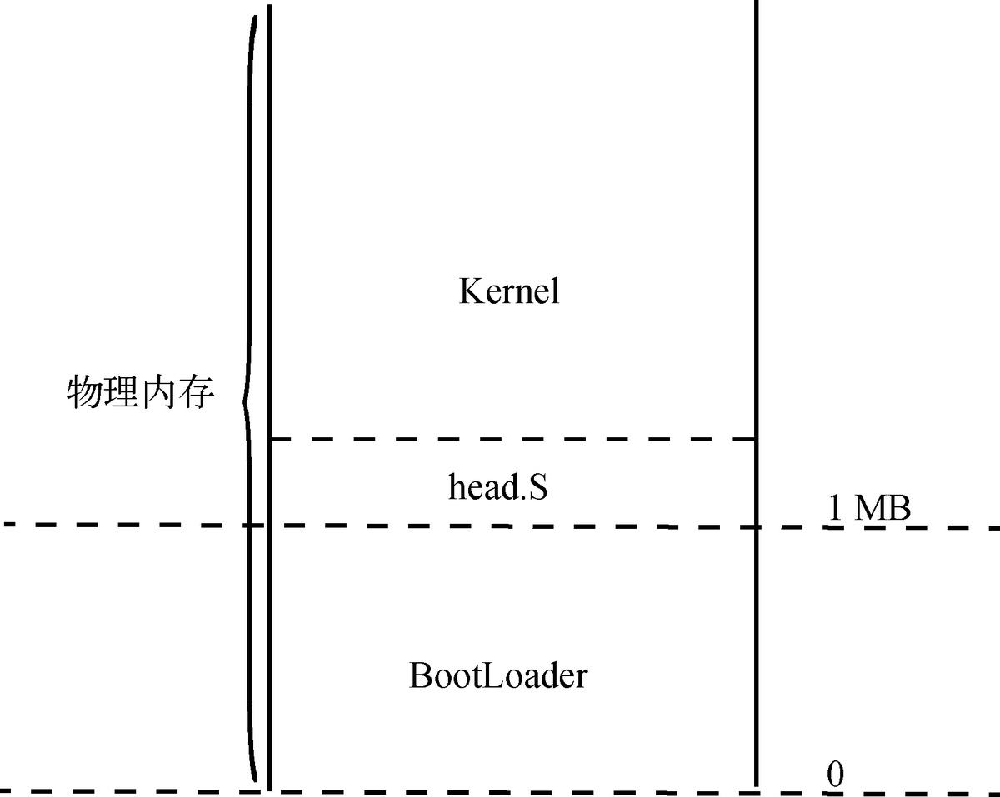
摘錄自一個64位操作系統的設計與實現 圖4-1

```
kernel/head.S
.section .data

.global GDT_Table

GDT_Table:
    .quad   0x0000000000000000          /*0 NULL    descriptor              00*/
    .quad   0x0020980000000000          /*1 KERNEL  Code    64-bit  Segment 08*/
    .quad   0x0000920000000000          /*2 KERNEL  Data    64-bit  Segment 10*/
    .quad   0x0020f80000000000          /*3 USER    Code    64-bit  Segment 18*/
    .quad   0x0000f20000000000          /*4 USER    Data    64-bit  Segment 20*/
    .quad   0x00cf9a000000ffff          /*5 KERNEL  Code    32-bit  Segment 28*/
    .quad   0x00cf92000000ffff          /*6 KERNEL  Data    32-bit  Segment 30*/
    .fill   10,8,0					/*8 ~ 9 TSS (jmp one segment <7>) in long-mode 128-bit 40*/
GDT_END:

GDT_POINTER:
GDT_LIMIT:  .word   GDT_END - GDT_Table - 1
GDT_BASE:   .quad   GDT_Table

```
這裡是定義系統的描述符表。我比較好奇的是在loader.asm中有一段內容是用於定義gdt64其中部分內容與head.S相同，為何要定義把gdt定義在兩個地方，到head.S中在重新載入一次?
```
kernel/head.S
loader.asm的定義
[SECTION gdt64]

LABEL_GDT64:        dq    0x0000000000000000
LABEL_DESC_CODE64:  dq    0x0020980000000000
LABEL_DESC_DATA64:  dq    0x0000920000000000
```
不過他在head.S的內容有多定義IDT與TSS。
以下這裡是page table的定義。
```
kernel/head.S
//=======	init page
.align 8

.org	0x1000

__PML4E:

	.quad	0x102007
	.fill	255,8,0
	.quad	0x102007
	.fill	255,8,0

.org	0x2000

__PDPTE:
	
	.quad	0x103003
	.fill	511,8,0

.org	0x3000

__PDE:

	.quad	0x000083	
	.quad	0x200083
	.quad	0x400083
	.quad	0x600083
	.quad	0x800083
	.quad	0xe0000083		/*0x a00000*/
	.quad	0xe0200083
	.quad	0xe0400083
	.quad	0xe0600083
	.quad	0xe0800083		/*0x1000000*/
	.quad	0xe0a00083
	.quad	0xe0c00083
	.quad	0xe0e00083
	.fill	499,8,0
```
在IA-32e架構下，頁表可分為4個等級(現在已經有支援5級的cpu出現了)，每個頁表項從4byte擴張到8byte，並且分頁機制除經典的4KB外也提供2MB與1GB大小的page。下圖為intel手冊關於IA-32e模式4級頁表的描述，其中PML4E是1級頁表，cr3暫存器指向他的起始地址。PDPTE為2級頁表，PDE為3級頁表，PT才是4級頁表。在64位元架構下總共48位元作為尋址使用，其中12位元做為page offset，剩下36位元由4級頁表均分每級頁表分配9位元，因此每級頁表最多有512個條目。在這裡我們只討論頁表大小為4KB的狀況。


圖片取自Intel 64 and IA-32 Architectures Software Developer’s Manual vol.3 
在這段程式碼中利用.org將這些結構定義在指定的內存位置，.align則是用於內存對齊的.align 8代表每一項都以8byte對齊。另外這部分的地址會經作者寫的linker被映射到線性地址的0xffff800000000000後的區域，而head.S被放字物理內存的1MB處所以對應的線性地址是0xffff800000100000。另外填入每個page的值最後8位的0x83是page的屬性。在PDE一個條目管控2MB的內存。
下圖為page table entry的格式
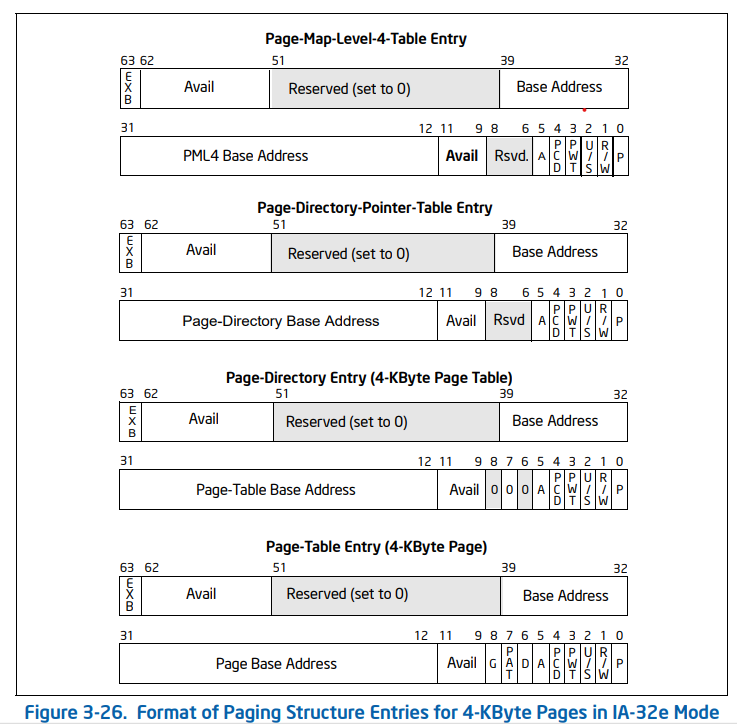
圖片取自Intel 64 and IA-32 Architectures Software Developer’s Manual
其中base address最大為28bit這是因為處理器最多支持40位元的物理地址尋址，而一個page table的大小恰好為4KB，因此40-12=28。


| 符號 | 描述                                                                                                     |
| ---- | ----------------------------------------------------------------------------------------------------|
| P    | 置位代表此頁在內存中                                                                                     |
| R/W  | 置位代表可讀寫，若無則代表此頁為只能讀取                                                                 |
| U/S  | 此位元被置位代表此頁可供所有人訪問，如果未設置只有supervisor可以訪問                                   |
| PWT  | Write-Through，置位啟用write-through caching(資料同時更新到快取與內存)，若無則為write-back(僅在快取更新) |
| PCD  | 這個位元用來控制page是否能進入快取，如置位不能進入快取                                                   |
| A    | 用來追蹤這個頁表示否被訪問過(此位元由作業系統管理，CPU不管)                                              |
| D    | 表示dirty如果被置位表示這個page有被修改過                                                                |

```
kernel/head.S
.section .text

_start:	//程式默認起始位置

	mov	$0x10,	%ax
	mov	%ax,	%ds
	mov	%ax,	%es
	mov	%ax,	%fs
	mov	%ax,	%ss
	mov	$0x7E00,	%esp

//=======	load GDTR

	lgdt	GDT_POINTER(%rip) // RIP-Relative尋址 操作數如果是32為原則可以在rip為中心找±2GB

//=======	load	IDTR

	lidt	IDT_POINTER(%rip)

	mov	$0x10,	%ax
	mov	%ax,	%ds
	mov	%ax,	%es
	mov	%ax,	%fs
	mov	%ax,	%gs
	mov	%ax,	%ss

	movq	$0x7E00,	%rsp

//=======	load	cr3

	movq	$0x101000,	%rax
	movq	%rax,		%cr3
	movq	switch_seg(%rip),	%rax
	pushq	$0x08
	pushq	%rax
	lretq   // GAS編譯器不支援ljmp/lcall所以用lretq (使用lretq必須自己手動push cs與rip到stack)

//=======	64-bit mode code

switch_seg:
	.quad	entry64

entry64:
	movq	$0x10,	%rax
	movq	%rax,	%ds
	movq	%rax,	%es
	movq	%rax,	%gs
	movq	%rax,	%ss
	movq	_stack_start(%rip),	%rsp		/* rsp address */

	movq	go_to_kernel(%rip),	%rax		/* movq address */
	pushq	$0x08
	pushq	%rax
	lretq

go_to_kernel:
	.quad	Start_Kernel
```
_start為程式的起始位置，並且需使用.golbal對_start加以修飾，否則會出現警告cannot find entry symbol _start，因為他不是全局的。在GAS編譯器中，`lgdt GDT_POINTER(%rip)` 這一行是RIP-Relative尋址，他的意思是以rip為中點使用相對偏移量來計算地址(讓目標地址依賴當前的rip暫存器，相對地址)，如果位移量是32位元整數值，那就會提供rip±2GB的尋址範圍。另外在NASM中編譯器不支持displacement(%rip)格式，必須使用關鍵字rel修飾，寫法為`mov	rax,[rel table]`。另外在GAS編譯器中不支援ljmp或lcall所以在程式碼中只使用lret(這是AT&T格式等價於intel的retf(遠跳轉))來進行段間切換。但如果要由lret返回就必須自己把cs、rip壓入stack中等待返回時彈出,最後兩條pushq就是這樣。

## 螢幕顯示
影格緩衝存儲器(frame buffer)他是用於顯示螢幕畫面的內存映射，此存儲器的每個存儲單元對應螢幕的一個像素點。可透過對每個像素點操作在螢幕上繪製文字或是圖片。在loader所設定的顯示模式可支援32位元深度的像素點，其中0-7位表示藍色，8-15位表示綠色，16-23位表示紅色，而24-31是保留位，這32位原可以表示出$2^{24}$種顏色。在loader我們所設定的螢幕解析度為1440*900。根據BIOS返回的資訊frame buffer的起始物理地址位於0xa00000，將需要的顏色寫入這個地址即可完成畫面繪製。若想要在螢目上顯示文字可建立一個表用於查找文字與螢幕記憶體位置的映射關係。

```
int color_printk(unsigned int FRcolor, unsigned int BKcolor, const char *fmt,...)
{
    int i = 0;
    int count = 0;
    int line = 0;
    va_list args;
    vastart(args, fmt);
    i = vsprintf(buf, fmt, args); // 向緩衝buf輸入字符並返回輸入的字符長度i
    va_end(args);
	......
}
```
這個函式用於將緩衝區buf的字符取出並繪製到螢幕上。而我們希望這個函式與printf相同支援可變參數，因此在這裡使用標準庫stdarg.h。vsprintf函是輸入的省略號內容放入緩衝區buf中，而返回值i則是輸入緩衝區的字符長度。接著我們根據緩存中的內容決定輸入的字符應該做什麼操作。
```
for (count = 0; count < i || line; ++count){
	if (line > 0) {
		// 這是製表符的操作 line > 0 代表有空白要填入
		--count; // 校正位置 
		goto Label_tab;
	}

	if ((unsigned char) *(buf + count) == '\n') {
		++Pos.Yposition;
		Pos.Xposition = 0;
	} 
	...
}

```
如果輸入字符為\n表示換行，\b則用空白覆蓋前一個字符，若為\t製表符將計算填入的空格數量將顯示位置調整到下一個製表位。

printfk等待補充

在編譯的過程中得到了以下警告，經查驗發現是書寫strlen函式使用關鍵字inline的問題
```
ld -b elf64-x86-64 -z muldefs -o system head.o main.o printk.o -T Kernel.lds 
ld: printk.o: in function `vsprintf':
printk.c:(.text+0x93f): undefined reference to `strlen'
```
這是strlen的定義
```
inline int strlen(char *String)
{
	register int __res;
	__asm__	__volatile__	(	"cld	\n\t"
					"repne	\n\t"
					"scasb	\n\t"
					"notl	%0	\n\t"
					"decl	%0	\n\t"
					:"=c"(__res)
					:"D"(String),"a"(0),"0"(0xffffffff)
					:
				);
	return __res;
}

```
當我們使用inline時，根據c語言規格書我們需要提供函數的內聯定義(inline definition)與外部定義(exteral definition)。c99手冊在6.7.4討論inline的章節提到
>Any function with internal linkage can be an inline function. For a function with external linkage, the following restrictions apply: If a function is declared with an inline function specifier, then it shall also be defined in the same translation unit. If all of the file scope declarations for a function in a translation unit include the inline function specifier without extern, then the definition in that translation unit is an inline definition. **An inline definition does not provide an external definition for the function**, and does not forbid an external definition in another translation unit. An inline definition provides an alternative to an external definition, which a translator may use to implement any call to the function in the same translation unit. **It is unspecified whether a call to the function uses the inline definition or the external definition.**

並且在6.9這一節提到
> An external definition is an external declaration that is also a definition of a function (other than an inline definition) or an object. If an identifier declared with external linkage is used in an expression (other than as part of the operand of a sizeof operator whose result is an integer constant), somewhere in the entire program there shall be exactly one external definition for the identifier; otherwise, there shall be no more than
one.

當我們使用inline但若沒有提供外部定義時他是一個未指定的行為(unspecified)，具體實作取決於編譯器。為了解決這個問題有兩種方案
>1.將strlen的修飾詞修改為`static inline int strlen(char *String);` 他會將函數轉變成interal linkage只要在同一個translation unit都可以使用這個函數
>2.頭文件中關於strlen不做任何修改，但是在需要使用這個函式的文件中加上`extern int strlen(char *String);`這可將函式添加外部定義。

詳細討論可察看此連結
[Is "inline" without "static" or "extern" ever useful in C99?](https://stackoverflow.com/questions/6312597/is-inline-without-static-or-extern-ever-useful-in-c99?noredirect=1&lq=1)

此時使用虛擬平台BOCHS執行可看到以下輸出，在畫面上我們成功顯示字串。


## 系統異常
### 異常的分類
錯誤(fault):這是一種可以修復的異常。只要錯誤被修正處理器將程式或任務的運行環境恢復至觸發異常前的狀態，並重新執行導致異常的指令(觸發異常的同時會把CS與EIP存入stack中待處理完異常後返回執行)。舉例來說page fault就屬這一類。
陷阱(trap):陷阱同樣允許處理器繼續執行程式或任務，但是處理器會跳過產生此異常的指令，處理完異常後的返回地址是觸發陷阱的那條指令的下一條。
中止(abort):發生嚴重的錯誤，此錯誤往往無法準確提供產生異常的位置，並且也不允許程序或任務繼續執行。典型的例子為硬體錯誤或是程式存在不合邏輯與非法值，舉例對地址0解引用。

下表為不同向量號的異常中斷，其中32~255號可由用戶自定義，使用時必須將定義載入IDT中斷描述符表，IDT的描述符有256個對應這裡的0-255。
| 向量號 | 助記符 | 異常/中斷類型 | 異常/中斷描述                                                   | 錯誤碼     | 觸發源                         |
| ------ | ------ | ------------- |:--------------------------------------------------------------- |:---------- |:------------------------------ |
| 0      | #DE    | fault         | 除法錯誤 Divide Error                                           | No         | DIV或IDIV指令                  |
| 1      | #DB    | fault/trap    | 調適異常 Debug Exception                                        | No         | 僅intel處理器使用              |
| 2      |        | interrupt     | NMI中斷 NMI Interrupt                                           | No         | 不可屏蔽中斷                   |
| 3      | #BP    | trap          | 斷點 Breakpoint                                                 | No         | INT3指令                       |
| 4      | #OF    | trap          | 溢出異常 Overflow                                               | No         | INTO指令                       |
| 5      | #BR    | fault         | 越界異常 BOUND Range Exceeded                                   | No         | BOUND指令                      |
| 6      | #UD    | fault         | 無效/未定義的機械碼 Invalid Opcode (Undefined Opcode)           | No         | UD2指令或保留的機械碼          |
| 7      | #NM    | fault         | 設備異常(FPU不存在) Device Not Available (No Math Coprocessor)  | No         | 浮點數指令WAIT/FWAIT指令       |
| 8      | #DF    | abort         | 雙重錯誤 Double Fault                                           | Yes (Zero) | 任何異常、NMI中斷或INTR中斷    |
| 9      |        | fault         | 協處理器段越界(保留) Coprocessor Segment Overrun (reserved)     | No         | 浮點指令                       |
| 10     | #TS    | fault         | 無效的TSS段 Invalid TSS                                         | Yes        | 訪問TSS段或任務切換            |
| 11     | #NP    | fault         | 段不存在 Invalid TSS                                            | Yes        | 加載段暫存器或訪問系統段       |
| 12     | #SS    | fault         | SS段錯誤 Stack-Segment Fault                                    | Yes        | Stack操作或加載Stack暫存器     |
| 13     | #GP    | fault         | 通用保護性異常 General Protection                               | Yes        | 任何內存引用和保護檢測         |
| 14     | #PF    | fault         | 頁錯誤 Page Fault                                               | Yes        | 任何內存引用                   |
| 15     |        |               | Intel保留位不可使用                                             | No         |                                |
| 16     | #MF    | fault         | x87 FPU錯誤(計算錯誤) x87 FPU Floating-Point Error (Math Fault) | No         | x87FPU浮點指令或WAIT/FWAIT指令 |
| 17     | #AC    | fault         | 對齊檢測 Alignment Check                                        | Yes(Zero)  | 引用內存中的任何數據           |
| 18     | #MC    | abort         | 機器檢測 Machine Check                                          | No         | 若有錯誤碼則與CPU類型有關      |
| 19     | #XM    | fault         | SIMD浮點異常  SIMD Floating-Point Exception                     | No         | SSE/SSE2/SSE3浮點指令          |
| 20     | #VE    | fault         | 虛擬化異常  Virtualization Exception                            | No         | 違反EPT                        |
| 21-31  |        |               | Intel保留位不可使用 Intel reserved. Do not use                  |            |                                |
| 32-255 |        | interrupt     | 自定義中斷 User Defined (Non-reserved) Interrupts               |            | 外部中斷或執行INT n指令        |

## 系統異常處理
intel官方手冊6.12節EXCEPTION AND INTERRUPT HANDLING有針對處理器的異常處理做詳細的描述。
而處理器用類似組合語言指令CALL的方法來執行異常/中斷處理程序，當處理器接收到異常/中斷時，就會高據產生的向量號從中斷描述符表IDT中查找，並從對應的中斷描述符中調轉到處理程式的位置。如果索引到任務門則發生任務切換轉去處理異常/中斷任務，而索引到interrupt gate或是trap gate則會像執行CALL一樣去執行異常/中斷處理程式，需要注意的是如果是產生的是中斷，此類任務須使用IRETD。
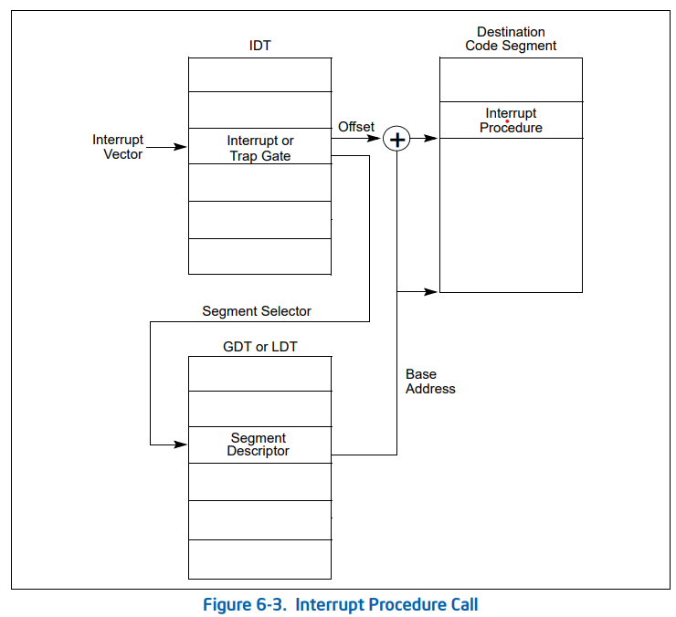
圖片取自 Intel 64 and IA-32 Architectures  Software Developer’s Manual vol.3 圖6.3

處理器在執行異常/中斷處理程式時，會檢測異常/中斷處理程式的特權級別，並與cs暫存器的特權級別做比較(這個特權級別收錄在CS所指向的GDT描述符中)。如果異常/中斷處理程式的特權級別更高，則會在執行異常/中斷處理程式前切換Stack空間(切換SS暫存器)，下面是書中撰寫的切換過程。
>1.處理器會限從IDT全局描述符表中找出任務的特權級與TSS結構體的地址，接著從TSS結構體取出SS暫存器與ESP(stack指針)，並將他們做為異常/中斷處理的stack空間進行切換。並且在切換時會將原先任務的SS與ESP壓入異常/中斷處理程式的stack以便在異常處理後返回。
>2.另外在stack切換的過程中同時會壓入EFLAGS、CS、EIP到異常/中斷處理程式的stack。
>3.如果異常會產生錯誤碼則保存在這個異常處理程式的stack中，放置於EIP暫存器後。

如果異常/中斷處理程式的權級與當前任務的權級相等(這裡不會發生任務切換，調用過程則像是呼叫函數一樣)。
>1.處理器將保存被中斷程式的EFLAGS、CS、EIP到stack中。(這裡是保存被中斷任務的的stack)
>2.如果異常產生錯誤碼則放在EIP暫存器後。

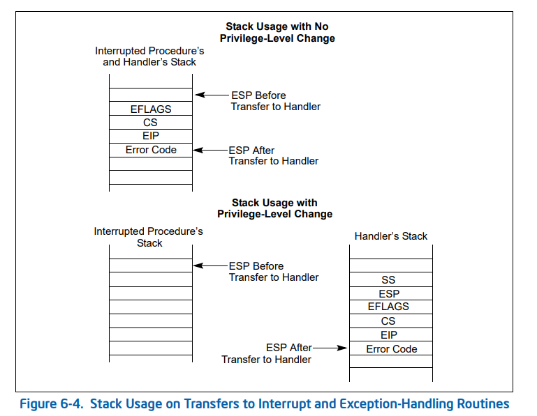
圖片取自 Intel 64 and IA-32 Architectures  Software Developer’s Manual vol.3 圖6.4

處理器必須使用IRET才能從異常/中斷處底程式中返回，IRET會恢復保存在stack上的EFLAGS。EFLAGS的IOPL只有在權級(CPL)為0時才可以被還原，而IF標誌位只有在CPL<=IOPL時才可被改變。另外，當處理器透過interrupt gate或trap gate執行中斷/異常處理程式時，會至位TF標誌位來關閉單步調適功能。(VM、RF、NT也會被置位)。
interrupt gate與trap gate的區別在於處理器對IF標誌位的操作。通過interrupt gate時處理器會置位IF從而屏蔽CPU接收其他的中斷請求。而通過trap gate時則不會置位IF。

```
kernel/head.S
setup_IDT:
    leaq    ignore_int(%rip),   %rdx
    movq    $(0x08 << 16),  %rax // 段選擇子的位置從bit8開始
    movw	%dx,	%ax			 // dx暫存器中放置ignore_int的地址，這裡低16位是offset
    movq    $(0x8E00 << 32),    %rcx // 0x8E00用來描述IDT的類型和特權級別	
    addq    %rcx,   %rax		 // 這裡用or或是add都可
    movl    %edx,   %ecx
    shrl    $16,    %ecx		 // 右移16位取ignore_int剩餘的地址
    shlq    $48,    %rcx		 // 左移48位讓剩餘16位的地址對上Offset的位置，該位置從bit48開始
    addq    %rcx,   %rax
    shrq    $32,    %rdx		 // 將剩餘的32位元地址取出
    leaq    IDT_Table(%rip),    %rdi // 把IDT_Table的地址放入rdi
    mov	$256,   %rcx
rp_sidt:
    movq    %rax,   (%rdi)		 // rax為IDT的前8byte
    movq    %rdx,   8(%rdi)		 // 這裡放置IDT的後4byte，剩餘4byte為保留位不管他
    addq    $0x10,  %rdi
    dec	%rcx					 // 重複填滿256個IDT描述符
    jne rp_sidt
```
我們目前先將IDT初始化，讓所有的IDT都指向ignore_int的操作，根據IDT描述符的架構，我們將信息依序填入。BIT0-15是處理函數地址的低16位，而段選擇子則放在BIT16-31，只要把指定的段選擇子左移16位即可，BIT32-48則用於表數IDT的類型與權限，左移32位填入。剩下BIT48~64是對應函式地址的16~32位。接著把函式地址的高32位放入，這樣就完成IDT描述符的寫入。
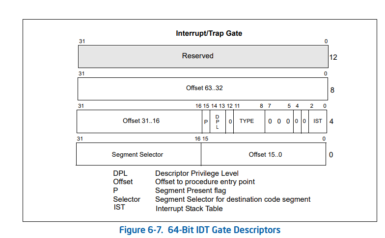
圖片取自 Intel 64 and IA-32 Architectures  Software Developer’s Manual vol.3 圖6.7

接下來將初始化TSS描述符，這裡的操作不涉及設定TSS結構體，他只是在GDT上註冊TSS描述符。
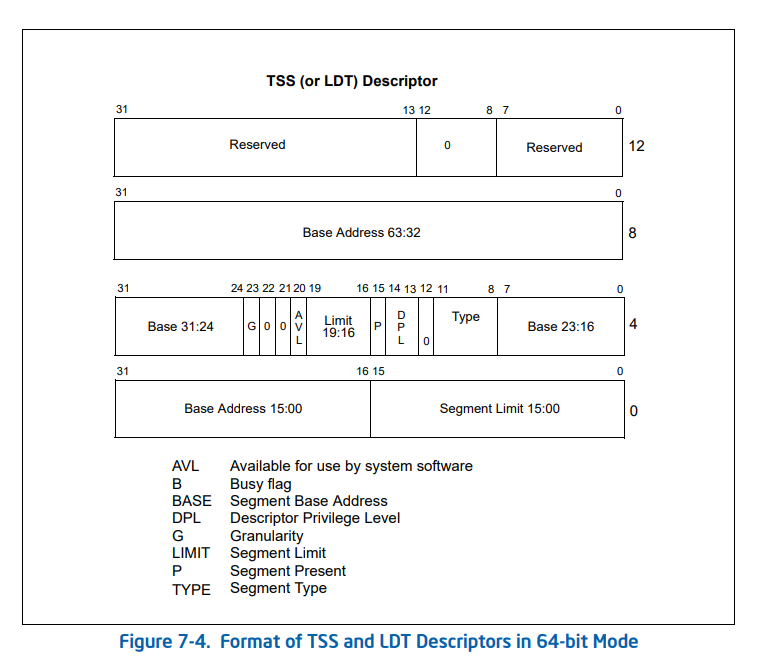

圖片取自 Intel 64 and IA-32 Architectures  Software Developer’s Manual vol.3 vol.3 圖7.4

```
kernel/head.S
//=======   setup_TSS64
setup_TSS64:
    leaq	TSS64_Table(%rip),	%rdx
    xorq    %rax,   %rax // rax = 0
    xorq    %rcx,   %rcx // rcx = 0
    movq    $0x89,  %rax
    shlq    $40,    %rax
    shrl    $24,    %ecx
    shlq    $56,    %rcx
    addq    %rcx,   %rax
    xorq    %rcx,   %rcx
    movl    %edx,   %ecx
    andl    $0xffffff,  %ecx
    shlq    $16,    %rcx
    addq    %rcx,   %rax
    addq    $103,   %rax		// 0X67 設定TSS的訪問屬性
    leaq    GDT_Table(%rip),    %rdi
    movq    %rax,   64(%rdi)
    shrq    $32,    %rdx
    movq    %rdx,   72(%rdi)

    mov     $0x40,  %ax
    ltr     %ax              // 將GDT加載到TR暫存器中，這個GDT將指向TSS結構體

    movq    go_to_kernel(%rip), %rax        /* movq address */
    pushq   $0x08
    pushq   %rax
    lretq

go_to_kernel:
    .quad   Start_Kernel
```
這一部分用於初始化GDT內所指向的TSS描述符，可透過LTR指令把TSS加載到TR暫存器中。目前的程式由於運行在特權0中所以在觸發IDT時，由於高特權級別所以不會切換任務stack也不需要訪問tss，在這種狀況下就算不加載TSS到TR中，異常/中斷處理程式也可以被正常執行。
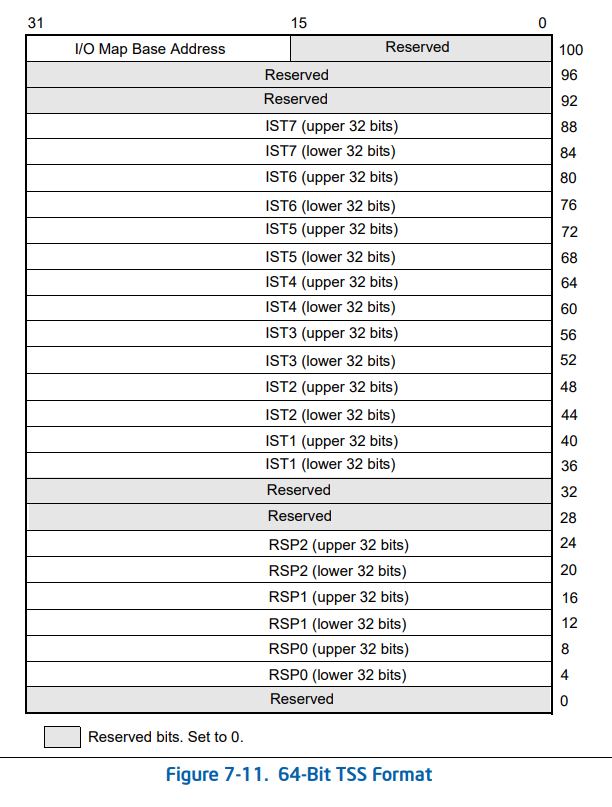
圖片取自 Intel 64 and IA-32 Architectures  Software Developer’s Manual vol.3 圖7-11

與TSS32和TSS16不同的是64位元架構不會儲存RAX、RBX、RCX等等的通用暫存器，這是因為IA-32e模式並不支援硬體的上下文交換。硬體上下文交換由於性能和可移植性較差的因素，作業系統通常使用軟體進行上下文交換，可參閱[Context_Switching](https://wiki.osdev.org/Context_Switching#Hardware_Context_Switching)。有別於實模式與保護模式，IA-32e模式的上下文完全交由使用者自己，程式將透過PCB去保存或恢復暫存器狀態。在TSS64中他專注於stack切換，因此當異常/中斷發生時，系統可以快速的切換stack而不需要進行完整的上下文切換。以下是intel手冊關於TSS64結構體的描述。
>2.1.3.1 Task-State Segments in IA-32e Mode
**Hardware task switches are not supported in IA-32e mode.** However, TSSs continue to exist. The base address of a TSS is specified by its descriptor. A 64-bit TSS holds the following information that is important to 64-bit operation: 
• **Stack pointer addresses for each privilege level**
• **Pointer addresses for the interrupt stack table**
• **Offset address of the IO-permission bitmap (from the TSS base)**
The task register is expanded to hold 64-bit base addresses in IA-32e mode. See also: Section 7.7, “Task Management in 64-bit Mode.”

```
kernel/head.S
//=======   ignore_int

ignore_int:
    cld
    pushq   %rax
    pushq   %rbx
    pushq   %rcx
    pushq   %rdx
    pushq   %rbp
    pushq   %rdi
    pushq   %rsi

    pushq   %r8
    pushq   %r9
    pushq   %r10
    pushq   %r11
    pushq   %r12
    pushq   %r13
    pushq   %r14
    pushq   %r15

    movq    %es,    %rax
    pushq   %rax
    movq    %ds,    %rax
    pushq   %rax

    movq    $0x10,  %rax // 第二個GDT描述符
    movq    %rax,   %ds
    movq    %rax,   %es

    leaq	int_msg(%rip),	%rax        /* leaq get address */
    pushq	%rax
    movq    %rax,   %rdx
    movq    $0x00000000,    %rsi
    movq    $0x00ff0000,    %rdi
    movq    $0, %rax
    callq   color_printk
    addq    $0x8,   %rsp

Loop:
    jmp	Loop // 系統會卡在這裡 等同於 jmp $

    popq    %rax
    movq    %rax,   %ds
    popq    %rax
    movq    %rax,   %es

    popq    %r15
    popq    %r14
    popq    %r13
    popq    %r12
    popq    %r11
    popq    %r10
    popq    %r9
    popq    %r8

    popq    %rsi
    popq    %rdi
    popq    %rbp
    popq    %rdx
    popq    %rcx
    popq    %rbx
    popq    %rax
    iretq

int_msg:
    .asciz  "Unknown interrupt or fault at RIP\n"
```
這段程式先保存個個暫存器的值，並且將DS與ES設定成核心的數據段，呼叫color_printk把信息印出，最後執行jmp指令死循環。接著我們可以測試IDT是否設定成功，將除以0的程式碼寫入kernel主程式中。


### 系統異常處理函式

```
kernel/trap.c
void sys_vector_init()
{
	/**
     * 以下的程式碼就是依據IDT的編號以初始化，並且會依據這些異常/中斷向量號的功能設定權限如DPL=0的interrupt gate與trap gate
	 * 或是DPL=3的trap gate。對於這些中斷向量號我們以TSS結構體IST1區域以紀錄各自的stack地址。
	 */
	set_trap_gate(0,1,divide_error);
	set_trap_gate(1,1,debug);
	set_intr_gate(2,1,nmi);
	set_system_gate(3,1,int3);
	set_system_gate(4,1,overflow);
	set_system_gate(5,1,bounds);
	set_trap_gate(6,1,undefined_opcode);
	set_trap_gate(7,1,dev_not_available);
	set_trap_gate(8,1,double_fault);
	set_trap_gate(9,1,coprocessor_segment_overrun);
	set_trap_gate(10,1,invalid_TSS);
	set_trap_gate(11,1,segment_not_present);
	set_trap_gate(12,1,stack_segment_fault);
	set_trap_gate(13,1,general_protection);
	set_trap_gate(14,1,page_fault);
	//15 Intel reserved. Do not use.
	set_trap_gate(16,1,x87_FPU_error);
	set_trap_gate(17,1,alignment_check);
	set_trap_gate(18,1,machine_check);
	set_trap_gate(19,1,SIMD_exception);
	set_trap_gate(20,1,virtualization_exception);

	//set_system_gate(SYSTEM_CALL_VECTOR,7,system_call);
}
```

```
//gate.h
//IDT_Table是head.S文件中的標誌符，為IDT描述符表的起始地址，而n則對應輸入的向量號。
inline void set_intr_gate(unsigned int n,unsigned char ist,void * addr)
{
	_set_gate(IDT_Table + n , 0x8E , ist , addr);	//P,DPL=0,TYPE=E
}

inline void set_trap_gate(unsigned int n,unsigned char ist,void * addr)
{
	_set_gate(IDT_Table + n , 0x8F , ist , addr);	//P,DPL=0,TYPE=F
}

inline void set_system_gate(unsigned int n,unsigned char ist,void * addr)
{
	_set_gate(IDT_Table + n , 0xEF , ist , addr);	//P,DPL=3,TYPE=F
}

```
3種不同函數都使用_set_gate來初始化IDT內的各個表項。參數IDT_Table是head.S的標誌符.gobal IDT_Table，並在gate.h中使用extern struct gate_struct IDT_Table[]宣告。以下為函式_set_gate，他透過內嵌組合語言完成。
```
#define _set_gate(gate_selector_addr,attr,ist,code_addr)	\
do								\
{	unsigned long __d0,__d1;				\
	__asm__ __volatile__	(	"movw	%%dx,	%%ax	\n\t"	\
					"andq	$0x7,	%%rcx	\n\t"	\
					"addq	%4,	%%rcx	\n\t"	\
					"shlq	$32,	%%rcx	\n\t"	\
					"addq	%%rcx,	%%rax	\n\t"	\
					"xorq	%%rcx,	%%rcx	\n\t"	\
					"movl	%%edx,	%%ecx	\n\t"	\
					"shrq	$16,	%%rcx	\n\t"	\
					"shlq	$48,	%%rcx	\n\t"	\
					"addq	%%rcx,	%%rax	\n\t"	\
					"movq	%%rax,	%0	\n\t"	\
					"shrq	$32,	%%rdx	\n\t"	\
					"movq	%%rdx,	%1	\n\t"	\
					:"=m"(*((unsigned long *)(gate_selector_addr)))	,					\
					 "=m"(*(1 + (unsigned long *)(gate_selector_addr))),"=&a"(__d0),"=&d"(__d1)		\
					:"i"(attr << 8),									\
					 "3"((unsigned long *)(code_addr)),"2"(0x8 << 16),"c"(ist)				\
					:"memory"		\
				);				\
}while(0)
```
首先這個巨集中我們有四個參數，分別為gate_selector_addr表示描述符的地址(即將設置的IDT條目)，attr表示描述符的屬性比如類型與權限，ist(Interrupt Stack Table)這表示放在TSS結構中的哪個IST上，code_addr為中斷/異常處理函式的地址。而輸入輸出約束則近一步告訴我們這些參數被放在那些暫存器中等待處理，並且函式最終的輸出結果為何。首先內嵌組合語言的格式為"指令:輸出:輸入:損壞"，由於64位元架構一個描述符的大小為16byte。movq	%%rax,	%0這條指令就是把rax暫存器的內容寫到內存的gate_selector_addr這個位置，而`movq %%rdx, %1`則是填入gate_selector_addr的後8byte。在輸入部分`"i"(attr << 8)`表示把attr左移8位並作為立即數輸入。另外`"3"((unsigned long *)(code_addr))`則是對應輸出約束的`"=&a"(__d0)`，此變量將被分配到ax暫存器，`"2"(0x8 << 16)`則被放到`"=&d"(__d1)`的dx暫存器。在這些輸入輸出中，如果沒有指定使用那些佔位符，這些佔位符就會以出線的先後順序確定使用的是幾號佔位符。
回到組合語言指令本身`movw %%dx, %%ax`，dx暫存器本身放置的是8 << 16，所以這條指令相當於把ax暫存器的低16位設0，`andq $0x7, %%rcx`則是保證rcx的值必定在IST1-IST7中間。addq %4, %%rcx實際上就是把權限(attr<<8)加入rcx，而左移的原因是因為地址IDT+4
的第8-11byte代表type,12-16則表示一些權限，左移8位可以讓這些位元被設定。接下來`shlq $32, %%rcx`，就是為了補足IDT+4所差距的4byte地址。並且使用`addq %%rcx, %%rax`把這些資訊放到rax暫存器上(這裡也可以使用or完成)。接著就把code_addr的低32位元放入rcx暫存器中，並右移16位元取高位地址部分。`shlq $48, %%rcx`左移48位使得將這16位的地址移動到描述符對應的位置。 `addq %%rcx, %%rax`接著把地址輸入rax暫存器中，這樣就定義好描述符前8byte此時利用`movq %%rax, %0`把這8byte寫入內存。而剩下的8位元就只剩下地址了`shrq $32, %%rdx`與`movq %%rdx, %1`就是把剩下的地址項寫入IDT的內存空間。
另外c語言無法實現把參數壓入暫存器的操作，這部分需要透過組合語言實現。必須在異常處理程式的入口中，保存當前程序的暫存器等待返回時恢復。

```
RESTORE_ALL:
	popq	%r15	
	popq	%r14	
	popq	%r13	
	popq	%r12	
	popq	%r11
	popq	%r10
	popq	%r9
	popq	%r8
	popq	%rbx
	popq	%rcx
	popq	%rdx
	popq	%rsi
	popq	%rdi
	popq	%rbp
	popq	%rax
	movq	%rax,	%ds	
	popq	%rax
	movq	%rax,	%es
	popq	%rax
	addq	$0x10,	%rsp
	iretq

```
最後一行將rsp+0x10一因為要將errcode(錯誤碼)、func(函式地址)彈出，因為他們的後兩個參數才是iretq需要的參數cs與rip，另外若涉及權級切換時iretq會從stack彈出ss與rsp用以恢復暫存器。接著先實現除法的異常處理。
```
ENTRY(divide_error)
	pushq	$0
	pushq	%rax
	leaq	do_divide_error(%rip),	%rax // 把計算後地址do_divide_error(%rip)放入rsp
	xchgq	%rax,	(%rsp)    // 交換[rsp]與rax，相當於把標籤do_divide_error壓入stack中 (這就是FUNC)

error_code:
	pushq	%rax
	movq	%es,	%rax
	pushq	%rax
	movq	%ds,	%rax
	pushq	%rax
	xorq	%rax,	%rax

	pushq	%rbp
	pushq	%rdi
	pushq	%rsi
	pushq	%rdx
	pushq	%rcx
	pushq	%rbx
	pushq	%r8
	pushq	%r9
	pushq	%r10
	pushq	%r11
	pushq	%r12
	pushq	%r13
	pushq	%r14
	pushq	%r15	
	
	cld
	movq	ERRCODE(%rsp),	%rsi // 函式的第二個參數
	movq	FUNC(%rsp),	%rdx	

	movq	$0x10,	%rdi
	movq	%rdi,	%ds
	movq	%rdi,	%es

	movq	%rsp,	%rdi // 函式的第一個參數
	////GET_CURRENT(%ebx)

	callq 	*%rdx // rdx存儲函式的入口地址

```
除法的異常處理通常不會有錯誤碼，為了讓操作統一在開始處`pushq $0`將數字0壓入stack代替error code。使用`xchgq %rax, (%rsp)`此舉是為了將FUNC函式的地址換入stack上。接著則將暫存器依照標籤RESTORE_ALL的順序反向壓入stack中。此時把內存地址ERRCODE(%rsp)當作參數輸入到%rsi，`movq %rsp, %rdi`也作為函數的輸入參數使用。`callq *%rdx`表示跳轉到rdx所儲存的地址(*表示絕對地址，而非相對地址)，這是一種間接調用此時rdx儲存的就是函式的入口地址。當異常處理函式結束後就還原暫存器的內容。
```
ret_from_exception:
	/*GET_CURRENT(%ebx)	need rewrite*/
ENTRY(ret_from_intr)
	jmp	RESTORE_ALL	/*need rewrite*/
```
目前只負責將暫存器會赴到執行中斷前，尚未實作程式的調度、信號處理等工作。由於在error_code中我們定義了參數如何推入stack保存，如何調用異常處理程式，接下來異常的項量號只需要將錯誤碼與函式的地址壓入stack中，並呼叫error_code即可。

```
ENTRY(invalid_TSS)
	pushq	%rax
	leaq	do_invalid_TSS(%rip),	%rax
	xchgq	%rax,	(%rsp)
	jmp	error_code

ENTRY(page_fault)
	pushq	%rax
	leaq	do_page_fault(%rip),	%rax
	xchgq	%rax,	(%rsp)
	jmp	error_code
```
### 錯誤碼介紹
以下來介紹錯誤碼的格式

圖片取自 Intel 64 and IA-32 Architectures  Software Developer’s Manual vol.3 6.13節

EXT:置位表示異常是在向程式投遞外部事件中觸發，如中斷或是更早期的異常。
IDT:置位表示錯誤碼的段選擇子紀錄的是IDT內的門描述符，而復位則表示紀錄的是GDT/LDT的描述符。
TI:只有當IDT復位(0)這一位才有效，置位則說明這個段選擇子紀錄的是LDT的段描述符或是門描述符，若無就是GDT。
此錯誤碼可以用於索引描述符表內的段描述符或門描述符。在一些條件下錯誤碼除EXT外都是0，這代表錯誤並非由引用特殊的段或是訪問NULL產生的。
do_invalid_TSS追加了錯誤碼的解析功能。

```
kernel/trap.c
void do_invalid_TSS(unsigned long rsp,unsigned long error_code)
{
    unsigned long *p = NULL;
    p = (unsigned long*)(rsp + 0x98);
    color_printk(RED,BLACK,"do_invalid_TSS(10),ERROR_CODE:%#018lx,RSP:%#018lx,RIP:%#018lx\n", error_code , rsp, *p);

    if (error_code & 0x01)
        color_printk(RED,BLACK,"The exception occurred during delivery of an event external to the program,such as an interrupt or an earlier exception.\n"); //檢查BIT0查看錯誤是否在外部事件或是更早的異常中觸發。

    if (error_code & 0x02)
        color_printk(RED,BLACK,"Refers to a gate descriptor in the IDT;\n"); // 是否為IDT
    else
        color_printk(RED,BLACK,"Refers to a descriptor in the GDT or the current LDT;\n");

    if ((error_code & 0x02) == 0)
        if (error_code & 0x04) // 檢查是否為LDT
            color_printk(RED,BLACK,"Refers to a segment or gate descriptor in the LDT;\n");
        else
            color_printk(RED,BLACK,"Refers to a descriptor in the current GDT;\n");

    color_printk(RED,BLACK,"Segment Selector Index:%#010x\n", error_code & 0xfff8);

    while(1);
}
```
### page fault
而對於page fault而言，錯誤碼的定義與其他異常的錯誤碼不同以下是intel手冊的定義。
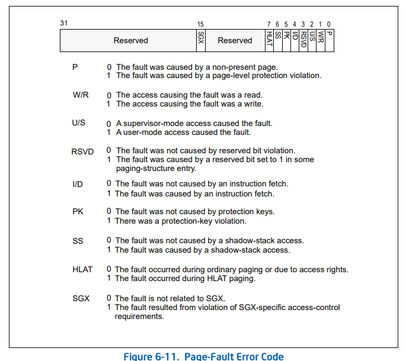
圖片取自 Intel 64 and IA-32 Architectures  Software Developer’s Manual vol.3 圖6-11
其中Ｐ標誌位用於指示異常是否有一個不存在的頁引發(P=0)，或進入的違規區域(P=1)，或是使用保留位(P=1)。
W/R標誌位表示異常是由讀取頁(W/R=0)或是寫入頁(W/R=1)所觸發。
U/S標誌位表示異常是由用戶模式(U/S=1)或是超級模式(U/S=0)所產生。
當CR4控制暫存器的PSE或是PAE被置位時，處理器將根據檢測頁表項的保留位，RSVD標誌位則指是異常是否由保留位所產生。
I/D標誌位則表示異常是否是透過讀取指令所產生。
CR2控制暫存器將保存觸發異常的線性地址，異常處理程序可以透過這個地址定位到頁目錄項和頁表項，頁錯誤組裡程序需要在第二的頁錯誤發生前保存CR2的值以免再次觸發頁錯誤異常。
在觸發異常時，處理器會將CS與EIP壓入異常處理程式的stack中，以便處理完異常後返回，如果是fault則指向觸發異常的指令，trap則是下一個指令。假設page fault發生在任務切戶前間，CS與EIP則可能指向新任務的第一條指令。
```
kernel/trap.c
void do_page_fault(unsigned long rsp,unsigned long error_code)
{
    unsigned long *p = NULL;
    unsigned long cr2 = 0;

    __asm__	__volatile__("movq	%%cr2,	%0":"=r"(cr2)::"memory"); // 將cr2暫存器的值放入變數cr2中

    p = (unsigned long*)(rsp + 0x98);
    color_printk(RED,BLACK,"do_page_fault(14),ERROR_CODE:%#018lx,RSP:%#018lx,RIP:%#018lx\n", error_code , rsp, *p);

    if (!(error_code & 0x01))
        color_printk(RED,BLACK,"Page Not-Present,\t"); // 這個頁是否存在。

    if (error_code & 0x02)
        color_printk(RED,BLACK,"Write Cause Fault,\t"); // 寫入時觸發
    else
        color_printk(RED,BLACK,"Read Cause Fault,\t"); // 讀取時觸發

    if (error_code & 0x04)
        color_printk(RED,BLACK,"Fault in user(3)\t");
    else
        color_printk(RED,BLACK,"Fault in supervisor(0,1,2)\t");

    if (error_code & 0x08)
        color_printk(RED,BLACK,",Reserved Bit Cause Fault\t"); // 頁表項的保留位引發異常

    if (error_code & 0x10)
        color_printk(RED,BLACK,",Instruction fetch Cause Fault"); // 取得指令時是否觸發異常

    color_printk(RED,BLACK,"\n");

    color_printk(RED,BLACK,"CR2:%#018lx\n",cr2);

    while(1);
}
```
在這裡先以內嵌組合語言語句取出cr2暫存器的值到變數cr2中，隨後解析錯誤碼的信息。
```
kernel/main.c
#include "lib.h"
#include "printk.h"
#include "gate.h"
#include "trap.h"

void Start_Kernel(void)
{
    ...
    
	load_TR(8);
    color_printk(YELLOW,BLACK,"Hello\t\t World!\n");
	set_tss64(0xffff800000007c00, 0xffff800000007c00, 0xffff800000007c00, 0xffff800000007c00, 0xffff800000007c00, 0xffff800000007c00, 0xffff800000007c00, 0xffff800000007c00, 0xffff800000007c00, 0xffff800000007c00);
	sys_vector_init(); // 初始化IDT
	i = 1 / 0; // 測試是否有正常載入IDT
    while(1);
}

```
編譯程式時，可能出現以下錯誤，這是因為在編譯檔案時我們選用-fno-builtin這確保編譯器使用的函式會是程式提供或是連接的版本，而不是C語言內建版本。而目前我們的lib.h尚未實作__stack_chk_fail，這裡先在Makefile中禁用stack保護-fno-stack-protector。
```
ld: printk.o: in function `number':
printk.c:(.text+0x4b6): undefined reference to `__stack_chk_fail'
```

這是在虛擬機上的執行結果可看到除以0的這個異常能夠正確顯示。
而如果把i改成取址操作，則會因為page table尚未註冊任何page而產生錯誤。
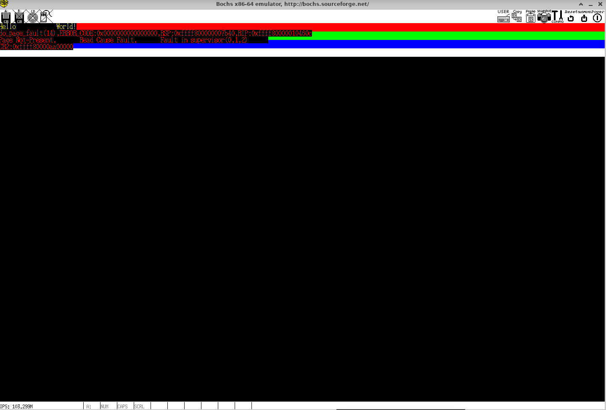
此時我們已經實現了基礎的異常捕獲功能，接著我們將統計系統的可用內存並實現內存管理。

## 內存管理
```
kernel\memory.h
// 這個數據是在BIOS模式下使用BIOS中斷int 15 AX=E820取得的記憶體資料
struct Memory_E820_Formate
{
	unsigned int	address1;
	unsigned int	address2;
	unsigned int	length1;
	unsigned int	length2;
	unsigned int	type;
};
```
這個結構體被放置在物理地址0x7E00處，由於我們已經開啟分頁這裡需要使用線性地址取得這個資料，對應的地址為0xffff800000007e00。
```
kernel\memory.c
void init_memory()
{
    int i, j;
    unsigned long TotalMem = 0;
    struct Memory_E820_Formate *p = NULL;
    color_printk(BLUE, BLACK, "Display Physics Address MAP,Type(1:RAM,2:ROM or Reserved,3:ACPI Reclaim Memory,4:ACPI NVS Memory,Others:Undefine)\n");
    p = (struct Memory_E820_Formate*) 0xffff800000007e00; // 內存信息的線性地址。
    
    for (i = 0; i < 32; ++i) {
        color_printk(ORANGE, BLACK,"Address:%#010x,%08x\tLength:%#010x,%08x\tType:%#010x\n",
                     p->address2, p->address1, p->length2, p->length1, p->type);
        unsigned long tmp = 0;
        if (p->type == 1)
        {
            tmp = p->length2; // address2代表高32位，因此length2的單位為4GB。
            TotalMem += p->length1;
            TotalMem += tmp << 32;
        }
        ++p;
        if (p->type > 4)
            break;
    }
    color_printk(ORANGE, BLACK, "OS Can Used Total RAM:%#018lx\n", TotalMem);
}
```
在這裡他做了一個假設BOIS系統呼叫int 15h AX=e820h所返回的內存塊不會超過32個，因此使用for (i = 0; i < 32; ++i)。在這裡址統計type為1的內存塊，因為這是可提供給OS使用的RAM，其餘type=2、type=4，OS皆不可用，type=3則是	ACPI Reclaim Memory，而type=5代表無法被使用的記憶體(壞掉的記憶體會顯示這個值)。
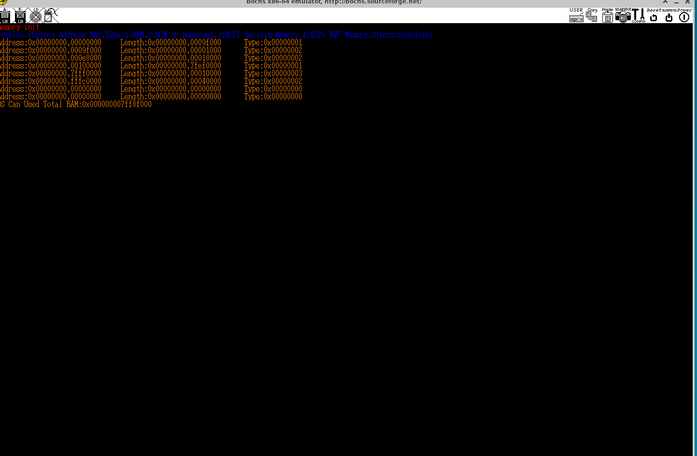
作業系統可以使用的記憶體容量為0x7ff8f000並且由兩個部分組成，一個是容量位0x9f000另一個容量為0x7fef0000，因此可用物理內存大小為0x7fef000 + 0x9f000 = 0x7ff8f000 ≈ 2047.55MB ≃ 2GB(這是在bochs的環境設置megs:2048 (表示2048MB))。


```
// 在64位元架構下一個頁表項佔8byte，因此一個頁表有4KB / 8byte = 512項
#define PTRS_PER_PAGE	512

#define PAGE_OFFSET	((unsigned long)0xffff800000000000) // kernel的起始線性地址，這是經過映射的結果對應物理地址的0。

/* 虛擬的地址只有使用48位元，高的16位是保留位。假使設定一個頁的大喜為4KB。最低的12位元就是offset。
 * 剩餘36位元將分成4等分，分別配給4級頁表，每個頁表有9位元，下面的巨集就是在說明這個關係。
 */
#define PAGE_GDT_SHIFT  39
#define PAGE_1G_SHIFT   30  // 第2級頁表一個項是2^30 = 1GB
#define PAGE_2M_SHIFT   21  // 第3級頁表一個項是2^21 = 2MB
#define PAGE_4K_SHIFT   12  // 第4級頁表一個項是2^12 = 4KB

#define PAGE_2M_SIZE    (1UL << PAGE_2M_SHIFT)
#define PAGE_4K_SIZE    (1UL << PAGE_4K_SHIFT)

#define PAGE_2M_MASK    (~ (PAGE_2M_SIZE - 1)) //忽略小於2MB的數字
#define PAGE_4K_MASK    (~ (PAGE_4K_SIZE - 1)) //忽略小於4KB的數字

#define PAGE_2M_ALIGN(addr) (((unsigned long)(addr) + PAGE_2M_SIZE - 1) & PAGE_2M_MASK) // 讓地址對齊2MB邊界
#define PAGE_4K_ALIGN(addr) (((unsigned long)(addr) + PAGE_4K_SIZE - 1) & PAGE_4K_MASK) // 讓地址對齊4KB邊界

// 下面兩個函式用於線性地址與物理地址之間的映射，但是這個映射關係只有前10MB(定義在head.S中)。
#define Virt_To_Phy(addr)   ((unsigned long)(addr) - PAGE_OFFSET)
#define Phy_To_Virt(addr)   ((unsigned long *)((unsigned long)(addr) + PAGE_OFFSET))
```
這裡要注意的是Virt_To_Phy與Phy_To_Virt址負責映射物理地址的前10MB他被位移到0xffff800000000000處，這用這10MB可使用此巨集。
``` memory.h
struct E820 {
    unsigned long address;
    unsigned long length;
    unsigned int  type;
}__attribute__((packed));
// 這是因為結構體以8 byte為單位對齊，所以要增加屬性packed，保證結構體是緊湊的。

struct Global_Memory_Descriptor {
    struct E820     e820[32];
    unsigned long   e820_length;	
};

extern struct Global_Memory_Descriptor memory_management_struct;
```
我們可以將E820結構體地址與長度的資料型態改成unsigned long，但要注意一點需要利用關鍵字__attribute__((packed))提醒編譯器不要填充空間讓結構體對齊，否則會得到錯誤的結果。接著定義全局記憶體描述符Global_Memory_Descriptor，他保有著int 15h AX=e820h所提供的所有記憶體信息。

```
kernel/memory.c
void init_memory()
{
    ...
    TotalMem = 0; // 考慮頁表對齊重新計算記憶體資源。

    for (i = 0; i <= memory_management_struct.e820_length; ++i) {
        unsigned long start,end;
        if (memory_management_struct.e820[i].type != 1)
            continue;
        start = PAGE_2M_ALIGN(memory_management_struct.e820[i].address);
        end   = (memory_management_struct.e820[i].address + memory_management_struct.e820[i].length) & PAGE_2M_MASK;
        if (end <= start)
            continue;
        TotalMem += (end - start) >> PAGE_2M_SHIFT;
    }
    
    color_printk(ORANGE, BLACK, "OS Can Used Total 2M PAGEs:%#010x=%010d\n", TotalMem, TotalMem);
}

```
由於我們所有的記憶體資源都要經過頁表管理，在我們讀取結構體E820的地址資訊時，只有地址與頁表大小對齊的才能使用。所以這裡我們重新計數可用記憶體資源。在這裡我們以頁目錄大小2MB對齊，在起始地址的位置用巨集AGE_2M_ALIGN上對其，而結束地址則可使用PAGE_2M_MASK下對齊。現在我們已經有可使用的內存頁數量1022 (2MB)，可以以此為基礎實現分配函數alloc_pages。
### 分配可用物理頁
在loader中我們透過系統調用int 15h AX=e820h來取得各個內存段的信息包刮RAM、ROM、保留空間等，我們以2MB為大小對作業系統可用的內存頁進行劃分，並且分跟後的內存頁將透過struct page結構體管理，並使用區域空間結構體struct zone用以代表可用內存區域，並記錄和管理各區的內存使用狀況。而這兩種結構體zone與page都會保存到全局結構體Global_Memory_Descriptor內。

取自一個64位操作系統的設計與實現 圖4-15
在這裡我們定義page與zone
```
kernel/memory.h
struct Page {
    struct Zone     *zone_struct;   // 本頁所屬區域結構體
    unsigned long   PHY_address;    // 頁的物理地址
    unsigned long   attribute;      // 頁的屬性
    unsigned long   reference_count;// 該頁的引用次數
    unsigned long   age;            // 該頁的建立時間
};

struct Zone {
    struct Page     *pages_group; // 結構體數組止指針
    unsigned long   pages_length; // page數量
    unsigned long   zone_start_address; // 本區域的起始頁對齊地址
    unsigned long   zone_end_address; // 本區域的結束頁對齊地址
    unsigned long   zone_length; // 頁對齊後的地址長度
    unsigned long   attribute;  // 本區域的屬性

    struct Global_Memory_Descriptor *GMD_struct; // 指向全局結構體

    unsigned long   page_using_count; // 已使用的物理內存頁數量
    unsigned long   page_free_count; // 空閒的物理內存頁數量
    unsigned long   total_pages_link; // 本區域物理頁被引用的次數

};
```
在結構體page中，PHY_address與zone_struct可透過計算獲得，但是這裡引入兩個成員可以節省計算時間，而attribute用於描述頁的映射狀態、活動狀態、使用者信息等。reference_count則代表當前有多少程式使用這個page。在zone中total_pages_link代表這個頁被引用的數量，但是要注意一個物理頁可以同時映射到多個線性地址，所以page_using_count不一定與量total_pages_link相等，而attribute則用於描述當前區域是否支援DMA或是頁是否經過頁表映射等訊息。接著我們在struct Global_Memory_Descriptor追加變量。
```
kernel/memory.h
struct Global_Memory_Descriptor {
    struct E820     e820[32];
    unsigned long   e820_length;
    unsigned long   *bits_map; // 物理地址空間頁映射位圖
    unsigned long   bits_size; // 物理地址空間的頁數量
    unsigned long   bits_length; // 物理地址空間頁映射位圖長度

    struct Page     *pages_struct;
    unsigned long   pages_size;
    unsigned long   pages_length;

    struct Zone     *zone_struct;
    unsigned long   zones_size;
    unsigned long   zones_length;

    unsigned long   start_code, end_code, end_data, end_brk;
    unsigned long   end_of_struct;
};
```
bits_map與pages_struct呈現一對一的映射關係，建立bits將方便檢索pages_struct的空閒頁表。pages_struct與zone_struct則用於記錄結構體數組的起始地址。而start_code與end_code則分別代表核心程式碼的起始地址與結束地址。end_data則是數據段的結束地址，end_brk為核心程式的節數地址，end_of_struct則是內存頁管理結構的結束地址。
這些變量是在鏈結器在kernel.lds所指定的地址處，我們可以透過聲明變量(標誌符)在main.c中把對應的地址輸入到start_code、end_code、end_data
與end_brk內。
```
kernel/main.c

extern char _text;
extern char _etext;
extern char _edata;
extern char _end;

void Start_Kernel(void)
{
    ...
    memory_management_struct.start_code = (unsigned long)&_text;
    memory_management_struct.end_code   = (unsigned long)&_etext;
    memory_management_struct.end_data   = (unsigned long)&_edata;
    memory_management_struct.end_brk    = (unsigned long)&_end;
    ...
}
```
接著擴展init_memory函式
```memory.c
void init_memory()
{
    ...
    color_printk(ORANGE, BLACK, "OS Can Used Total 2M PAGEs:%#010x=%010d\n", TotalMem, TotalMem);
    TotalMem = memory_management_struct.e820[memory_management_struct.e820_length].address
               + memory_management_struct.e820[memory_management_struct.e820_length].length; // 這是總地址空間，包括RAM、ROM、內存空洞等。
           
    // bits map construction init
    memory_management_struct.bits_map = (unsigned long*) ((memory_management_struct.end_brk + PAGE_4K_SIZE - 1) & PAGE_4K_MASK);
    memory_management_struct.bits_size = TotalMem >> PAGE_2M_SHIFT;
    memory_management_struct.bits_length = (((unsigned long)(TotalMem >> PAGE_2M_SHIFT)
                                            + sizeof(long) * 8 - 1) / 8) & ( ~ (sizeof(long) - 1));
    memset(memory_management_struct.bits_map, 0xff, memory_management_struct.bits_length);
    ...
}
```
物理地址的空間劃分訊息通常位於最後一條內存段劃分信息中，我們把這部分信息取出，並將這個地址以2MB對齊並劃分分頁，這是物理地址可分頁數，需要注意的是這個分頁數不是所有地址都可以被使用有些是ROM有些是內存空洞。接著我們將這個分頁數量賦值給成員bits_size。bits_map指針將指向核心程式的結束地址，另外bits_map指針會上對齊至4KB邊界。接著將bits_map內的全部位置先以0xff標註為非內存頁(之後會將真正可用的物理內存頁復位);

```
kernel/memory.c
void init_memory()
{
    ...
    // pages construction init
    memory_management_struct.pages_struct = (struct Page*)(((unsigned long)memory_management_struct.bits_map
                                            + memory_management_struct.bits_length + PAGE_4K_SIZE - 1) & PAGE_4K_MASK);
    memory_management_struct.pages_size = TotalMem >> PAGE_2M_SHIFT;
    memory_management_struct.pages_length = ((TotalMem >> PAGE_2M_SHIFT) * sizeof(struct Page) + sizeof(long) - 1)
                                            & (~sizeof(long) - 1);
    memset(memory_management_struct.pages_struct, 0, memory_management_struct.pages_length); //init pages memory
    ...
}
```
struct page結構體的物理地址將放置在bits_map後的獨立一個新頁，並且pages_size用於統計有多少物理內存頁，pages_length則是這個結構體的記憶體長度，這個長度將對sizeof(long)對齊，而page_struct中間的所有元素先定義成0以利後續初始化程式使用。
```
    //zones construction init
    memory_management_struct.zone_struct = (struct Zone*)(((unsigned long)memory_management_struct.pages_struct
                                            + memory_management_struct.pages_length + PAGE_4K_SIZE - 1) & PAGE_4K_MASK);
    memory_management_struct.zones_size = 0;
    memory_management_struct.zones_length = (5 * sizeof(struct Zone) + sizeof(long) - 1) & (~(sizeof(long) - 1));
    memset(memory_management_struct.zone_struct, 0, memory_management_struct.zones_length); //init zones memory

```
這裡用來建立zone的結構體信息，書上說目前因為無法計算zone的具體數量所以先將size定義為0，並且zones_length先以5個結構體計算並與sizeof(long)對齊。建立完上述空間後，再次遍歷E820中的所有元素以完成初始化。
```
kernel/memory.c
void init_memory()
{
    ...
    for (i = 0; i < memory_management_struct.e820_length; ++i) {
        unsigned long start, end;
        struct Zone *z;
        struct Page *p;
        unsigned long *b;

        if (memory_management_struct.e820[i].type != 1)
            continue; // 非OS可用內存就跳過
        start = PAGE_2M_ALIGN(memory_management_struct.e820[i].address); // 內存頁先對2MB對齊
        end = (memory_management_struct.e820[i].address + memory_management_struct.e820[i].length) & PAGE_2M_MASK;
        if (end <= start)
            continue; // 代表這一塊內存無法劃分出一塊大小為2MB並且與2MB對齊的頁，故跳過。
        // 這裡相當於依照BIOS系統呼叫int 15h AX=E820h的返回結果，如果這塊內存符合條件，就把它放到一個新的zone。
        // zone init
        z = memory_management_struct.zone_struct + memory_management_struct.zones_size; // 相當於zone_struct[zones_size] 
        memory_management_struct.zones_size++;

        z->zone_start_address = start;
        z->zone_end_address = end;
        z->zone_length = end - start;

        z->page_using_count = 0;
        z->page_free_count = (end - start) >> PAGE_2M_SHIFT;
        
        z->total_pages_link = 0;

        z->attribute = 0;
        z->GMD_struct = &memory_management_struct;

        z->pages_length = (end - start) >> PAGE_2M_SHIFT;
        z->pages_group = (struct Page*)(memory_management_struct.pages_struct + (start >> PAGE_2M_SHIFT));

        //page init
        p = z->pages_group;
        for (j = 0; j < z->pages_length; ++j, ++p) {
            p->zone_struct = z;
            p->PHY_address = start + PAGE_2M_SIZE * j;
            p->attribute = 0;

            p->reference_count = 0;
            p->age = 0;

            *(memory_management_struct.bits_map + ((p->PHY_address >> PAGE_2M_SHIFT) >> 6)) ^= 1UL << (p->PHY_address >> PAGE_2M_SHIFT) % 64;
            /* bit_map中一個位元就代表一個頁。
             * (p->PHY_address >> PAGE_2M_SHIFT) >> 6用於索引此物理頁對應bits_map哪一項。
             * 右移6位則是因為bits_map的每一個元素是64位元。
             * 1ul << (p->PHY_address >> PAGE_2M_SHIFT) % 64 則用於計算需要標記的是哪一個位元。
             * 利用^=把這個位元清0，來表示這一個頁可以被使用。
             */
        }
    }
    ...
}
```
這段程式用於初始化bit_map、Zone、Page，他會遍歷E820內所有物理內存信息，並取出type=1的可用物理內存段，接著判斷這一段物理內存是否可以劃分以2MB為單位對齊並且大小為2MB的頁，如果可以這個內存段就會被分配到一個Zone，並且根據Zone的起始地址start定義這個Zone的頁pages_group從哪裡開始。接著遍歷zone所具有的內存頁Page，把這個Page歸屬於哪個zone，與對應的物理地址和權限等等資訊寫入。最後將這個物理頁在bit_map中對應的位元清0，代表此頁可被使用。
```
kernel/memory.c
void init_memory()
{
    ...
    /////////////init address 0 to page struct 0; because the memory_management_struct.e820[0].type != 1
    
    memory_management_struct.pages_struct->zone_struct = memory_management_struct.zone_struct;

    memory_management_struct.pages_struct->PHY_address = 0UL;
    memory_management_struct.pages_struct->attribute = 0;
    memory_management_struct.pages_struct->reference_count = 0;
    memory_management_struct.pages_struct->age = 0;

    /////////////
    ...
}
```
由於0~2MB之間的空間包含很多物理內存段，所以這個內存段不會出現在Zone中。由於這個物理空間包含了核心程式，因此必須手動對他做初始化。
```
void init_memory()
{
    ...
    for (i = 0; i < memory_management_struct.zones_size; ++i) { //need rewrite in the future
        struct Zone *z = memory_management_struct.zone_struct + i;
        color_printk(ORANGE, BLACK, "zone_start_address:%#018lx,zone_end_address:%#018lx,zone_length:%#018lx,pages_group:%#018lx,pages_length:%#018lx\n",
                    z->zone_start_address, z->zone_end_address, z->zone_length, z->pages_group, z->pages_length);
        if (z->zone_start_address == 0x100000000)
            ZONE_UNMAPED_INDEX = i;
    }
    memory_management_struct.end_of_struct = (unsigned long) ((unsigned long) memory_management_struct.zone_struct 
                                             + memory_management_struct.zones_length + sizeof(long) * 32) & (~(sizeof(long) - 1));
    ...                                      
}
```
這段程式用於映射顯示各區域空間結構體的信息，如果當前區域的起始地址為0x100000000就把此區域的索引放入ZONE_UNMAPED_INDEX，表示這個物理內存頁尚未經過映射，最需需要調整end_of_struct以紀錄結構體的結束地址，並預留空間以防內存越界訪問。
```
void init_memory()
{
    ...
    memory_management_struct.end_of_struct = (unsigned long) ((unsigned long) memory_management_struct.zone_struct 
                                             + memory_management_struct.zone_length + sizeof(long) * 32) & (~(sizeof(long) - 1)));

    color_printk(ORANGE,BLACK, "start_code:%#018lx,end_code:%#018lx,end_data:%#018lx,end_brk:%#018lx,end_of_struct:%#018lx\n",
                 memory_management_struct.start_code, memory_management_struct.end_code, memory_management_struct.end_data, memory_management_struct.end_brk, memory_management_struct.end_of_struct);

    i = Virt_To_Phy(memory_management_struct.end_of_struct) >> PAGE_2M_SHIFT;/* 這理用於計算從地址0到內存管理結構結尾佔據多少頁 */

    for (j = 0; j <= i; ++j) {
        page_init(memory_management_struct.pages_struct + j,PG_PTable_Maped | PG_Kernel_Init | PG_Active | PG_Kernel);
    }
    ...
}
```
程式先把核心程式的start_code、end_code、end_data、end_brk、end_of_struct變量打印。接著用i記錄這個業管理結構的大小，由於end_of_struct的值一開始是由head.S中繼承過來的是線性地址，需轉換成物理地址，使用巨集PAGE_2M_SHIFT可以獲得這個結構總共佔據多少2M大小的分頁。接著，初始化這些分頁，把它們添加上PG_PTable_Maped(經過頁表映射的頁)、PG_Kernel_Init(核心初始化程式)、PG_Active(使用中的頁)、PG_Kernel(核心的頁)的屬性。這些屬性被定義在memory.h中，每個屬性都佔據attribute的一個位元。接著init_memory剩下的程式碼則用於清理頁表項，這些頁表在進入IA-32e mode時需要維持一致性頁表映射(物裡地址與線性地址相同)，從loader繼承過來的資料此時已經被放入核心的數據段中，因此不需要保留一致性頁表映射。
```
kernel/memory.c
void init_memory()
{
    ...
    Global_CR3 = Get_gdt();
    color_printk(INDIGO,BLACK, "Global_CR3\t:%#018lx\n", Global_CR3);
    color_printk(INDIGO,BLACK, "*Global_CR3\t:%#018lx\n", *Phy_To_Virt(Global_CR3) & (~0xff));
    color_printk(PURPLE,BLACK, "**Global_CR3\t:%#018lx\n", *Phy_To_Virt(*Phy_To_Virt(Global_CR3) & (~0xff)) & (~0xff));

    for(i = 0;i < 10;i++)
        *(Phy_To_Virt(Global_CR3)  + i) = 0UL; /* 這裡把一級頁表的10個條目清空 */
    
    flush_tlb();
}
```
函數Get_gdt()用於獲取CR3暫存器的物理地址，這個暫存器指向一級頁表的物理地址。在head.S中定義一級頁表的物理位置為0x101000，二級頁表為102000，三級則為103000。因此Global_CR3 = 0x101000，*Global_CR3 = 0x102000，**Global_CR3 = 0x102000。而為了消除一致性頁表映射，需要將頁目錄的前10個頁表項清零(實際上在head.S中我們只有定義第0項與第256項，消除一致性映射只要把第0項清0即可)。並且清零的同時這些頁表項不會立即生效，我們必須清空MMU的TLB cache，使用memory.h中定義的flush_tlb函式即可完成此操作，以下為他的實現。
```
#define flush_tlb()                         \
do {                                        \
    unsigned long	tmpreg;                 \
    __asm__ __volatile__    (               \
                "movq   %%cr3,  %0  \n\t"   \
                "movq   %0, %%cr3   \n\t"   \
                :"=r"(tmpreg)               \
                :                           \
                :"memory"                   \
                );                          \
}while(0)
```
此巨集使用do{}while(0)只是為了讓使用巨集時，可以在後面加上分號，符合書寫習慣。關鍵字__volatile__代表這些指令不可以被優化或是重新排序。而輸出約束定義tmpreg是操作數0，所以操作是先將cr3暫存器的值放入變數tmpreg中，並將這個值稍後移回CR3暫存器。雖然上述程式碼並沒有改變CR3的值，但是寫入的操作就會讓TLB刷新。
```
static inline unsigned long *Get_gdt()
{
    unsigned long * tmp;
    __asm__ __volatile__    (
                    "movq   %%cr3,	%0	\n\t"
                    :"=r"(tmp)
                    :
                    :"memory"
                );
    // 把cr3的值放入操作數0也就是tmp中。
    return tmp;
}
```
函式Get_get則是把cr3的儲存的地址放入操作數0也就是變數tmp中。
```
kernel/memory.c
unsigned long page_init(struct Page *page, unsigned long flags)
{
    if (!page->attribute) {
        *(memory_management_struct.bits_map + ((page->PHY_address >> PAGE_2M_SHIFT) >> 6)) |= 1UL << (page->PHY_address >> PAGE_2M_SHIFT) % 64;
        page->attribute = flags;
        page->reference_count++;
        page->zone_struct->page_using_count++;
        page->zone_struct->page_free_count--;
        page->zone_struct->total_pages_link++;
    } else if ((page->attribute & PG_Referenced) || (page->attribute & PG_K_Share_To_U)
                || (flags & PG_Referenced) || (flags & PG_K_Share_To_U)) {
        page->attribute |= flags;
        page->reference_count++;
        page->zone_struct->total_pages_link++;
    } else {
        *(memory_management_struct.bits_map + ((page->PHY_address >> PAGE_2M_SHIFT) >> 6)) |= 1UL << (page->PHY_address >> PAGE_2M_SHIFT) % 64;
        page->attribute |= flags;
    }
    return 0;
}
```
page_init函式用於初始化頁，首先檢查此頁的屬性如果沒有任何東西，說明這是準備要建立的新頁，此時先到bit_map中置位這個頁表的位元表示啟用這個頁，接著位這個頁添加屬性。而如果當前頁具有引用屬性(PG_Referenced)或是共享屬性(PG_K_Share_To_U)在添加屬性的同時需要增加zone結構體的引用計數，若都沒有就只是添加頁表屬性與置位bit_map。下圖為運行的結果。
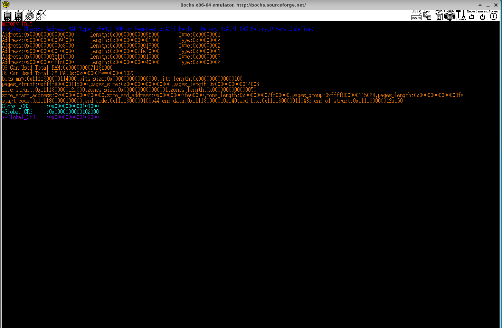
如此我們已經成功初始化GMD、page與zone。

### 實現物理頁內存分配函數
分配函數alloc_pages會從初始化得內存管理單元結構體中搜索伏身申請條件的page，並將其設定為使用狀態。(目前alloc_pages的設計具有缺陷如容易陷入內存破碎化等等問題，這些問題會在之後改善這裡先完成最基礎的功能)
```
struct Page * alloc_pages(int zone_select,int number,unsigned long page_flags)
{
    int i;
    unsigned long page = 0;
    int zone_start = 0;
    int zone_end = 0;

    switch(zone_select) {
        case ZONE_DMA:
            zone_start = 0;
            zone_end = ZONE_DMA_INDEX;
            break;
        case ZONE_NORMAL:
            zone_start = ZONE_DMA_INDEX;
            zone_end = ZONE_NORMAL_INDEX;
            break;
        case ZONE_UNMAPED:
            zone_start = ZONE_UNMAPED_INDEX;
            zone_end = memory_management_struct.zones_size - 1;
            break;
        default:
            color_printk(RED,BLACK,"alloc_pages error zone_select index\n");
            return NULL;
            break;
    }
    ...
}
```
首先函式會透過變數zone_select選擇從DMA區域空間、以映射頁表的空間或是位映射頁表的空間中一次性申請連續物理頁，並對這些頁設置page_flags屬性。
如果zone_select無法找到匹配的區域空間會打印錯誤訊息並返回。此外在.bochsrc文件中我們設定megs:2048，所以在bochs虛擬機上僅有2GB的內存空間，因此目前ZONE_DMA_INDEX、ZONE_NORMAL_INDEX、ZONE_UNMAPED_INDEX都是代表同一個空間(默認值0的空間)。
```
kernel/memory.c
struct Page *alloc_pages(int zone_select,int number,unsigned long page_flags)
{
    ...
    // number為需申請的頁數，遍歷所有的zone，找到一個zone可分配number頁數的內存。
    for(i = zone_start; i <= zone_end; ++i) {
        struct Zone *z;
        unsigned long j;
        unsigned long start, end, length;
        unsigned long tmp;

        if((memory_management_struct.zone_struct + i)->page_free_count < number)
            continue; // 頁不足的zone就跳過

        z = memory_management_struct.zone_struct + i;
        start = z->zone_start_address >> PAGE_2M_SHIFT;
        end = z->zone_end_address >> PAGE_2M_SHIFT;
        length = z->zone_length >> PAGE_2M_SHIFT;

        tmp = 64 - start % 64; // 因為在bit_map中每一項都代表64個page，考慮對齊問題引入參數tmp
        // start + tmp 為 64的倍數，因此for迴圈只有在第一次循環時j可能不對齊，其餘都是64倍數
        for(j = start; j <= end; j += j % 64 ? tmp : 64) {
            unsigned long * p = memory_management_struct.bits_map + (j >> 6); // bits_map一項表示64個頁。
            unsigned long shift = j % 64; // 找到j於bits_map對應項中的位元。
            unsigned long k;
            for(k = shift; k < 64 - shift; ++k) {
                /* (*p >> k) | (*(p + 1) << (64 - k)用於取得連續的64個page。
                 * 三元表達式用於避免溢出，用了一個number == 64的特例，並建立掩碼。 
                 * 假設做與運算的結果不是0則代表找不到連續的可用物理頁，取!即可幫助判斷。
                 */
                if( !(((*p >> k) | (*(p + 1) << (64 - k))) & (number == 64 ? 0xffffffffffffffffUL : (1UL << number) - 1))) {
                    // 找到可用的頁並分配空間
                    unsigned long l;
                    page = j + k - 1; // 定位pages_struct中所代表的物理頁
                    for(l = 0; l < number; ++l) {
                        struct Page *x = memory_management_struct.pages_struct + page + l;
                        page_init(x,page_flags); // 初始化
                    }
                    goto find_free_pages;
                }
            }
        }
    }

    return NULL;

find_free_pages:

}
```
這一部分程式碼將用於遍歷目標區域所有的zone，並從中找出第一個具有申請大小連續物理頁的zone。在程式碼中需要頻繁對64取餘數是因為數組bits_map的資料型別是unsigned long每一項具有64位元，每個位元映射到物理內存的一個頁。考慮到zone的起始地址不一定是128MB的倍數(bits_map一項可以映射128MB)，所以引入變數tmp以解決對齊問題。函數會先透過page_free_count篩選出具有足夠空閒物理內存的zone，接著遍歷這個zone所代表的物理頁，利用bits_map去查找是否存在連續並且數量大於等於number的連續物理頁。尚未被使用的頁在bits_map對應的位元會被標示為0，根據這個特性可建立掩碼MASK，將掩碼與bits_map擷取出的值做與運算後即可判斷是否存在連續閒置的物理頁，如果運算結果為0說明找到了符合條件的連續物理頁，運算結果非0則代表部分物理頁被占用需繼續查找。接下來在main.c中測試alloc_pages申請連續的64個頁，並查看輸出結果。
```
kernel/main.c
void Start_Kernel(void)
{
    ...
    struct Page * page = NULL;

    color_printk(RED,BLACK, "memory_management_struct.bits_map:%#018lx\n", *memory_management_struct.bits_map);
    color_printk(RED,BLACK, "memory_management_struct.bits_map:%#018lx\n", *(memory_management_struct.bits_map + 1));

    page = alloc_pages(ZONE_NORMAL,64,PG_PTable_Maped | PG_Active | PG_Kernel);

    for(i = 0; i <= 64; ++i) {
        color_printk(INDIGO,BLACK, "page%d\tattribute:%#018lx\taddress:%#018lx\t", i, (page + i)->attribute, (page + i)->PHY_address);
        ++i;
        color_printk(INDIGO,BLACK, "page%d\tattribute:%#018lx\taddress:%#018lx\n", i, (page + i)->attribute, (page + i)->PHY_address);
    }

    color_printk(RED,BLACK, "memory_management_struct.bits_map:%#018lx\n", *memory_management_struct.bits_map);
    color_printk(RED,BLACK, "memory_management_struct.bits_map:%#018lx\n", *(memory_management_struct.bits_map + 1));
    ...
}
```
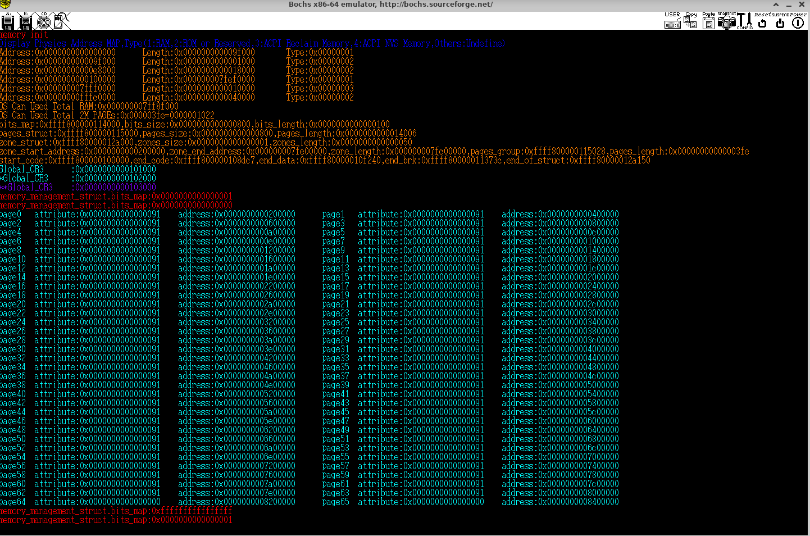
可看到這64個頁的屬性被設為0x91，且物理地址從0X200000處(2MB處)開始建立64個連續的頁。至於為何從0x200000開始，這是因為在此之前我們只註冊了2MB的頁用於放置kernel程式與內存管理信息等內容。

## 中斷處理
這一節主要討論由PIC(Programmable Interrupt Controller)發出的中斷，這些中斷可以被註冊到IDT上，當發生項應的中斷時處理器就會跳轉做相對應的中斷/異常處理函式。intel處理器只由一個外部中斷引腳INTR，這腳負責接收來自PIC的信息，而PIC則負責彙總所有發生的中斷，在根據各IRQ的屬性來決定中斷是否被屏蔽或是送至CPU。書中在本節先以8259A PIC作為入門晶片。
### 8259A PIC
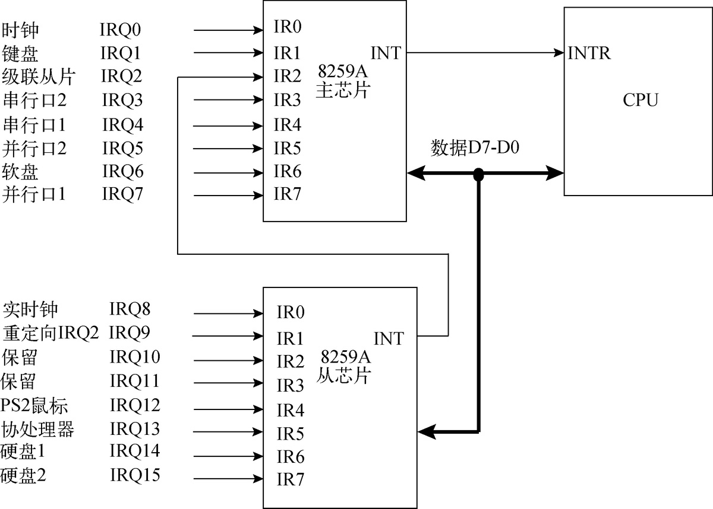
圖片擷取自 一個64位操作系統的設計與實現 圖4-18
在圖中8259A晶片做為主晶片，直接與CPU的INTR相連，另外其IRQ2腳位則與從晶片相連。
8259A具有可配置的兩組暫存器，分別為ICW (InitializationCommand Word，初始化命令字)與OCW（Operational Control Word，操作控制字）。在8259A PIC工作前必須先使用ICW配置暫存器組，而OCW則用於操作中斷控制器，可用於調整中斷控制器的工作方式。
PC上採用I/O地址映射方式，這些暫存器將被映射到I/O端口的地址空間，必須使用指令IN與OUT來讀取或是寫入暫存器。對於8259A PIC的主晶片其I/O端口為20h與21h而從晶片則為a0h與a1h，透過這些I/O端口可操作ICW與OCW從而操控IRR、PR、ISR、IMR等暫存器。
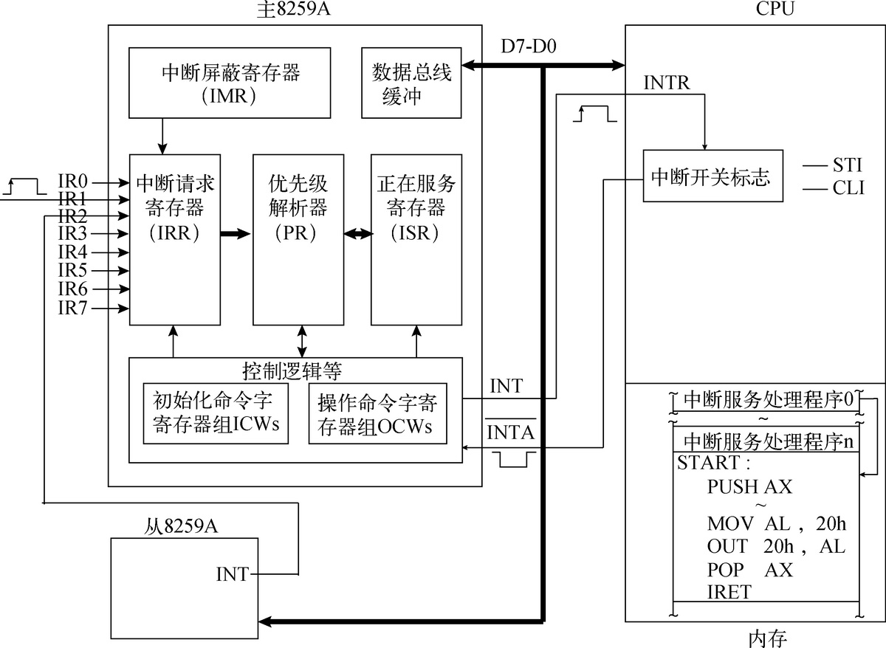
圖片擷取自 一個64位操作系統的設計與實現 圖4-19
IRR(Interrupt Request Register，中斷請求暫存器)用以保存IR0~IR7共8個引腳的中斷請求，這個暫存器有8bits分別對應IR0-IR7。而IMR(Interrupt Mask Register，中斷屏蔽暫存器)同樣具有8bits，用以紀錄被屏蔽的引腳，如果被置位PIC就會屏蔽來自該引腳的信息，並忽略他。PR(（Priority Resolver，優先級解析器)從IRR暫存器中選取中斷請求中最高優先級的，發送信息給ISR(In-Service Register，正在服務暫存器)。ISR暫存器紀錄著待處理的中斷請求。8259A晶片會項CPU傳遞INT中斷信號，並且CPU會在執行完每個指令後檢測是否接收到INT信號，如果有接收到且CPU不處於屏蔽中斷狀態，CPU會返回INTA信息給8259A(表示接收到中斷)，此時8259A就會把這個信息保存到ISR中並復位IRR暫存器的信號位。隨後CPU會在向8259A發送第二個INTA信號，這是為了通知8259A把中斷向量號(8bit數據)送到數據總線上提供CPU讀取，當CPU接收到中斷向量號時可以檢索對應的IDT描述符並調轉到對應的處理程式。
而ISR的復位有兩種方式這取決於8259A晶片採取AEOI(Automatic End of Interrupt，自動結束中斷)或是非自動，前者在接收到CPU傳送的第2個INTA時就會復位ISR，而後者則必須等待CPU在中斷處理程式的結尾處傳送EOI(End of Interrupt，結束中斷命令)來復位ISR，如果中斷請求來自從晶片(IRQ8~IRQ15)，則必需傳送兩個EOI(這是指復位IRQ2和從晶片對應的IRQ)。
**初始化命令字ICW**
ICW暫存器組包含四個暫存器，初始化時必須依順序由ICW1-ICW4的順序初始化。8259A主晶片ICW1由I/O端口20h控制，而ICW2、ICW3、ICW4則由I/O端口21h控制。從晶片的CIW1則由I/O端口A0h，ICW2、ICW3、ICW4則由I/O端口A1h控制。另外初始化只需要滿足ICW1-ICW4的順序就好，先初始化主晶片再初始化從晶片或是兩個晶片交替初始化都可以。另外這四個暫存器都只有8位元。

**ICW1暫存器


| 位  | 描述                                     | 位  | 描述                      |
| --- :---------------------------------------- | --- | ------------------------- |
| 0   | 是否使用ICW4，1:使用，0:不使用           | 3   | 觸發模式，現已忽略必須為0 |
| 1   | 是否存在從晶片，1:單片8259A，0:級聯8259A | 4   | ICW必須為1                |
| 2   | 忽略必須為0                              | 5-7 | PC必須為0                 |
目前我們將ICW1控制字初始化為11h (置為bit0與bit4)。

**ICW2暫存器
初始化時根據寫入的高5位來做為中斷向量的高5位，剩下的3位則透過中斷源(是哪個引腳輸出IR0-IR7)形成完整的8位中斷向量號。


| 位  | 描述            |
| --- | --------------- |
| 3-7 | 中斷向量號高5位 |
| 0-2 | 0               |
通常狀況下主8259A晶片的中斷向量號會設為20h(占用20h-20h)，而從8259a晶片則從28h開始(占用28h-2fh)。

**ICW3暫存器

主從ICW3暫存器的意義不同，對於主暫存器各位元的狀態用於表示是否級聯從晶片。比如BIT2 = 1表示IR2級聯從晶片，而0代表沒有級聯，同樣的假設BIT0=1則代表IR0級聯從晶片，而從晶片的ICW暫存器則用於紀錄與主晶片的級聯狀態，用BIT0~BIT2表示銜接到主晶片的哪個IR引腳，BIT3-BIT7則必須設定為0。由於我們的系統中主晶片的IR2級聯從晶片所以主晶片的ICW置字為04h(BIT2)，從晶片的ICW3為02h(表示接到IR2)。

**ICW4

| 位   | 描述                                                    |
| ---- | ------------------------------------------------------- |
| 5-7  | 必須為0                                                 |
| 4    | 1=SFNM，0=FNM                                           |
| 2-3  | 緩衝模式:00=無緩衝，10=從晶片緩衝模式，11主晶片緩衝模式 |
| 1    | 1=AEOI，0=EOI                                           |
| 0    | 1=8086/88模式，0=MCS 80/85模式                          |

FNM（Fully Nested Mode，全嵌套模式）：此模式下中斷優先級的順序為IR0~IR7，如果從8259A晶片的中斷正在被處理，該晶片將被主晶片屏蔽到處理完畢，期間產生任何中斷都不會被受理。
SFNM（Special Fully Nested Mode，特殊全嵌套模式）:基本與FNM相同，但當從晶片的中斷請求正在被受理時，主晶片不會屏蔽從晶片，這使得主晶片可以接收來自從晶片更高優先級的中斷。另外CPU從中斷處理程式返回時需要相向從晶片發送EOI指令，並檢測從晶片ISR是否存在待處理的中斷，沒有中斷等待處理時才發送第2個EOI給主晶片，表示IRQ2的中斷已經全數處理完成。
在這裡把ICW4設為01h即可，書上說核心通常不會把中斷控制器的配置弄的複雜儘量採用簡單的邏輯。

OCW暫存器
OCW暫存器組有3個暫存器，分別用OCW1-OCW3表示，用於調整與控制工作期間的中斷控制器，與ICW不同這三個暫存器沒有順序之分。主晶片中OCW1映射到I/O端口21h中，OCW2與OCW3則映射到I/O端口20h處，而從晶片OCW1則映射到I/O端口a1處，OCW2、OCW3映射到a0h處。
OCW1暫存器有8位元分別表示是否屏蔽來自IR的中斷請求，若BIT0=1則屏蔽來自IR0的中斷請求。

下表為OCW2暫存器的描述

| 位  | 描述           |
| --- | -------------- |
| 7   | 優先級循環標誌 |
| 6   | 特殊設定標誌   |
| 5   | 非自動結束標誌 |
| 4   | 0              |
| 3   | 0              |
| 0-2 | 優先級設定     |
而OCW2暫存器的第5-7位可以組成多種模式


| D5  | D6  | D7  | 意義                      |
| --- | --- | --- | ------------------------- |
| 0   | 0   | 0   | 循環AEOI模式(清除)        |
| 0   | 0   | 1   | 非特殊EOI命令(全嵌套模式) |
| 0   | 1   | 0   | 無操作                    |
| 0   | 1   | 1   | 特數EOI命令(非全嵌套模式) |
| 1   | 0   | 0   | 循環ADOI模式(設置)        |
| 1   | 0   | 1   | 循環非特殊EOI命令         |
| 1   | 1   | 0   | 設置優先級命令            |
| 1   | 1   | 1   | 循環特殊EOI命令           |

D7=1的循環模式是指，8259A晶片使用一個8bit循環對列保存各個引腳的中斷請求，當執行完一個中斷請求後，這個請求的優先即會被設定到最低，並排入對列的尾端。
D6=1，D7=1這是特殊循環模式，代表在循環模式的基礎上將D0~D2指定的優先級設為最低優先級，並按照循環模式循環降低中斷請求的優先級。

**OCW3
| 位  | 描述                             |
| --- | -------------------------------- |
| 7   | 為0                              |
| 5-6 | 11:開啟特殊屏蔽，10:關閉特殊屏蔽 |
| 4   | 為0                              |
| 3   | 為1                              |
| 2   | 1:輪詢，0:無輪詢                 |
| 0-1 | 10=讀IRR暫存器，11=讀ISR暫存器   |

### 觸發中斷
異常是處理器產生的任務暫停而中斷是外部設備產生的任務暫停，兩者都需要保存和恢復任務現場。以下為保存任務現場的程式碼，放在kernel/interrupt.c。
```
#define SAVE_ALL                    \
    "cld;           \n\t"           \
    "pushq  %rax;   \n\t"           \
    "pushq  %rax;   \n\t"           \
    "movq   %es,    %rax;   \n\t"   \
    "pushq  %rax;   \n\t"           \
    "movq   %ds,    %rax;   \n\t"   \
    "pushq  %rax;   \n\t"           \
    "xorq   %rax,   %rax;   \n\t"   \
    "pushq  %rbp;   \n\t"           \
    "pushq  %rdi;   \n\t"           \
    "pushq  %rsi;   \n\t"           \
    "pushq  %rdx;   \n\t"           \
    "pushq  %rcx;   \n\t"           \
    "pushq  %rbx;   \n\t"           \
    "pushq  %r8;    \n\t"           \
    "pushq  %r9;    \n\t"           \
    "pushq  %r10;   \n\t"           \
    "pushq  %r11;   \n\t"           \
    "pushq  %r12;   \n\t"           \
    "pushq  %r13;   \n\t"           \
    "pushq  %r14;   \n\t"           \
    "pushq  %r15;   \n\t"           \
    "movq   $0x10,  %rdx;   \n\t"   \
    "movq   %rdx,   %ds;    \n\t"   \
    "movq   %rdx,   %es;    \n\t"

/* 在內嵌組合語言表達式中，如果輸入輸出與損壞部分可以省略
 * 另外這裡不使用__asm__關鍵字是因為他是巨集，他會在其他部分被調用比如
 * __asm__ __volatile__ (
 *  SAVE_ALL
 * );
 */
 
#define IRQ_NAME2(nr) nr##_interrupt(void)
#define IRQ_NAME(nr) IRQ_NAME2(IRQ##nr)

#define Build_IRQ(nr)   \
void IRQ_NAME(nr);      \
__asm__ (	SYMBOL_NAME_STR(IRQ)#nr"_interrupt:     \n\t"   \
            "pushq  $0x00                           \n\t"   \
            SAVE_ALL                                        \
            "movq   %rsp,   %rdi                    \n\t"   \
            "leaq   ret_from_intr(%rip),	%rax    \n\t"   \
            "pushq  %rax                            \n\t"   \
            "movq   $"#nr", %rsi                    \n\t"   \
            "jmp    do_IRQ  \n\t");
// SYMBOL_NAME_STR此巨集在linkage.h中定義。
```
這一段巨集用於定義中斷處理程式的入口。##在巨集展開的過程中會把操作符兩邊連接。比如IRQ_NAME2(0x20)會被替換成IRQ_NAME2(IRQ0x20)這樣，最終會生成函數名void IRQ0x20_interrupt(void)。而操作符#則是把輸入的值強制轉換為字串，如YMBOL_NAME_STR(X) #X，經過轉換後X將變成字串。如果nr為0x20，"movq $"#nr", %rsi"則會被替換成"movq $0x20 %rsi"。接著程式會透過leaq指令取得返回地址並放入stack中，這是因為使用jmp跳轉含是不會押入返回地址，如需要使用ret指令就要自己壓入stack中。do_IRQ函式的輸入參數則由rdi與rsi指定，分別為rsp與中斷向量號。
```
Build_IRQ(0x20)
...
Build_IRQ(0x37)

void (* interrupt[24])(void)=
{
    IRQ0x20_interrupt,
    ...
    IRQ0x37_interrupt,
};
// 這是放置函數指針的數組。
```
我比較好奇為什麼Build_IRQ不使用do{}while(0)封裝，這樣可以加上分號看起來更直觀，另外Build_IRQ(0x20)作用就是宣告一個函數void IRQ0x20_interrupt(void)。接下來將初始化PIC 8259A與其相應的IDT內的門描述符。
```
void init_interrupt()
{
    int i;
    // 32 - 55對應0x20-0x0x37。
    for (i = 32;i < 56; ++i) {
        set_intr_gate(i, 2, interrupt[i - 32]);
        // i表示是第i號idt描述符，2表示使用tss的isr2，interrupt[i - 32]為處理函式的地址。
    }

    color_printk(RED, BLACK, "8259A init \n");
    //8259A-master	ICW1-4
    io_out8(0x20,0x11); // 0x11表示啟用ICW4 (BIT4為ICW，BIT0為啟用ICW4)
    io_out8(0x21,0x20); // 表示中斷向量從0x20開始(BIT0-BIT2必須為0)
    io_out8(0x21,0x04); // 表示IRQ2聯集從8259A晶片
    io_out8(0x21,0x01); // 表示AEOI模式會自動復位ISR，不須透過CPU發出EOI指令。

    //8259A-slave	ICW1-4
    io_out8(0xa0,0x11);
    io_out8(0xa1,0x28);
    io_out8(0xa1,0x02); // 表示銜接到IRQ2的引腳
    io_out8(0xa1,0x01);

    //8259A-M/S	OCW1
    io_out8(0x21,0x00); // 不屏蔽中斷請求。
    io_out8(0xa1,0x00);
    sti(); // 恢復CPU中斷
}
```
io_out8是內嵌組合語言指令放在lib.h，用於輸出數據到指定I/O端口。最後操作OCW1使得PIC的所有中斷指令都可以傳輸到CPU而不會被屏蔽，而sti則用於恢復CPU中斷(置位EFLAGS暫存器的中斷標誌位IF)。接著我們來測試PIC是否有初始化成功。
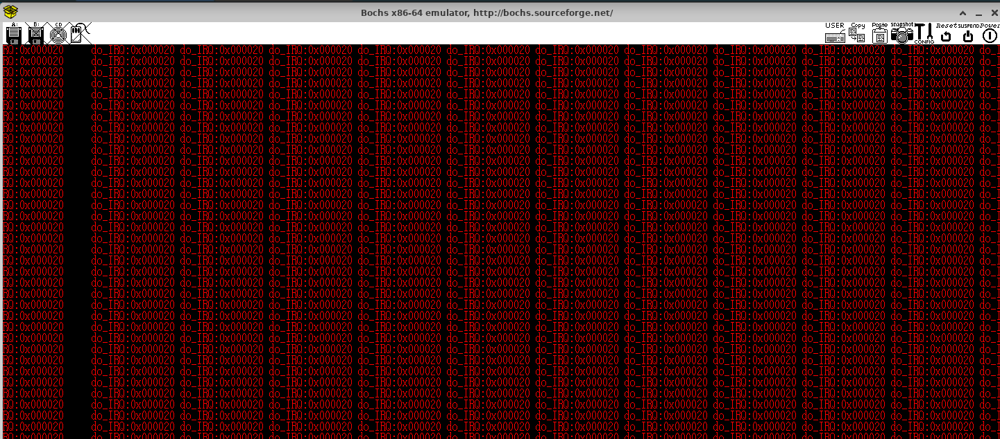
可以注意到畫面上重複印出do_IRQ:0x20，這對應的是IRQ0定時器所產生的中斷，如此PIC便初始化成功了，接下來我們來實現鍵盤驅動(IRQ1)。

### 鍵盤驅動
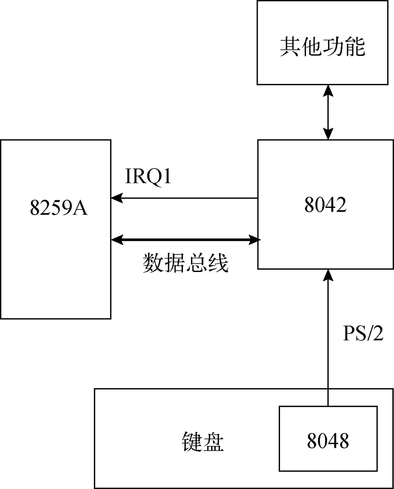
當8048鍵盤控制器檢測到按鍵被按下時會將該鍵位對應的編碼值傳送到8042鍵盤控制器晶片中，並由8024晶片將此編碼值解析成統一的鍵盤掃描碼，並輸出到鍵盤緩衝區中等待處理器處理，需要注意的是如果緩衝區沒有被清空8042晶片就不會接收新的數據。
計盤掃描碼總共有3套:第1套為原始的XT掃描碼集，第2套為AT掃描碼集，第三套為PS/2掃描碼集(少用)。現今鍵盤接默認使用AT鍵盤掃描碼，但出於兼容性考量AT掃描碼最後會轉換成XT掃描碼供處理器使用(也可不換成XT但這樣需要另做配置)。
XT掃描碼的特點為每個按鍵的碼由1byte組成，bit0-bit6代表按鍵的掃描碼，而bit7則代表按鍵狀態(0:按下，1:鬆開)。按下按鍵時鍵盤控制器的輸出稱為make code，而鬆開時則稱為break code。此外有些擴展按鍵使用2byte的掃描碼，按此按鍵被按下時鍵盤控制器會產生兩個中斷請求，第一個中斷請求會向處理器發送0xe0前綴，第二個中斷請求則向處理器發送1byte的make code，而鬆開時一樣產生兩個中斷請求，發送前綴0xe0在發送break code。另外還有2個特殊按鍵PrtScn與Pause/Break，前者會發送兩個含有擴展碼前綴的碼xe0、0x2a、0xe0、0x37，而鬆開時也會收到2組包含前綴的擴展碼生0xe0、0xb7、0xe0、0xaa。而Pause/Break則只有在按下時才產生掃描碼0xe1、0x1d、0x45、0xe1、0x9d、0xc5，鬆開時不會有任何回應。鍵盤控制器同樣使用I/O端口地址映射方式，需要透過組合語言指令IN、OUT輸入與輸出資料，其I/O端口為60h與64h，60h的暫存器用於讀寫緩衝區，而64h則用於讀取暫存器狀態或是發送控制命令給晶片。
** 鍵盤中斷捕獲函式
```
void init_interrupt()
{
    ...
    //8259A-M/S	OCW1
    io_out8(0x21,0xfd); // 把IRQ1以外的中段屏蔽
    io_out8(0xa1,0xff);
    ...
}
```
操作OCW1讓屏蔽IRQ1以外的中斷，確保只會輸出IRQ1來自鍵盤的信息。
```
void do_IRQ(unsigned long regs, unsigned long nr)	//regs:rsp,nr
{
    unsigned char x;
    color_printk(RED, BLACK, "do_IRQ:%#08x\t", nr);
    x = io_in8(0x60);
    color_printk(RED, BLACK, "key code:%#08x\n", x);
    io_out8(0x20, 0x20);
}
```
在這裡我們什麼都不做只是輸出鍵盤的掃描碼，以下為輸出結果。可利用佇列實現緩衝區紀錄鍵盤的輸出結果，並建立按鍵的映射關係即可完成簡易的輸入與輸出。
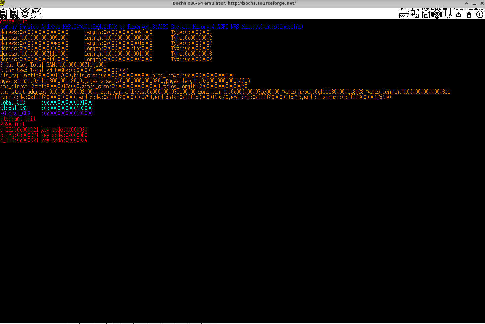

### 行程排程管理
Process為程式維護運行時的各種資源，如:行程ID(PID)、行程的頁表、行程執型現場的暫存器值、行程各個段的地址空間信息與維護信息等，這些資源會被友組茲的結構劃到PCB(Process Control Block，行程控制結構體)中，並作為爬承調度的決策信息提供調度的演算法使用。調度策略將直接影響系統地執行效能。Linux就曾經使用過O1算法、RSDL算法、CFS算法等。

PCB用於紀錄與統整行程的資源使用狀況和運行態信息(包括硬體與軟體)。struct task_struct是此系統的第一版PCB，以下的結構體接定義在task.h中。
```
struct task_struct {
    struct List list;
    volatile long state;
    unsigned long flags;

    struct mm_struct *mm;
    struct thread_struct *thread;

    unsigned long addr_limit;   /*0x0000,0000,0000,0000 - 0x0000,7fff,ffff,ffff user*/
                                /*0xffff,8000,0000,0000 - 0xffff,ffff,ffff,ffff kernel*/
    long pid;
    long counter;
    long signal;
    long priority;
};
```


| 結構體成員                     | 說明                                                                        |
|:------------------------------ |:--------------------------------------------------------------------------- |
| struct List list               | 雙向鍊表，用於連接各行程(process)的控制結構體                               |
| volatile long state            | 行程狀態:運行態、停止態、可中斷態等，關鍵字volatile表示讀寫時都需經過內存 |
| unsigned long flags            | 行程標誌:process、thread、kernel thread                                   |
| struct mm_struct * mm          | 內存空間分布結構體，紀錄內存頁表與程式段信息                                |
| struct thread_struct * thread; | 行程切換時保留的狀態信息                                                    |
| unsigned long addr_limit       | 行程地址空間範圍 <br>0x00000000,00000000 - 0x00007FFF,FFFFFFFF (user) <br>0xFFFF8000,00000000 - 0xFFFFFFFF,FFFFFFFF (kernel)                                                           |
| long pid                       | 行程ID                                                                      |
| long counter                   | 行程可用時間片                                                              |
| long signal                    | 行程持有的訊號                                                              |
| long priority                  | 行程優先級                                                                  |

state使用關鍵字volatile表示不希望編譯器對他做優化，每次使用這個便量時都需要經過內存而非通過暫存器副本或是快取的值。struct mm_struct此結構體描述了一個程式的頁表結構與程式的各段信息，包括一級頁表地址、程式碼段、數據段、只讀數據段、應用層stack等，以下是定義。

```
struct mm_struct {
    pml4t_t *pgd;   //一級頁表地址，切換任務時載入cr3時使用。
    
    unsigned long start_code, end_code; // 程式碼段的起始與結束地址
    unsigned long start_data, end_data; // 數據段的起始與結束地址
    unsigned long start_rodata, end_rodata; // 只讀數據段的起始與結束地址
    unsigned long start_brk, end_brk; // 動態內存分配區 (heap)
    unsigned long start_stack;	// stack基地址
};
```
成員pgd保存的是這個行程一級頁表的起始地址，方便切換行程載入cr3暫存器。其他便量則名數應用程式的地址空間。每次行程切換時都必須將現場的暫存器保存，系統會將這些數據保存在struct thread_struct內。
```
struct thread_struct {
    unsigned long rsp0;	//核心層使用的stack基地址

    unsigned long rip;
    unsigned long rsp;	

    unsigned long fs;
    unsigned long gs;

    unsigned long cr2;
    unsigned long trap_nr; // 產生異常的異常號
    unsigned long error_code; // 異常的錯誤碼
};
```

圖片擷自 一個64位操作系統的設計與實現 圖4-24
**注意這張圖把struct task_struct誤植成struck task_struck**

在linux核心中核心stack中間與struct task_struct相鄰，低地址處放truct task_struct，高地址則是stack。其中stack與struct task_struct的空間大小被巨集STACK_SIZE所定義為32768(32KB) (先暫時定義為32KB若空間不足時再擴充)。整個空間用聯合體union所定義。
```
union task_union {
    struct task_struct task;
    unsigned long stack[STACK_SIZE / sizeof(unsigned long)];
}__attribute__((aligned (8)));	//8Bytes align
```
這個聯合體占用32KB空間併購過關鍵字設定以8byte為單位對齊，實際上聯合體的起始地址必須依照32KB對齊。

```
#define INIT_TASK(tsk)                  \
{                                       \
    .state = TASK_UNINTERRUPTIBLE,      \
    .flags = PF_KTHREAD,                \
    .mm = &init_mm,	                    \
    .thread = &init_thread,             \
    .addr_limit = 0xffff800000000000,   \
    .pid = 0,                           \
    .counter = 1,                       \
    .signal = 0,                        \
    .priority = 0                       \
}
// 用於初始化 struct task_struct

union task_union init_task_union __attribute__((__section__ (".data.init_task"))) = {INIT_TASK(init_task_union.task)};

struct task_struct *init_task[NR_CPUS] = {&init_task_union.task,0};

struct mm_struct init_mm = {0};

struct thread_struct init_thread = 
{
	.rsp0 = (unsigned long)(init_task_union.stack + STACK_SIZE / sizeof(unsigned long)),
	.rsp = (unsigned long)(init_task_union.stack + STACK_SIZE / sizeof(unsigned long)),
	.fs = KERNEL_DS,
	.gs = KERNEL_DS,
	.cr2 = 0,
	.trap_nr = 0,
	.error_code = 0
};
```
INIT_TASK用於初始化結構體struct task_struct，全局變量init_task_union設定屬性`__attribute__((__section__ (".data.init_task")))`，這表示這個全局便量會練節到一個特殊的程式段.data.init_task中，鏈結的地址於鏈結腳本kernel.lds中定義。

```
SECTIONS
{
    ...
	. = ALIGN(32768);
	.data.init_task : { *(.data.init_task) }
    ...
}

```
`. = ALIGN(32768)`將起始地址被設為32KB的倍數，書上說這裡採用32KB而非8是因為，其他的niontask_union都使用kmalloc函數申請地址而這個函數返回的地址都會依照32KB對齊，如果.data.init_task依照8byte對齊，使用巨集current與GET_CURRENT可能出現問題。接下來定義TSS任務狀態段
```
struct tss_struct
{
    unsigned int  reserved0;
    unsigned long rsp0;
    unsigned long rsp1;
    unsigned long rsp2;
    unsigned long reserved1;
    unsigned long ist1;
    unsigned long ist2;
    unsigned long ist3;
    unsigned long ist4;
    unsigned long ist5;
    unsigned long ist6;
    unsigned long ist7;
    unsigned long reserved2;
    unsigned short reserved3;
    unsigned short iomapbaseaddr;
}__attribute__((packed));
```
這裡使用`__attribute__((packed))`是為了讓結構體緊湊以符合TSS任務狀態段定義，如果不添加結構體內部會按照各個資料型別對齊，而生成多餘的用於對齊的空間。而為了實現系統調用，我們需要一個結構體用於在切換行程時保存各個暫存器的值，我們將這個結構體放到ptrace.h。
```
struct pt_regs {
    unsigned long r15;
    unsigned long r14;
    unsigned long r13;
    unsigned long r12;
    unsigned long r11;
    unsigned long r10;
    unsigned long r9;
    unsigned long r8;
    unsigned long rbx;
    unsigned long rcx;
    unsigned long rdx;
    unsigned long rsi;
    unsigned long rdi;
    unsigned long rbp;
    unsigned long ds;
    unsigned long es;
    unsigned long rax;
    unsigned long func;
    unsigned long errcode;
    unsigned long rip;
    unsigned long cs;
    unsigned long rflags;
    unsigned long rsp;
    unsigned long ss;
};
```
系統調用不會產生錯誤碼，而這裡添加errcode書上說是為了兼顧異常/中斷處理程式與系統調用api處理程式，所以直接用中斷/異常的執行過程來設置struct pt_regs。
```
static inline struct task_struct *get_current()
{
    struct task_struct * current = NULL;
    __asm__ __volatile__ ("andq %%rsp,%0    \n\t":"=r"(current):"0"(~32767UL));
    return current;
}

#define current get_current()

#define GET_CURRENT                 \
    "movq   %rsp,   %rbx    \n\t"   \
    "andq   $-32768,%rbx    \n\t"
```
在組合語言表達式中`"andq %%rsp,%0"`，這是讓rsp與32KB向下對齊，(~32767UL)相當於建立一個MASK低15位都是0，其餘則為1。

**初始化行程**

行程間的切換必須在由核心所提供的公共區域進行。核心空間用於處理所有行程對系統的操作請求包括行程交換等等。(書中8.4節將介紹作業系統的地址空間分布)
圖片擷取自 一個64位操作系統的設計與實現 圖4-25
```
#define switch_to(prev,next)                        \
do{                                                 \
    __asm__ __volatile__ (  "pushq  %%rbp   \n\t"   \
                "pushq  %%rax               \n\t"   \
                "movq   %%rsp,  %0          \n\t"   \
                "movq   %2, %%rsp           \n\t"   \
                "leaq   1f(%%rip),  %%rax   \n\t"   \
                "movq   %%rax,  %1          \n\t"   \
                "pushq  %3                  \n\t"   \
                "jmp    __switch_to         \n\t"   \
                "1: \n\t"                           \
                "popq   %%rax               \n\t"   \
                "popq   %%rbp               \n\t"   \
                :"=m"(prev->thread->rsp),"=m"(prev->thread->rip)                    \
                :"m"(next->thread->rsp),"m"(next->thread->rip),"D"(prev),"S"(next)  \
                :"memory"   \
                );          \
}while(0)
/* 這裡pushq %rax是因為後面leaq指令會修改rax。leaq 1f(%rip), %rax 表示以rip位起點向後查找最近的標籤1:的地址。
 * movq %%rsp, %0就是把目前的rsp送到prev->thread->rsp，movq %%rax, %1則是把目前的標籤1的rip放入prev->thread->rip。
 * 另外__switch_to的參數由rdi rsi給出，由輸入約束指定暫存器"D""S"，實際的任務切換將在__switch_to完成。
 * __switch_to的返回地址由pushq %3設定。
 */
```
巨集`switch_to`主要用於將行程的資訊rsp rip寫入結構體thread中保存，並跳轉至`__switch_to`函式來完成行程切換的動作。`__switch_to`的輸入參數由輸入約束的"D"(prev),"S"(next)所給出，注意這裡D、S是大寫，與rax、rbx、rcx、rdx的小寫不同。而`pushq %3`是因為jmp指令不會壓入返回地址，需要自己設定。
接著來討論位於kernel/task.c的`__switch_to`函式
```
inline void __switch_to(struct task_struct *prev, struct task_struct *next)
{

    init_tss[0].rsp0 = next->thread->rsp0;
    set_tss64(init_tss[0].rsp0, init_tss[0].rsp1, init_tss[0].rsp2, init_tss[0].ist1, init_tss[0].ist2, init_tss[0].ist3, init_tss[0].ist4, init_tss[0].ist5, init_tss[0].ist6, init_tss[0].ist7);

    __asm__ __volatile__("movq  %%fs,   %0 \n\t":"=a"(prev->thread->fs));
    __asm__ __volatile__("movq  %%gs,   %0 \n\t":"=a"(prev->thread->gs));

    __asm__ __volatile__("movq  %0, %%fs \n\t"::"a"(next->thread->fs));
    __asm__ __volatile__("movq  %0, %%gs \n\t"::"a"(next->thread->gs));

    color_printk(WHITE,BLACK,"prev->thread->rsp0:%#018lx\n",prev->thread->rsp0);
    color_printk(WHITE,BLACK,"next->thread->rsp0:%#018lx\n",next->thread->rsp0);
}
```
在linux2.4後process會共用同一個TSS，準確來說是1個CPU具有1個TSS，這些TSS由全局變數init_tss數組管理。我們可以宣告`extern struct tss_struct init_tss[NR_CPUS];`，而這裡賦值`init_tss[0].rsp0 = next->thread->rsp0;`是因為在任務切換時是在核心工作，需要切換核心的stack(rsp0指的就是核心的stack)。set_tss64則是把init_tss的資訊載入全局變數TSS64_Table中，此變數在head.S中定義，TR暫存器指向這個結構體。
接著就是用rax暫存器將當前行程的fs與gs保存到prev->thread中，隨後將下一個行程的fs、gs用rax暫存器換入。至於其他暫存器的保存則在進入核心層前就已經由應用程式保存，所以切換任務時不需要保存或是還原通用暫存器，設置rip與rsp即可。
完成簡易的行程切換功能後，我們可以嘗試建立一個新的行程，並在不同行程間切換。
```
 void task_init()
{
    struct task_struct *p = NULL;

    init_mm.pgd = (pml4t_t*)Global_CR3; // 最初的一級頁表

    init_mm.start_code = memory_management_struct.start_code; // 核心程式碼段的起始地址
    init_mm.end_code = memory_management_struct.end_code; // 核心程式碼段結束地址

    init_mm.start_data = (unsigned long)&_data; // 數據段起始地址
    init_mm.end_data = memory_management_struct.end_data; // 數據段結束地址

    init_mm.start_rodata = (unsigned long)&_rodata; // 只讀數據段起始地址
    init_mm.end_rodata = (unsigned long)&_erodata; // 只讀數據段結束地址

    init_mm.start_brk = 0;
    init_mm.end_brk = memory_management_struct.end_brk; // 核心程式碼的結束地址

    init_mm.start_stack = _stack_start; // 系統第一個行程的stack基地址

    //	init_thread,init_tss
    set_tss64(init_thread.rsp0, init_tss[0].rsp1, init_tss[0].rsp2, init_tss[0].ist1, init_tss[0].ist2, init_tss[0].ist3, init_tss[0].ist4, init_tss[0].ist5, init_tss[0].ist6, init_tss[0].ist7);

    init_tss[0].rsp0 = init_thread.rsp0;

    list_init(&init_task_union.task.list);

    kernel_thread(init, 10, CLONE_FS | CLONE_FILES | CLONE_SIGNAL); // 建立init行程

    init_task_union.task.state = TASK_RUNNING; // 修改成運行狀態。

    p = container_of(list_next(&current->list), struct task_struct,list); // 從成員list反推結構體的起始地址。

    switch_to(current,p); // 切換到init行程。
}
```
這一段程式碼用於初始化第1個行程，這裡的一些變量_data、_rodata、_erodata是在Kernel.lds定義的，而變量_stack_start則是在head.S中定義。程式碼的上半部分將kernel的程式碼與數據段等寫入init_mm中，init_mm是系統第一個mm_struct用於記錄系統核心的行程的記憶體信息。接著就將第1個行程的TSS結構體寫入TSS64_Table中，而list_init則是初始化雙向鍊表並指向自己。kernel_thread函數則幫系統建立第2個行程，這個行程通常被稱為(init行程)。另外輸入的標誌位CLONE_FS、CLONE_FILES、CLONE_SIGNAL目前尚未建立功能。最後使用switch_to函式切換行程。另外以下為init行程的定義目前功能僅有印出信息。

```
unsigned long init(unsigned long arg)
{
    color_printk(RED,BLACK, "init task is running,arg:%#018lx\n", arg);
    return 1;
}
```
接著完成新增任務的kernel_thread。
```
int kernel_thread(unsigned long (*fn)(unsigned long), unsigned long arg, unsigned long flags)
{
    struct pt_regs regs; // 為新的行程保存現場信息所建立的結構體。
    memset(&regs, 0, sizeof(regs)); // 初始化為0
    regs.rbx = (unsigned long)fn;
    regs.rdx = (unsigned long)arg;
    regs.ds = KERNEL_DS; // 核心的數據段
    regs.es = KERNEL_DS;
    regs.cs = KERNEL_CS; // 核心的程式碼段
    regs.ss = KERNEL_DS;
    regs.rflags = (1 << 9); // 第9位是IF標誌位表示CPU可以響應中斷。
    regs.rip = (unsigned long)kernel_thread_func; // 這是引導程式
    return do_fork(&regs,flags,0,0);
}
```
`unsigned long (*fn)(unsigned long)`是函式指針，我們希望執行的init行程的入口地址就在這以輸入。首先建立struct pt_regs讓每次發生行程切換時都可以保存現場信息或恢復現場信息。regs.rbx放置init行程的入口地址，regs.rdx則放置傳遞參數，由於這是核心的行程所以數據段與程式碼段設為KERNEL_DS與KERNEL_CS。接著設定regs.rflags使這個行程可以響應中斷，另外regs.rip則設定到引導程式中，用於準備前置工作引導目標程式執行。接下來我們將介紹do_fork函式。

```
unsigned long do_fork(struct pt_regs *regs, unsigned long clone_flags, unsigned long stack_start, unsigned long stack_size)
{
    struct task_struct *tsk = NULL;
    struct thread_struct *thd = NULL;
    struct Page *p = NULL;
    
    color_printk(WHITE,BLACK, "alloc_pages,bitmap:%#018lx\n", *memory_management_struct.bits_map);
    p = alloc_pages(ZONE_NORMAL, 1, PG_PTable_Maped | PG_Active | PG_Kernel); // 申請一個頁，並設定頁的屬性。
    color_printk(WHITE,BLACK,"alloc_pages,bitmap:%#018lx\n",*memory_management_struct.bits_map);

    tsk = (struct task_struct *)Phy_To_Virt(p->PHY_address);
    color_printk(WHITE,BLACK,"struct task_struct address:%#018lx\n",(unsigned long)tsk);

    memset(tsk, 0, sizeof(*tsk));
    *tsk = *current; // 把當前行程的task_struct賦值給*tsk。另外current是巨集替換成函式get_current()。

    list_init(&tsk->list);
    list_add_to_before(&init_task_union.task.list,&tsk->list); // 把目前的任務放到&tsk->list前面。
    tsk->pid++;
    tsk->state = TASK_UNINTERRUPTIBLE;

    thd = (struct thread_struct*)(tsk + 1); // 把thread_struct放置到task_struct後面
    tsk->thread = thd;	

    memcpy(regs, (void*)((unsigned long)tsk + STACK_SIZE - sizeof(struct pt_regs)), sizeof(struct pt_regs));
    // 將tsk轉換成unsigned long是希望地址計算以byte為單位，並且在最外層轉換為(void*)是因為memcpy的輸入必須為指針。
    // 這裡memcpy的定義與string.h的不同，書中定義 void *memcpy(void *From, void *To, long Num);
    // 這裡的操作就相當於把regs中所有的暫存器值push到stack中。

    thd->rsp0 = (unsigned long)tsk + STACK_SIZE;
    thd->rip = regs->rip;
    thd->rsp = (unsigned long)tsk + STACK_SIZE - sizeof(struct pt_regs);

    if(!(tsk->flags & PF_KTHREAD))
        thd->rip = regs->rip = (unsigned long)ret_from_intr;
    // PF_KTHREAD用來判斷這一個行程是核心層的還是應用層的。如果是應用層就把程式入口設定在ret_from_intr。
    // 感覺像是我們撰寫main函式的程式入口 _start?
    tsk->state = TASK_RUNNING;

    return 0;
}
```
do_fork函數目前完成PCB的建立與相關處距初始化，但是目前由於尚未設定內存分配函數，內存空間使用部分暫以物理頁為單位。在這段程式碼中我們先分配一個2MB大小的頁給`struct Page *p`，接著將任務結構體`struct thread_struct *tsk`設定在頁地址的起始位置`p->PHY_address`，接著把tsk的內容清0後，複製父行程的task_struct。並利用函式`list_add_to_befor`操作雙向練表把此任務添加到父行程的前面。thd的起始地址被放到tsk + sizeof(task_struct)處。另外tsk會放在task_union中與32KB的stack共用空間，所以這裡memcpy的操作實際上就是把regs暫存器的值壓入stack中。需要這一的是這裡memcpy的函數定義不是string.h的，src與dst的位置需要對調看(作者是這樣寫的)。最後判斷行程的標誌位`if(!(tsk->flags & PF_KTHREAD))`來決定程式的入口點，如果是核心層就不修改程式入口，如果是應用層就修改到ret_from_intr。

執行完do_fork函式後在init_task_union.task.list已經具有兩個PCB了，如此就可以在不同行程間切換。另外在執行init行程前會先執行行kernel_thread_func模塊。
```
extern void kernel_thread_func(void);
__asm__ (
"kernel_thread_func:    \n\t"
"   popq    %r15    \n\t"
"   popq    %r14    \n\t"
"   popq    %r13    \n\t"
"   popq    %r12    \n\t"
"   popq    %r11    \n\t"
"   popq    %r10    \n\t"
"   popq    %r9     \n\t"
"   popq    %r8     \n\t"
"   popq    %rbx    \n\t"
"   popq    %rcx    \n\t"
"   popq    %rdx    \n\t"
"   popq    %rsi    \n\t"
"   popq    %rdi    \n\t"
"   popq    %rbp    \n\t"
"   popq    %rax    \n\t"
"   movq    %rax,   %ds     \n\t"
"   popq    %rax            \n\t"
"   movq    %rax,   %es     \n\t"
"   popq    %rax            \n\t"
"   addq    $0x38,  %rsp    \n\t"
/////////////////////////////////
"   movq    %rdx,   %rdi    \n\t"
"   callq   *%rbx           \n\t" // 注意rbx存的是行程的入口地址，這裡用*代表使用絕對地址。
"   movq    %rax,   %rdi    \n\t"
"   callq   do_exit         \n\t" // 釋放行程
);
// stack的頂部存放struct pt_regs，這裡的動作就是透過pop恢復暫存器的值，而addq $0x38, %rsp用來平衡stack(pt_reg有一些成員用不到)
```
這個函式實際上就是將do_fork中寫入結構體struct pt_regs恢復到暫存器上，`addq $0x38, %rsp`則是用於平衡stack，因為pt_regs有7個成員不會在這裡用到(0x38 = 7 * 8 = 56)。另外rbx儲存的是kernel_thread中寫入的程式入口地址，因此`callq *%rbx`就是開始執行這個任務。最後呼叫do_exit釋放行程。
```
unsigned long do_exit(unsigned long code)
{
    color_printk(RED, BLACK, "exit task is running,arg:%#018lx\n", code);
    while(1);
}
```
由於釋放PCB的過程相對複雜在這裡先以打印內容代表行程執行到釋放階段。kernel_thread借助do_fork建立PCB結構體，但是沒有獨立的應用層空間，他看起來就像是從核心的主行程中建立的執行緒，因此會被稱為核心執行緒(kernel thread)。因此函式kernel_thread就是建立核心執行緒，另外雖然init現在是核心的執行緒，但是他的權級是可能改變的，當init執行do_excebe後就會轉換到應用層。(這裡將在書中第12章實現)。

## 關於運行時遇到的一些錯誤
這是我使用編譯器gcc的版本
gcc version 11.4.0 (Ubuntu 11.4.0-1ubuntu1~22.04)
### inline 函數定義
我們定義以下函數`inline void __switch_to(struct task_struct *prev, struct task_struct *next)`而這個函數是透過巨集`#define switch_to(prev,next)`在組合語言中以標籤的形式呼叫，inline關鍵字並不會讓函式建立外部定義，所以會發生以下錯誤。
```
ld: task.o: in function `task_init':
/home/borane/64-bit-operating-system/kernel/task.c:157: undefined reference to `__switch_to'
/home/borane/64-bit-operating-system/kernel/task.c:157:(.text+0xb95): relocation truncated to fit: R_X86_64_PLT32 against undefined symbol `__switch_to'
```
錯誤表示linker找不到函式__switch_to的定義。為了解決這個問題需要加上一個外部宣告，我們可以在kernel/task.h中宣告。
`extern void __switch_to(struct task_struct *prev, struct task_struct *next);`
如此linker就找的到函式的定義。

### 關於__stack_chk_fail的問題
在linker處理檔案時出現了以下錯誤，這是因為linker找不到__stack_chk_fail函式的定義，而__stack_chk_fail位於libc庫中
```
ld: printk.o: in function `color_printk':
printk.c:(.text+0x5fd): undefined reference to `__stack_chk_fail'
ld: printk.o: in function `number':
printk.c:(.text+0x141c): undefined reference to `__stack_chk_fail'
ld: task.o: in function `kernel_thread':
/home/borane/64-bit-operating-system/kernel/task.c:97: undefined reference to `__stack_chk_fail'
```
以下是Makefile中訂定義
```
printk.o: printk.c
	gcc  -mcmodel=large -fno-builtin -m64 -c printk.c
    
task.o: task.c
	gcc  -mcmodel=large -fno-builtin -m64 -c task.c
```
由於我們啟用了-fno-builtin這表示編譯器不會使用任何c語言庫的函式。解決的方法為建立函式__stack_chk_fail的定義或是加上-fno-stack-protector將編譯條件修改成
```
printk.o: printk.c
	gcc  -mcmodel=large -fno-builtin -m64 -c __stack_chk_fail printk.c
    
task.o: task.c
	gcc  -mcmodel=large -fno-builtin -m64 -c __stack_chk_fail task.c
```

### 執行上下文切換時遇到的問題 (#GP)

在Bochs虛擬機模擬的畫面中可看到系統觸發了GP(general protection)，並且段選擇子為0x00，這個選擇子對應GDT表的第1個元素，此描述符被定義為NULL。

觀察Bochs打印出的錯誤可以看到以下提示`access_read_linear(): canonical failure`這代表出現了一個不規範的地址，這有可能是因為訪問了一個無效的內存地址或內存訪問越界等等。從Bochs虛擬機打印的信息可看到發生錯誤的指令地址為rip:ffff80000010a197，接著我們反組譯system可以看到以下結果。
在地址0xffff80000010a197的ret指令將從stack中pop返回地址，而正是這個返回地址是無效的。
```
ffff800000109fcd <__switch_to>:
...
ffff80000010a197:	c3       
```
函式__switch_to是巨集switch_to中以jmp跳轉的因此其返回地址是自行壓入stack，觀察以下函式。
```
#define switch_to(prev,next)                        \
do{                                                 \
    __asm__ __volatile__ (  "pushq  %%rbp   \n\t"   \
                "pushq  %%rax               \n\t"   \
                "movq   %%rsp,  %0          \n\t"   \
                "movq   %2, %%rsp           \n\t"   \
                "leaq   1f(%%rip),  %%rax   \n\t"   \
                "movq   %%rax,  %1          \n\t"   \
                "pushq  %3                  \n\t"   \
                "jmp    __switch_to         \n\t"   \
                "1: \n\t"                           \
                "popq   %%rax               \n\t"   \
                "popq   %%rbp               \n\t"   \
                :"=m"(prev->thread->rsp),"=m"(prev->thread->rip)                    \
                :"m"(next->thread->rsp),"m"(next->thread->rip),"D"(prev),"S"(next)  \
                :"memory"   \
                );          \
}while(0)
```
`pushq  %3`這個被壓入stack上的操作數就是返回地址，而第三個操作數是next->thread->rip，可以斷定就是此變數的地址出錯。

有了這個推斷我在進入switch_to函數前打印next->thread->rip的值，其表示的地址為0x800000007c00ffff，對於64位系統在大多數的計算機上只使用48位原來取址，剩下的BIT47-BIT63必須全數為0或是1，而我們接收到的rip地址顯然不符合此規則，因此觸發了GP。而這個RIP地址是由kernel_thread所寫入的kernel_thread_func。
```
extern void kernel_thread_func(void);
__asm__ (
"kernel_thread_func:    \n\t"
...
);
```
可以推斷`extern void kernel_thread_func(void);`與組合語言標籤`kernel_thread_func`應該是不同的，而我們寫入rip的地址是`extern void kernel_thread_func(void);`才導致出錯。
```
__asm__ (
".global kernel_thread_func \n\t"
"kernel_thread_func:    \n\t"
...
);
```
接著將標籤補上關鍵字.global使得標籤kernel_thread_func變得全局可見，執行結果如以下所示。

可看到任務成功的執行與退出，可推斷GP異常發生的原因是`extern void kernel_thread_func(void)`與`kernel_thread_func:`沒有正確連結所導致的。